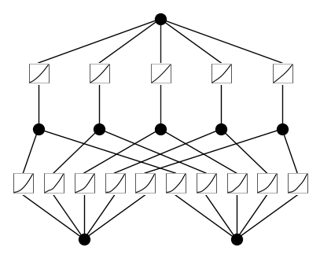
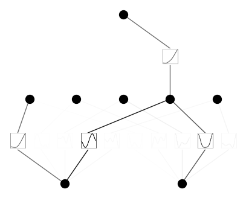
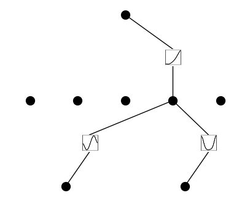

Demo 2: Plotting
================

Initialize KAN and create dataset

.. code:: ipython3

    from kan import *
    # create a KAN: 2D inputs, 1D output, and 5 hidden neurons. cubic spline (k=3), 5 grid intervals (grid=5).
    model = KAN(width=[2,5,1], grid=5, k=3, seed=0)
    
    # create dataset f(x,y) = exp(sin(pi*x)+y^2)
    f = lambda x: torch.exp(torch.sin(torch.pi*x[:,[0]]) + x[:,[1]]**2)
    dataset = create_dataset(f, n_var=2)
    dataset['train_input'].shape, dataset['train_label'].shape

.. parsed-literal::

    (torch.Size([1000, 2]), torch.Size([1000, 1]))

Plot KAN at initialization

.. code:: ipython3

    # plot KAN at initialization
    model(dataset['train_input']);
    model.plot(beta=100)

.. code:: ipython3

    # if you want to add variable names and title
    model.plot(beta=100, in_vars=[r'$\alpha$', 'x'], out_vars=['y'], title = 'My KAN')

.. image:: API_2_plotting_files/API_2_plotting_5_0.png

Train KAN with sparsity regularization

.. code:: ipython3

    # train the model
    model.fit(dataset, opt="LBFGS", steps=20, lamb=0.01, lamb_entropy=10.);

.. parsed-literal::

    train loss: 1.56e-01 | test loss: 1.31e-01 | reg: 2.07e+01 : 100%|██| 20/20 [00:12<00:00,  1.64it/s]

:math:`\beta` controls the transparency of activations. Larger
:math:`\beta` => more activation functions show up. We usually want to
set a proper beta such that only important connections are visually
significant. transparency is set to be
:math:`{\rm tanh}(\beta |\phi|_1)` where :math:`|\phi|_1` is the l1 norm
of the activation function. By default :math:`\beta=3`.

.. code:: ipython3

    model.plot(beta=3)

.. code:: ipython3

    model.plot(beta=100000)

.. code:: ipython3

    model.plot(beta=0.1)

.. image:: API_2_plotting_files/API_2_plotting_11_0.png

After purning, “mask=True” will remove all connections that are
connected to unsignificant neurons. The insignificant neurons themselves
are still visualized. If you want those neurons to be removed as well,
see below. Insignificant/Significant neurons are defined based on l1
norm of its incoming and outgoing functions.

.. code:: ipython3

    model.prune()
    model.plot(mask=True)

.. code:: ipython3

    model.plot(mask=True, beta=100000)

.. code:: ipython3

    model.plot(mask=True, beta=0.1)

.. image:: API_2_plotting_files/API_2_plotting_15_0.png

Remove insignificant neurons

.. code:: ipython3

    model2 = model.prune()
    model2(dataset['train_input']) # it's important to do a forward first to collect activations
    model2.plot()

Resize the figure using the “scale” parameter. By default: 0.5

.. code:: ipython3

    model2.plot(scale=0.5)

.. image:: API_2_plotting_files/API_2_plotting_19_0.png

.. code:: ipython3

    model2.plot(scale=0.2)

.. code:: ipython3

    model2.plot(scale=2.0)

.. image:: API_2_plotting_files/API_2_plotting_21_0.png

If you want to see sample distribution in addition to the line, set
“sample=True”

.. code:: ipython3

    model2(dataset['train_input'])
    model2.plot(sample=True)

.. image:: API_2_plotting_files/API_2_plotting_23_0.png

The samples are more visible if we use a smaller number of samples

.. code:: ipython3

    model2(dataset['train_input'][:20])
    model2.plot(sample=True)

If a function is set to be symbolic, it becomes red

.. code:: ipython3

    model2.fix_symbolic(0,1,0,'x^2')

.. parsed-literal::

    Best value at boundary.
    r2 is 0.9928952974445153

.. parsed-literal::

    tensor(0.9929)

.. code:: ipython3

    model2.plot()

If a function is set to be both symbolic and numeric (its output is the
addition of symbolic and spline), then it shows up in purple

.. code:: ipython3

    model2.set_mode(0,1,0,mode='ns')

.. code:: ipython3

    model2.plot()

.. image:: API_2_plotting_files/API_2_plotting_31_0.png

