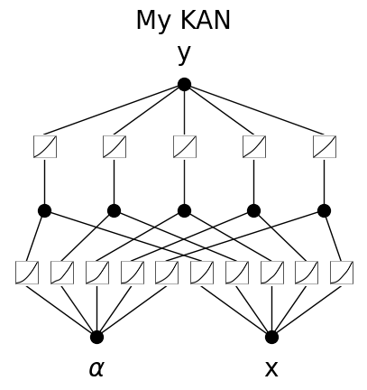
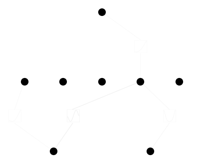
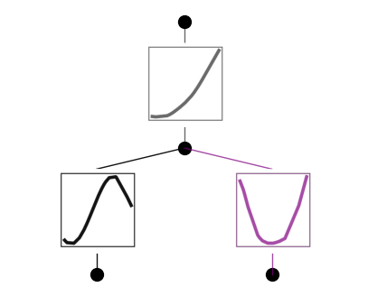

API 2: Plotting
===============

Initialize KAN and create dataset

.. code:: ipython3

    from kan import *
    
    device = torch.device('cuda' if torch.cuda.is_available() else 'cpu')
    print(device)
    
    # create a KAN: 2D inputs, 1D output, and 5 hidden neurons. cubic spline (k=3), 5 grid intervals (grid=5).
    model = KAN(width=[2,5,1], grid=3, k=3, seed=1, device=device)
    
    # create dataset f(x,y) = exp(sin(pi*x)+y^2)
    f = lambda x: torch.exp(torch.sin(torch.pi*x[:,[0]]) + x[:,[1]]**2)
    dataset = create_dataset(f, n_var=2, device=device)
    dataset['train_input'].shape, dataset['train_label'].shape

.. parsed-literal::

    cuda
    checkpoint directory created: ./model
    saving model version 0.0

.. parsed-literal::

    (torch.Size([1000, 2]), torch.Size([1000, 1]))

Plot KAN at initialization

.. code:: ipython3

    # plot KAN at initialization
    model(dataset['train_input']);
    model.plot(beta=100)

.. image:: API_2_plotting_files/API_2_plotting_4_0.png

.. code:: ipython3

    # if you want to add variable names and title
    model.plot(beta=100, in_vars=[r'$\alpha$', 'x'], out_vars=['y'], title = 'My KAN')

Train KAN with sparsity regularization

.. code:: ipython3

    # train the model
    model.fit(dataset, opt="LBFGS", steps=20, lamb=0.01);

.. parsed-literal::

    | train_loss: 5.20e-02 | test_loss: 5.35e-02 | reg: 4.93e+00 | : 100%|█| 20/20 [00:03<00:00,  5.22it

.. parsed-literal::

    saving model version 0.1

.. parsed-literal::

    

:math:`\beta` controls the transparency of activations. Larger
:math:`\beta` => more activation functions show up. We usually want to
set a proper beta such that only important connections are visually
significant. transparency is set to be :math:`{\rm tanh}(\beta \phi)`
where :math:`\phi` is the scale of the activation function
(metric=‘forward_u’), normalized scale (metric=‘forward_n’) or the
feature attribution score (metric=‘backward’). By default
:math:`\beta=3` and metric=‘backward’.

.. code:: ipython3

    model.plot()

.. image:: API_2_plotting_files/API_2_plotting_9_0.png

.. code:: ipython3

    model.plot(beta=100000)

.. image:: API_2_plotting_files/API_2_plotting_10_0.png

.. code:: ipython3

    model.plot(beta=0.1)

plotting with different metrics: ‘forward_n’, ‘forward_u’, ‘backward’

.. code:: ipython3

    model.plot(metric='forward_n', beta=100)

.. image:: API_2_plotting_files/API_2_plotting_13_0.png

.. code:: ipython3

    model.plot(metric='forward_u', beta=100)

.. image:: API_2_plotting_files/API_2_plotting_14_0.png

.. code:: ipython3

    model.plot(metric='backward', beta=100)

Remove insignificant neurons

.. code:: ipython3

    model = model.prune()
    model.plot()

.. parsed-literal::

    saving model version 0.2

.. image:: API_2_plotting_files/API_2_plotting_17_1.png

Resize the figure using the “scale” parameter. By default: 0.5

.. code:: ipython3

    model.plot(scale=0.5)

.. image:: API_2_plotting_files/API_2_plotting_19_0.png

.. code:: ipython3

    model.plot(scale=0.2)

.. image:: API_2_plotting_files/API_2_plotting_20_0.png

.. code:: ipython3

    model.plot(scale=2.0)

If you want to see sample distribution in addition to the line, set
“sample=True”

.. code:: ipython3

    model.plot(sample=True)

The samples are more visible if we use a smaller number of samples

.. code:: ipython3

    model.get_act(dataset['train_input'][:20])
    model.plot(sample=True)

.. image:: API_2_plotting_files/API_2_plotting_25_0.png

If a function is set to be symbolic, it becomes red

.. code:: ipython3

    model.fix_symbolic(0,1,0,'x^2')

.. parsed-literal::

    r2 is 0.9992202520370483
    saving model version 0.3

.. parsed-literal::

    tensor(0.9992, device='cuda:0')

.. code:: ipython3

    model.plot()

.. image:: API_2_plotting_files/API_2_plotting_28_0.png

If a function is set to be both symbolic and numeric (its output is the
addition of symbolic and spline), then it shows up in purple

.. code:: ipython3

    model.set_mode(0,1,0,mode='ns')

.. code:: ipython3

    model.plot(beta=100)

