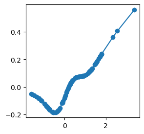

API 3: Extracting activation functions
======================================

The KAN diagrams give intuitive illustration, but sometimes we may also
want to extract the values of activation functions for more quantitative
tasks. Using the indexing convention introduced in the indexing
notebook, each edge is indexed as :math:`(l,i,j)`, where :math:`l` is
the layer index, :math:`i` is the input neuron index, and :math:`j` is
output neuron index.

.. code:: ipython3

    from kan import *
    import matplotlib.pyplot as plt
    
    device = torch.device('cuda' if torch.cuda.is_available() else 'cpu')
    print(device)
    
    # create a KAN: 2D inputs, 1D output, and 5 hidden neurons. cubic spline (k=3), 5 grid intervals (grid=5).
    model = KAN(width=[2,5,1], grid=3, k=3, seed=1, device=device)
    x = torch.normal(0,1,size=(100,2)).to(device)
    model(x)
    model.plot(beta=100)

.. parsed-literal::

    cuda
    checkpoint directory created: ./model
    saving model version 0.0

.. image:: API_3_extract_activations_files/API_3_extract_activations_1_1.png

.. code:: ipython3

    l = 0
    i = 0
    j = 3
    x, y = model.get_fun(l,i,j)

If we are interested in the range of some activation function, we can
use get_range.

.. code:: ipython3

    model.get_range(l,i,j)

.. parsed-literal::

    x range: [-1.61 , 3.38 ]
    y range: [-0.19 , 0.56 ]

.. parsed-literal::

    (array(-1.6111118, dtype=float32),
     array(3.38374, dtype=float32),
     array(-0.18606013, dtype=float32),
     array(0.5614974, dtype=float32))

