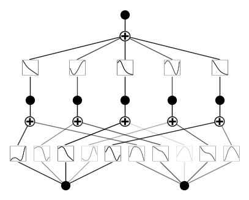
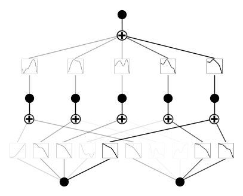
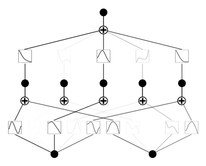
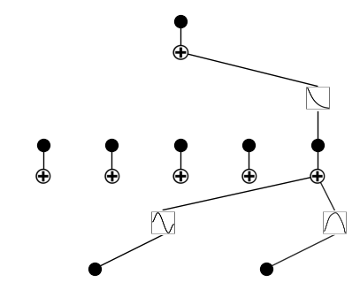
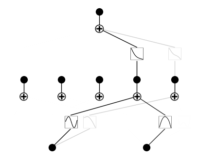

API 6: Training Hyperparamters
==============================

Regularization helps interpretability by making KANs sparser. This may
require some hyperparamter tuning. Let’s see how hyperparameters can
affect training

Load KAN and create_dataset

.. code:: ipython3

    from kan import *
    import torch
    
    device = torch.device('cuda' if torch.cuda.is_available() else 'cpu')
    print(device)
    
    f = lambda x: torch.exp(torch.sin(torch.pi*x[:,[0]]) + x[:,[1]]**2)
    dataset = create_dataset(f, n_var=2, device=device)
    dataset['train_input'].shape, dataset['train_label'].shape

.. parsed-literal::

    cuda

.. parsed-literal::

    (torch.Size([1000, 2]), torch.Size([1000, 1]))

Default setup

.. code:: ipython3

    # train the model
    model = KAN(width=[2,5,1], grid=5, k=3, seed=1, device=device)
    model.fit(dataset, opt="LBFGS", steps=20, lamb=0.01);
    model.plot()

.. parsed-literal::

    checkpoint directory created: ./model
    saving model version 0.0

.. parsed-literal::

    | train_loss: 3.34e-02 | test_loss: 3.29e-02 | reg: 4.93e+00 | : 100%|█| 20/20 [00:05<00:00,  3.73it

.. parsed-literal::

    saving model version 0.1

Parameter 1: :math:`\lambda`, overall penalty strength.
~~~~~~~~~~~~~~~~~~~~~~~~~~~~~~~~~~~~~~~~~~~~~~~~~~~~~~~

Previously :math:`\lambda=0.01`, now we try different :math:`\lambda`.

:math:`\lambda=0`

.. code:: ipython3

    # train the model
    model = KAN(width=[2,5,1], grid=5, k=3, seed=1, device=device)
    model.fit(dataset, opt="LBFGS", steps=20, lamb=0.00);
    model.plot()

.. parsed-literal::

    checkpoint directory created: ./model
    saving model version 0.0

.. parsed-literal::

    | train_loss: 5.51e-03 | test_loss: 6.14e-03 | reg: 1.52e+01 | : 100%|█| 20/20 [00:03<00:00,  5.84it

.. parsed-literal::

    saving model version 0.1

:math:`\lambda=1`

.. code:: ipython3

    # train the model
    model = KAN(width=[2,5,1], grid=5, k=3, seed=0, device=device)
    model.fit(dataset, opt="LBFGS", steps=20, lamb=1.0);
    model.plot()

.. parsed-literal::

    checkpoint directory created: ./model
    saving model version 0.0

.. parsed-literal::

    | train_loss: 1.70e+00 | test_loss: 1.73e+00 | reg: 1.08e+01 | : 100%|█| 20/20 [00:04<00:00,  4.59it

.. parsed-literal::

    saving model version 0.1

Parameter 2: (relative) penalty strength of entropy :math:`\lambda_{\rm ent}`.
~~~~~~~~~~~~~~~~~~~~~~~~~~~~~~~~~~~~~~~~~~~~~~~~~~~~~~~~~~~~~~~~~~~~~~~~~~~~~~

The absolute magnitude is :math:`\lambda\lambda_{\rm ent}`. Previously
we set :math:`\lambda=0.1` and :math:`\lambda_{\rm ent}=2.0` (default).
Below we fix :math:`\lambda=0.1` and vary :math:`\lambda_{\rm ent}`.

:math:`\lambda_{\rm ent}=0.0`

.. code:: ipython3

    # train the model
    model = KAN(width=[2,5,1], grid=5, k=3, seed=1, device=device)
    model.fit(dataset, opt="LBFGS", steps=20, lamb=0.01, lamb_entropy=0.0);
    model.plot()

.. parsed-literal::

    checkpoint directory created: ./model
    saving model version 0.0

.. parsed-literal::

    | train_loss: 4.20e-02 | test_loss: 4.50e-02 | reg: 2.57e+00 | : 100%|█| 20/20 [00:04<00:00,  4.68it

.. parsed-literal::

    saving model version 0.1

:math:`\lambda_{\rm ent}=10.`

.. code:: ipython3

    # train the model
    model = KAN(width=[2,5,1], grid=5, k=3, seed=1, device=device)
    model.fit(dataset, opt="LBFGS", steps=20, lamb=0.01, lamb_entropy=10.0);
    model.plot()

.. parsed-literal::

    checkpoint directory created: ./model
    saving model version 0.0

.. parsed-literal::

    | train_loss: 7.83e-02 | test_loss: 7.74e-02 | reg: 1.54e+01 | : 100%|█| 20/20 [00:05<00:00,  3.77it

.. parsed-literal::

    saving model version 0.1

Parameter 3: seed.
~~~~~~~~~~~~~~~~~~

Previously we use seed = 1. Below we vary seed.

:math:`{\rm seed} = 42`

.. code:: ipython3

    model = KAN(width=[2,5,1], grid=3, k=3, seed=42, device=device)
    model.fit(dataset, opt="LBFGS", steps=20, lamb=0.01);
    model.plot()

.. parsed-literal::

    checkpoint directory created: ./model
    saving model version 0.0

.. parsed-literal::

    | train_loss: 5.67e-02 | test_loss: 5.72e-02 | reg: 5.81e+00 | : 100%|█| 20/20 [00:04<00:00,  4.81it

.. parsed-literal::

    saving model version 0.1

