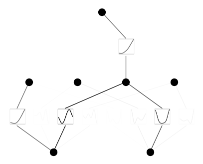
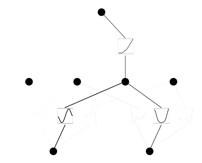
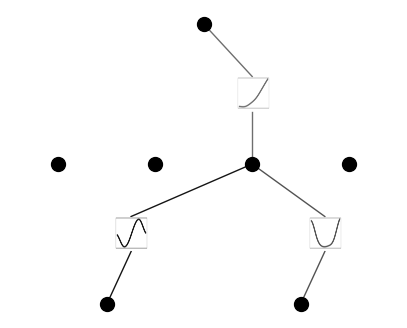
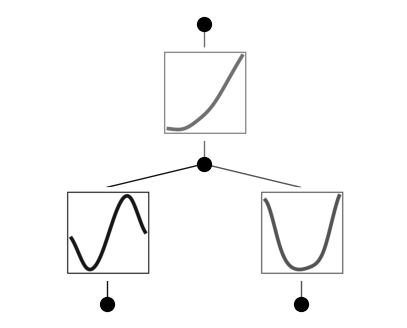

Demo 7: Pruning
===============

We usually use pruning to make neural networks sparser hence more
efficient and more interpretable. KANs provide two ways of pruning:
automatic pruning, and manual pruning.

Automatic pruning
-----------------

For each node, we consider it active if both of its max incoming l1 and
outgoing l1 are above some threshold (see paper for details). Only
active neurons will be kept, while inactive neurons are pruned away.
Note that there is no automatic edge pruning, just to be safe (there are
cases where important edges have small l1 norm). However, one can
manually prune away nodes and edges.

.. code:: ipython3

    from kan import *
    # create a KAN: 2D inputs, 1D output, and 5 hidden neurons. cubic spline (k=3), 5 grid intervals (grid=5).
    model = KAN(width=[2,5,1], grid=5, k=3, seed=0)
    
    # create dataset f(x,y) = exp(sin(pi*x)+y^2)
    f = lambda x: torch.exp(torch.sin(torch.pi*x[:,[0]]) + x[:,[1]]**2)
    dataset = create_dataset(f, n_var=2)
    dataset['train_input'].shape, dataset['train_label'].shape
    
    # train the model
    model.train(dataset, opt="LBFGS", steps=20, lamb=0.01, lamb_entropy=10.);
    model = model.prune()
    model(dataset['train_input'])
    model.plot()

.. parsed-literal::

    train loss: 1.54e-01 | test loss: 1.30e-01 | reg: 2.02e+01 : 100%|██| 20/20 [00:11<00:00,  1.68it/s]

Let’s try to use different threshold, by default, threshold = 1e-2

threshold = 1e-4 leaves more hidden nodes.

.. code:: ipython3

    from kan import *
    # create a KAN: 2D inputs, 1D output, and 5 hidden neurons. cubic spline (k=3), 5 grid intervals (grid=5).
    model = KAN(width=[2,5,1], grid=5, k=3, seed=0)
    
    # create dataset f(x,y) = exp(sin(pi*x)+y^2)
    f = lambda x: torch.exp(torch.sin(torch.pi*x[:,[0]]) + x[:,[1]]**2)
    dataset = create_dataset(f, n_var=2)
    dataset['train_input'].shape, dataset['train_label'].shape
    
    # train the model
    model.train(dataset, opt="LBFGS", steps=20, lamb=0.01, lamb_entropy=10.);
    model = model.prune(threshold=1e-4)
    model(dataset['train_input'])
    model.plot()

.. parsed-literal::

    train loss: 1.54e-01 | test loss: 1.30e-01 | reg: 2.02e+01 : 100%|██| 20/20 [00:11<00:00,  1.70it/s]

Manual pruning
--------------

We can manually prune away nodes

.. code:: ipython3

    model.remove_node(1,0)

.. code:: ipython3

    model.plot()

We can also manually remove edges

.. code:: ipython3

    model.remove_edge(0,0,1)
    model.remove_edge(0,0,3)
    model.remove_edge(0,1,1)
    model.remove_edge(0,1,3)

.. code:: ipython3

    model.plot()

Use prune() if you don’t want to see these inactive nodes in the hiddenl
layer

.. code:: ipython3

    model = model.prune(mode='manual', active_neurons_id=[[0,1],[2],[0]]);
    model(dataset['train_input'])
    model.plot()

