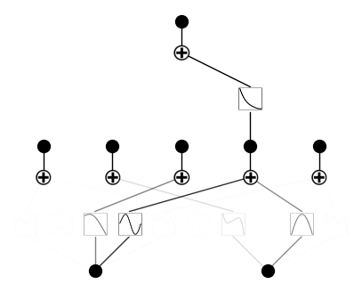

API 8: Regularization
=====================

Regularization helps interpretability by making KANs sparser. This may
require some hyperparamter tuning. Let’s see how hyperparameters can
affect training

Load KAN and create_dataset

.. code:: ipython3

    from kan import *
    import torch
    
    device = torch.device('cuda' if torch.cuda.is_available() else 'cpu')
    print(device)
    
    f = lambda x: torch.exp(torch.sin(torch.pi*x[:,[0]]) + x[:,[1]]**2)
    dataset = create_dataset(f, n_var=2, device=device)
    dataset['train_input'].shape, dataset['train_label'].shape

.. parsed-literal::

    cuda

.. parsed-literal::

    (torch.Size([1000, 2]), torch.Size([1000, 1]))

We apply L1 regularization to which tensor? Currently, we support five
choices for reg_metric: \* ‘edge_forward_spline_n’: the “norm” of edge,
normalized (output std/input std), only consider the spline (ignorning
symbolic) \* ‘edge_forward_sum’: the “norm” of edge, normamlized (output
std/input std), including both spline + symbolic \*
‘edge_forward_spline_u’: the “norm” of edge, unnormalized (output std),
only consider the spline (ignorning symbolic) \* ‘edge_backward’: edge
attribution score \* ‘node_backward’: node attribution score

.. code:: ipython3

    # train the model
    model = KAN(width=[2,5,1], grid=3, k=3, seed=1, device=device)
    model.fit(dataset, opt="LBFGS", steps=20, lamb=0.01, reg_metric='edge_forward_spline_n'); # default
    #model.fit(dataset, opt="LBFGS", steps=20, lamb=0.01, reg_metric='edge_forward_sum');
    #model.fit(dataset, opt="LBFGS", steps=20, lamb=0.01, reg_metric='edge_forward_spline_u'); 
    #model.fit(dataset, opt="LBFGS", steps=20, lamb=0.01, reg_metric='edge_backward');
    #model.fit(dataset, opt="LBFGS", steps=20, lamb=0.01, reg_metric='node_backward');
    model.plot()

.. parsed-literal::

    checkpoint directory created: ./model
    saving model version 0.0

.. parsed-literal::

    | train_loss: 4.57e-02 | test_loss: 4.35e-02 | reg: 7.15e+00 | : 100%|█| 20/20 [00:04<00:00,  4.58it

.. parsed-literal::

    saving model version 0.1

.. image:: API_8_regularization_files/API_8_regularization_4_3.png

Note: To plot the KAN diagram, there are also three options \*
forward_u: same as edge_forward_spline_u \* forward_n: same as
edge_forward_spline_u \* backward: same as edge_backward

.. code:: ipython3

    model.plot(metric='forward_u')
    #model.plot(metric='forward_n')
    #model.plot(metric='backward') # default

