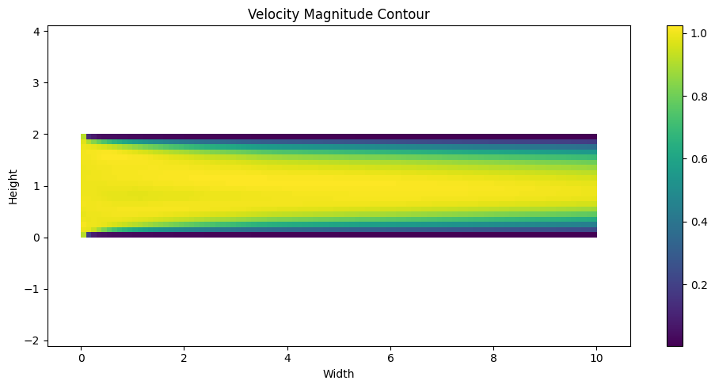
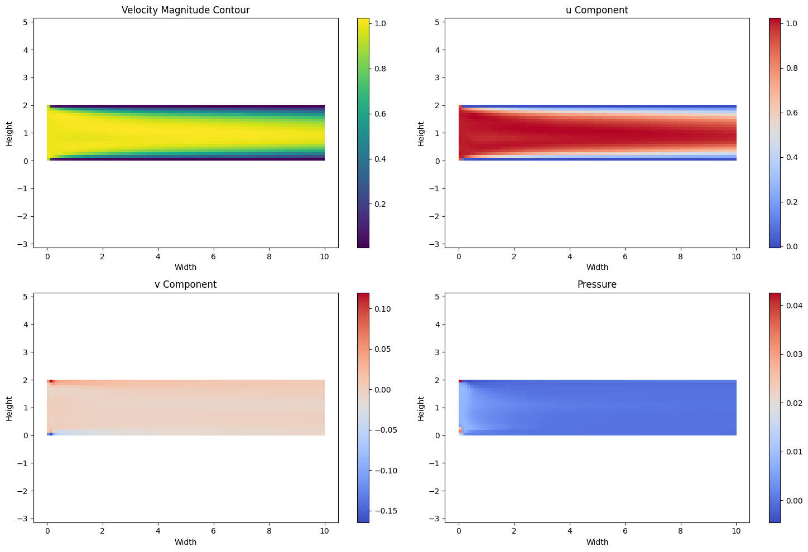
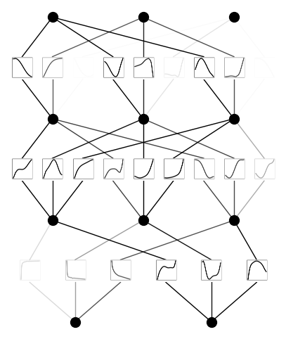

Community 1: Physics-informed KAN
=================================

**Disclaimer: This is uploaded from a github user, not the KAN authors.
KAN authors did not writer this or proofread this carefully, hence are
not responsible for mistakes in this notebook. If you have questions,
please consult the github user who uploaded it. Thank you!**

.. code:: ipython3

    import torch
    from torch import autograd
    from torch.utils.tensorboard import SummaryWriter
    from tqdm import tqdm
    import matplotlib.pyplot as plt
    from kan import KAN, LBFGS
    
    device = torch.device("cpu")
    print("Using device:", device)
    
    rho = torch.tensor(1.0, device=device, requires_grad=False)
    nu = torch.tensor(0.01, device=device, requires_grad=False)
    eps = torch.tensor(1e-8, device=device, requires_grad=False)
    
    width, height = 10.0, 2.0
    num_points_x, num_points_y = 100, 20
    
    x = torch.linspace(0, width, num_points_x, device=device, requires_grad=False)
    y = torch.linspace(0, height, num_points_y, device=device, requires_grad=False)
    X, Y = torch.meshgrid(x, y, indexing='ij')
    coordinates = torch.stack([X.flatten(), Y.flatten()], dim=1).to(device)
    coordinates.requires_grad = True  # Ensure coordinates require grad
    
    model = KAN(width=[2,3,3, 3], grid=5, k=10, grid_eps=1.0,
                noise_scale_base=0.25).to(device)
    
    def batch_jacobian(func, x, create_graph=False):
        def _func_sum(x):
            return func(x).sum(dim=0)
        return autograd.functional.jacobian(_func_sum, x, create_graph=create_graph).permute(1, 0, 2)
    
    def batch_hessian(func, x):
        jacobian = batch_jacobian(func, x, create_graph=True)
        hessians = []
        for i in range(jacobian.size(1)):
            grad = autograd.grad(jacobian[:, i].sum(), x, create_graph=True, retain_graph=True)[0]
            hessians.append(grad.unsqueeze(1))
        return torch.cat(hessians, dim=1)
    
    def navier_stokes_residuals(coords):
        coords = coords.clone().detach().requires_grad_(True)  # Ensure coords require grad
        y_pred = model(coords)
        grads = batch_jacobian(model, coords, create_graph=True)
        hessians = batch_hessian(model, coords)
    
        u, v, p = y_pred[:, 0], y_pred[:, 1], y_pred[:, 2]
        u_x, u_y = grads[:, 0, 0], grads[:, 0, 1]
        v_x, v_y = grads[:, 1, 0], grads[:, 1, 1]
        p_x, p_y = grads[:, 2, 0], grads[:, 2, 1]
    
        u_xx, u_yy = hessians[:, 0, 0], hessians[:, 0, 1]
        v_xx, v_yy = hessians[:, 1, 0], hessians[:, 1, 1]
    
        continuity = u_x + v_y + eps * p
        x_momentum = u * u_x + v * u_y + (1 / rho) * p_x - nu * (u_xx + u_yy)
        y_momentum = u * v_x + v * v_y + (1 / rho) * p_y - nu * (v_xx + v_yy)
    
        no_slip_mask = (coords[:, 1] == 0) | (coords[:, 1] == height)
        inlet_mask = (coords[:, 0] == 0)
        outlet_mask = (coords[:, 0] == width)
    
        no_slip_loss = torch.mean(u[no_slip_mask] ** 2 + v[no_slip_mask] ** 2)
        inlet_loss = torch.mean((u[inlet_mask] - 1) ** 2)
        outlet_pressure_loss = torch.mean(p[outlet_mask] ** 2)
    
        bc_loss = no_slip_loss + inlet_loss + outlet_pressure_loss
        total_loss = torch.mean(continuity ** 2 + x_momentum ** 2 + y_momentum ** 2) + bc_loss
        return total_loss
    
    writer = SummaryWriter()
    
    def train():
        optimizer = LBFGS(model.parameters(), lr=1,
                          history_size=10, line_search_fn="strong_wolfe", tolerance_grad=1e-32, tolerance_change=1e-32, tolerance_ys=1e-32)
        
        steps = 200 # 20 steps are enough
        pbar = tqdm(range(steps), desc='Training Progress')
    
        for step in pbar:
            def closure():
                optimizer.zero_grad()
                loss = navier_stokes_residuals(coordinates)
                loss.backward()
                return loss
    
            optimizer.step(closure)
            if step % 5 == 0:
                current_loss = closure().item()
                pbar.set_description("Step: %d | Loss: %.3f" %
                                     (step, current_loss))
                writer.add_scalar('Loss/train', current_loss, step)
    
    train()
    
    writer.close()

.. parsed-literal::

    Using device: cpu

.. parsed-literal::

    Step: 195 | Loss: 0.011: 100%|██████████| 200/200 [2:52:51<00:00, 51.86s/it]  

.. code:: ipython3

    u_pred = model(coordinates)[:, 0].detach().reshape(
        num_points_x, num_points_y).T
    
    v_pred = model(coordinates)[:, 1].detach().reshape(
        num_points_x, num_points_y).T
    
    
    magnitude = torch.sqrt(u_pred ** 2 + v_pred ** 2)
    
    plt.figure(figsize=(10, 5))  # Set the figure size as needed
    plt.imshow(magnitude, extent=(0, width, 0, height), origin='lower', cmap='viridis')
    plt.colorbar()  # Add a colorbar to show the magnitude scale
    plt.title('Velocity Magnitude Contour')
    plt.xlabel('Width')
    plt.ylabel('Height')
    plt.axis('equal')  # Ensure the plot has equal scaling
    plt.tight_layout()  # Adjust layout to prevent overlap
    plt.show()

.. code:: ipython3

    # Extracting predictions
    u_pred = model(coordinates)[:, 0].detach().reshape(num_points_x, num_points_y).T
    v_pred = model(coordinates)[:, 1].detach().reshape(num_points_x, num_points_y).T
    p_pred = model(coordinates)[:, 2].detach().reshape(num_points_x, num_points_y).T
    
    # Velocity Magnitude
    magnitude = torch.sqrt(u_pred ** 2 + v_pred ** 2)
    
    # Plotting all subplots
    fig, axs = plt.subplots(2, 2, figsize=(15, 10))
    
    # Velocity Magnitude
    im0 = axs[0, 0].imshow(magnitude, extent=(0, width, 0, height), origin='lower', cmap='viridis')
    fig.colorbar(im0, ax=axs[0, 0])
    axs[0, 0].set_title('Velocity Magnitude Contour')
    axs[0, 0].set_xlabel('Width')
    axs[0, 0].set_ylabel('Height')
    axs[0, 0].axis('equal')
    
    # u Component
    im1 = axs[0, 1].imshow(u_pred, extent=(0, width, 0, height), origin='lower', cmap='coolwarm')
    fig.colorbar(im1, ax=axs[0, 1])
    axs[0, 1].set_title('u Component')
    axs[0, 1].set_xlabel('Width')
    axs[0, 1].set_ylabel('Height')
    axs[0, 1].axis('equal')
    
    # v Component
    im2 = axs[1, 0].imshow(v_pred, extent=(0, width, 0, height), origin='lower', cmap='coolwarm')
    fig.colorbar(im2, ax=axs[1, 0])
    axs[1, 0].set_title('v Component')
    axs[1, 0].set_xlabel('Width')
    axs[1, 0].set_ylabel('Height')
    axs[1, 0].axis('equal')
    
    # Pressure
    im3 = axs[1, 1].imshow(p_pred, extent=(0, width, 0, height), origin='lower', cmap='coolwarm')
    fig.colorbar(im3, ax=axs[1, 1])
    axs[1, 1].set_title('Pressure')
    axs[1, 1].set_xlabel('Width')
    axs[1, 1].set_ylabel('Height')
    axs[1, 1].axis('equal')
    
    plt.tight_layout()  # Adjust layout to prevent overlap
    plt.show()

.. code:: ipython3

    model.plot(beta=10)

