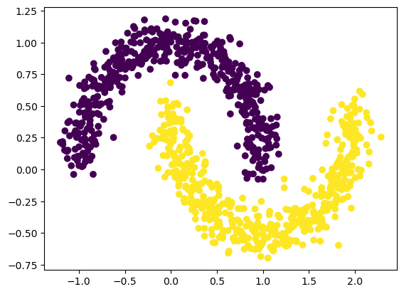

Example 4: Classification
=========================

Regression formulation
----------------------

Let’s first treat the problem as a regression problem (output dimension
= 1, MSE loss).

create the two moon dataset

.. code:: ipython3

    from kan import *
    import matplotlib.pyplot as plt
    from sklearn.datasets import make_moons
    import numpy as np
    
    device = torch.device('cuda' if torch.cuda.is_available() else 'cpu')
    print(device)
    
    dataset = {}
    train_input, train_label = make_moons(n_samples=1000, shuffle=True, noise=0.1, random_state=None)
    test_input, test_label = make_moons(n_samples=1000, shuffle=True, noise=0.1, random_state=None)
    
    dtype = torch.get_default_dtype()
    dataset['train_input'] = torch.from_numpy(train_input).type(dtype).to(device)
    dataset['test_input'] = torch.from_numpy(test_input).type(dtype).to(device)
    dataset['train_label'] = torch.from_numpy(train_label[:,None]).type(dtype).to(device)
    dataset['test_label'] = torch.from_numpy(test_label[:,None]).type(dtype).to(device)
    
    X = dataset['train_input']
    y = dataset['train_label']
    plt.scatter(X[:,0].cpu().detach().numpy(), X[:,1].cpu().detach().numpy(), c=y[:,0].cpu().detach().numpy())

.. parsed-literal::

    cuda

.. parsed-literal::

    <matplotlib.collections.PathCollection at 0x7f3839ef1c10>

.. image:: Example_4_classfication_files/Example_4_classfication_3_2.png

Train KAN

.. code:: ipython3

    model = KAN(width=[2,1], grid=3, k=3, device=device)
    
    def train_acc():
        return torch.mean((torch.round(model(dataset['train_input'])[:,0]) == dataset['train_label'][:,0]).type(dtype))
    
    def test_acc():
        return torch.mean((torch.round(model(dataset['test_input'])[:,0]) == dataset['test_label'][:,0]).type(dtype))
    
    results = model.fit(dataset, opt="LBFGS", steps=20, metrics=(train_acc, test_acc));
    results['train_acc'][-1], results['test_acc'][-1]

.. parsed-literal::

    checkpoint directory created: ./model
    saving model version 0.0

.. parsed-literal::

    | train_loss: 1.55e-01 | test_loss: 1.56e-01 | reg: 3.94e+00 | : 100%|█| 20/20 [00:01<00:00, 15.55it

.. parsed-literal::

    saving model version 0.1

.. parsed-literal::

    

.. parsed-literal::

    (1.0, 0.9980000257492065)

Automatic symbolic regression

.. code:: ipython3

    lib = ['x','x^2','x^3','x^4','exp','log','sqrt','tanh','sin','tan','abs']
    model.auto_symbolic(lib=lib)
    formula = model.symbolic_formula()[0][0]
    ex_round(formula, 4)

.. parsed-literal::

    fixing (0,0,0) with sin, r2=0.9654733538627625, c=2
    fixing (0,1,0) with x, r2=0.975755512714386, c=1
    saving model version 0.2

.. math::

    \displaystyle - 0.853 x_{2} - 0.3885 \sin{\left(3.1242 x_{1} - 1.5464 \right)} + 0.7063

How accurate is this formula?

.. code:: ipython3

    # how accurate is this formula?
    def acc(formula, X, y):
        batch = X.shape[0]
        correct = 0
        for i in range(batch):
            correct += np.round(np.array(formula.subs('x_1', X[i,0]).subs('x_2', X[i,1])).astype(np.float64)) == y[i,0]
        return correct/batch
    
    print('train acc of the formula:', acc(formula, dataset['train_input'], dataset['train_label']))
    print('test acc of the formula:', acc(formula, dataset['test_input'], dataset['test_label']))

.. parsed-literal::

    train acc of the formula: tensor(0.9980, device='cuda:0')
    test acc of the formula: tensor(0.9970, device='cuda:0')

Classification formulation
--------------------------

Let’s then treat the problem as a classification problem (output
dimension = 2, CrossEntropy loss).

Create the two moon datatset

.. code:: ipython3

    from kan import KAN
    import matplotlib.pyplot as plt
    from sklearn.datasets import make_moons
    import torch
    import numpy as np
    
    dataset = {}
    train_input, train_label = make_moons(n_samples=1000, shuffle=True, noise=0.1, random_state=None)
    test_input, test_label = make_moons(n_samples=1000, shuffle=True, noise=0.1, random_state=None)
    
    dataset['train_input'] = torch.from_numpy(train_input).type(dtype).to(device)
    dataset['test_input'] = torch.from_numpy(test_input).type(dtype).to(device)
    dataset['train_label'] = torch.from_numpy(train_label).type(torch.long).to(device)
    dataset['test_label'] = torch.from_numpy(test_label).type(torch.long).to(device)
    
    X = dataset['train_input']
    y = dataset['train_label']
    plt.scatter(X[:,0].cpu().detach().numpy(), X[:,1].cpu().detach().numpy(), c=y[:].cpu().detach().numpy())

.. parsed-literal::

    <matplotlib.collections.PathCollection at 0x7f383010d5b0>

Train KAN
~~~~~~~~~

.. code:: ipython3

    model = KAN(width=[2,2], grid=3, k=3, seed=2024, device=device)
    
    def train_acc():
        return torch.mean((torch.argmax(model(dataset['train_input']), dim=1) == dataset['train_label']).type(dtype))
    
    def test_acc():
        return torch.mean((torch.argmax(model(dataset['test_input']), dim=1) == dataset['test_label']).type(dtype))
    
    results = model.fit(dataset, opt="LBFGS", steps=20, metrics=(train_acc, test_acc), loss_fn=torch.nn.CrossEntropyLoss());

.. parsed-literal::

    checkpoint directory created: ./model
    saving model version 0.0

.. parsed-literal::

    | train_loss: 0.00e+00 | test_loss: 2.37e-01 | reg: 4.10e+02 | : 100%|█| 20/20 [00:01<00:00, 18.81it

.. parsed-literal::

    saving model version 0.1

.. parsed-literal::

    

Automatic symbolic regression

.. code:: ipython3

    lib = ['x','x^2','x^3','x^4','exp','log','sqrt','tanh','sin','abs']
    model.auto_symbolic(lib=lib)

.. parsed-literal::

    fixing (0,0,0) with x, r2=0.48220324516296387, c=1
    fixing (0,0,1) with x, r2=0.3202315866947174, c=1
    fixing (0,1,0) with x, r2=0.9358773231506348, c=1
    fixing (0,1,1) with x, r2=0.9290410876274109, c=1
    saving model version 0.2

.. code:: ipython3

    formula1, formula2 = model.symbolic_formula()[0]
    ex_round(formula1, 4)

.. math::

    \displaystyle - 15.0316 x_{1} + 177.9349 x_{2} - 63.0716

.. code:: ipython3

    ex_round(formula2, 4)

.. math::

    \displaystyle 60.4718 x_{1} - 156.0295 x_{2} + 16.9

How accurate is this formula?

.. code:: ipython3

    # how accurate is this formula?
    def acc(formula1, formula2, X, y):
        batch = X.shape[0]
        correct = 0
        for i in range(batch):
            logit1 = np.array(formula1.subs('x_1', X[i,0]).subs('x_2', X[i,1])).astype(np.float64)
            logit2 = np.array(formula2.subs('x_1', X[i,0]).subs('x_2', X[i,1])).astype(np.float64)
            correct += (logit2 > logit1) == y[i]
        return correct/batch
    
    print('train acc of the formula:', acc(formula1, formula2, dataset['train_input'], dataset['train_label']))
    print('test acc of the formula:', acc(formula1, formula2, dataset['test_input'], dataset['test_label']))

.. parsed-literal::

    train acc of the formula: tensor(0.8870, device='cuda:0')
    test acc of the formula: tensor(0.8810, device='cuda:0')

