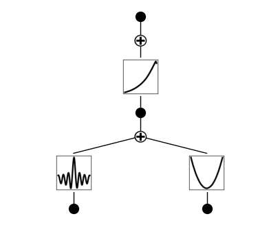

Example 5: Special functions
============================

Let’s construct a dataset which contains special functions
:math:`f(x,y)={\rm exp}(J_0(20x)+y^2)`, where :math:`J_0(x)` is the
Bessel function.

.. code:: ipython3

    from kan import *
    
    device = torch.device('cuda' if torch.cuda.is_available() else 'cpu')
    print(device)
    
    # create a KAN: 2D inputs, 1D output, and 5 hidden neurons. cubic spline (k=3), 5 grid intervals (grid=5).
    model = KAN(width=[2,1,1], grid=3, k=3, seed=2, device=device)
    f = lambda x: torch.exp(torch.special.bessel_j0(20*x[:,[0]]) + x[:,[1]]**2)
    dataset = create_dataset(f, n_var=2, device=device)
    
    # train the model
    model.fit(dataset, opt="LBFGS", steps=20);

.. parsed-literal::

    cuda
    checkpoint directory created: ./model
    saving model version 0.0

.. parsed-literal::

    | train_loss: 5.15e-01 | test_loss: 5.86e-01 | reg: 5.84e+00 | : 100%|█| 20/20 [00:03<00:00,  5.89it

.. parsed-literal::

    saving model version 0.1

Plot trained KAN, the bessel function shows up in the bettom left

.. code:: ipython3

    model.plot()

.. image:: Example_5_special_functions_files/Example_5_special_functions_4_0.png

.. code:: ipython3

    model = model.refine(20)
    model.fit(dataset, opt="LBFGS", steps=20);

.. parsed-literal::

    saving model version 0.2

.. parsed-literal::

    | train_loss: 1.54e-02 | test_loss: 4.73e-02 | reg: 7.50e+00 | : 100%|█| 20/20 [00:02<00:00,  6.93it

.. parsed-literal::

    saving model version 0.3

.. parsed-literal::

    

.. code:: ipython3

    model.plot()

suggest_symbolic does not return anything that matches with it, since
Bessel function isn’t included in the default SYMBOLIC_LIB. We want to
add Bessel to it.

.. code:: ipython3

    model.suggest_symbolic(0,0,0)

.. parsed-literal::

      function  fitting r2   r2 loss  complexity  complexity loss  total loss
    0        0    0.000000  0.000014           0                0    0.000003
    1        x    0.001602 -0.002298           1                1    0.799540
    2      sin    0.161428 -0.253977           2                2    1.549205
    3      cos    0.161428 -0.253977           2                2    1.549205
    4    1/x^2    0.099456 -0.151116           2                2    1.569777

.. parsed-literal::

    ('0',
     (<function kan.utils.<lambda>(x)>,
      <function kan.utils.<lambda>(x)>,
      0,
      <function kan.utils.<lambda>(x, y_th)>),
     0.0,
     0)

.. code:: ipython3

    SYMBOLIC_LIB.keys()

.. parsed-literal::

    dict_keys(['x', 'x^2', 'x^3', 'x^4', 'x^5', '1/x', '1/x^2', '1/x^3', '1/x^4', '1/x^5', 'sqrt', 'x^0.5', 'x^1.5', '1/sqrt(x)', '1/x^0.5', 'exp', 'log', 'abs', 'sin', 'cos', 'tan', 'tanh', 'sgn', 'arcsin', 'arccos', 'arctan', 'arctanh', '0', 'gaussian'])

add bessel function J0 to the symbolic library. we should include a name
and a pytorch implementation. c is the complexity assigned to J0.

.. code:: ipython3

    add_symbolic('J0', torch.special.bessel_j0, c=1)

After adding Bessel, we check suggest_symbolic again

.. code:: ipython3

    # J0 fitting is not very good
    model.suggest_symbolic(0,0,0)

.. parsed-literal::

      function  fitting r2   r2 loss  complexity  complexity loss  total loss
    0        0    0.000000  0.000014           0                0    0.000003
    1       J0    0.198505 -0.319216           1                1    0.736157
    2        x    0.001602 -0.002298           1                1    0.799540
    3      sin    0.161428 -0.253977           2                2    1.549205
    4      cos    0.161428 -0.253977           2                2    1.549205

.. parsed-literal::

    ('0',
     (<function kan.utils.<lambda>(x)>,
      <function kan.utils.<lambda>(x)>,
      0,
      <function kan.utils.<lambda>(x, y_th)>),
     0.0,
     0)

The fitting r2 is still not high, this is because the ground truth is
J0(20x) which involves 20 which is too large. our default search is in
(-10,10). so we need to set the search range bigger in order to include
20. now J0 appears at the top of the list

.. code:: ipython3

    model.suggest_symbolic(0,0,0,a_range=(-40,40))

.. parsed-literal::

      function  fitting r2   r2 loss  complexity  complexity loss  total loss
    0       J0    0.998912 -9.830484           1                1   -1.166097
    1        0    0.000000  0.000014           0                0    0.000003
    2        x    0.001602 -0.002298           1                1    0.799540
    3      cos    0.583964 -1.265186           2                2    1.346963
    4      sin    0.583964 -1.265186           2                2    1.346963

.. parsed-literal::

    ('J0',
     (<function torch._C._special.special_bessel_j0>,
      J0,
      1,
      <function torch._C._special.special_bessel_j0>),
     0.9989116787910461,
     1)

