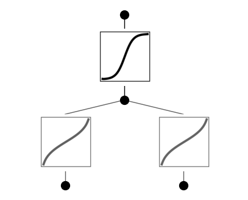
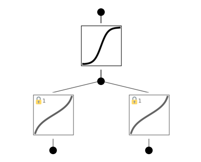
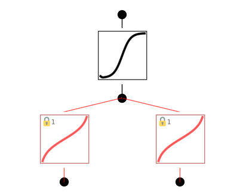
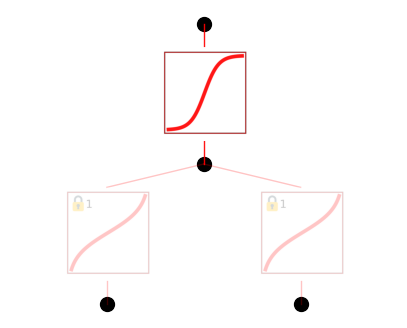

Example 10: Use of lock for Relativity Addition
===============================================

In this example, we will symbolically regress
:math:`f(u,v)=\frac{u+v}{1+uv}`. In relavitity, we know the rapidity
trick :math:`f(u,v)={\rm tanh}({\rm arctanh}\ u+{\rm arctanh}\ v)`. Can
we rediscover rapidity trick with KAN?

Intialize model and create dataset

.. code:: ipython3

    from kan import KAN, create_dataset
    
    # initialize KAN with G=3
    model = KAN(width=[2,1,1], grid=10, k=3)
    
    # create dataset
    f = lambda x: (x[:,[0]]+x[:,[1]])/(1+x[:,[0]]*x[:,[1]])
    dataset = create_dataset(f, n_var=2, ranges=[-0.9,0.9])

Train KAN and plot

.. code:: ipython3

    model.fit(dataset, opt="LBFGS", steps=20);

.. parsed-literal::

    train loss: 5.28e-04 | test loss: 6.37e-04 | reg: 2.73e+00 : 100%|██| 20/20 [00:03<00:00,  5.41it/s]

.. code:: ipython3

    model.plot(beta=10)

We notice that the two functions in the first layer look the same. Let’s
try to lock them!

.. code:: ipython3

    model.lock(0,[[0,0],[1,0]])

.. code:: ipython3

    model.plot(beta=10)

Now there are lock symbols in their top left corners!

.. code:: ipython3

    model.fit(dataset, opt="LBFGS", steps=20);

.. parsed-literal::

    train loss: 5.13e-04 | test loss: 6.00e-04 | reg: 2.73e+00 : 100%|██| 20/20 [00:03<00:00,  5.68it/s]

Retrain the model, the loss remains similar, meaning that the locking
does not degrade model behavior, justifying our hypothesis that these
two activation functions are the same. Let’s now determine what this
function is using :math:`\texttt{suggest_symbolic}`

.. code:: ipython3

    model.suggest_symbolic(0,1,0)

.. parsed-literal::

    function , r2
    arctanh , 0.9999993678015309
    tan , 0.9998485210873531
    arcsin , 0.998865199664262
    sqrt , 0.9830640000050016
    x^2 , 0.9830517375289431

.. parsed-literal::

    ('arctanh',
     (<function kan.utils.<lambda>(x)>, <function kan.utils.<lambda>(x)>),
     0.9999993678015309)

We can see that :math:`{\rm arctanh}` is at the top of the suggestion
list! So we can set both to arctanh, retrain the model, and plot it.

.. code:: ipython3

    model.fix_symbolic(0,0,0,'arctanh')
    model.fix_symbolic(0,1,0,'arctanh')

.. parsed-literal::

    r2 is 0.9999992221865773
    r2 is 0.9999993678015309

.. parsed-literal::

    tensor(1.0000)

.. code:: ipython3

    model.fit(dataset, opt="LBFGS", steps=20, update_grid=False);

.. parsed-literal::

    train loss: 2.39e-04 | test loss: 2.54e-03 | reg: 2.73e+00 : 100%|██| 20/20 [00:03<00:00,  6.33it/s]

.. code:: ipython3

    model.plot(beta=10)

We will see that :math:`{\rm tanh}` is at the top of the suggestion list
(:math:`{\rm sigmoid}` is equivalent to tanh given input/ouput affine
transformations)! So we can set it to :math:`{\rm tanh}`, retrain the
model to machine precision, plot it and finally get the symbolic
formula.

.. code:: ipython3

    model.suggest_symbolic(1,0,0)

.. parsed-literal::

    function , r2
    tanh , 0.9999837308133379
    sigmoid , 0.9999837287987492
    arctan , 0.9995498634842791
    sin , 0.996256989539414
    gaussian , 0.9938095927784649

.. parsed-literal::

    ('tanh',
     (<function kan.utils.<lambda>(x)>, <function kan.utils.<lambda>(x)>),
     0.9999837308133379)

.. code:: ipython3

    model.fix_symbolic(1,0,0,'tanh')

.. parsed-literal::

    r2 is 0.9999837308133379

.. parsed-literal::

    tensor(1.0000, grad_fn=<SelectBackward0>)

.. code:: ipython3

    model.fit(dataset, opt="LBFGS", steps=20);

.. parsed-literal::

    train loss: 1.69e-11 | test loss: 5.76e-12 | reg: 2.69e+00 : 100%|██| 20/20 [00:00<00:00, 21.70it/s]

.. code:: ipython3

    model.plot()

.. code:: ipython3

    model.symbolic_formula()[0][0]

.. math::

    \displaystyle 1.0 \tanh{\left(1.0 \operatorname{atanh}{\left(1.0 x_{1} \right)} + 1.0 \operatorname{atanh}{\left(1.0 x_{2} \right)} \right)}

