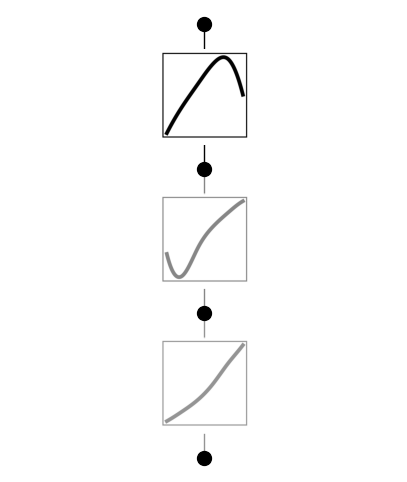
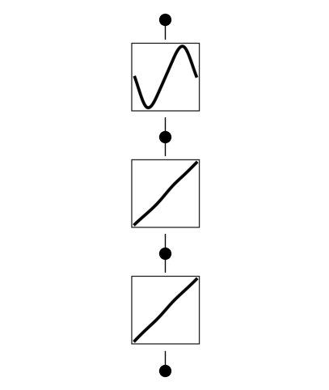
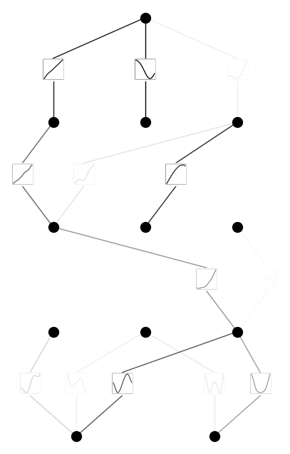
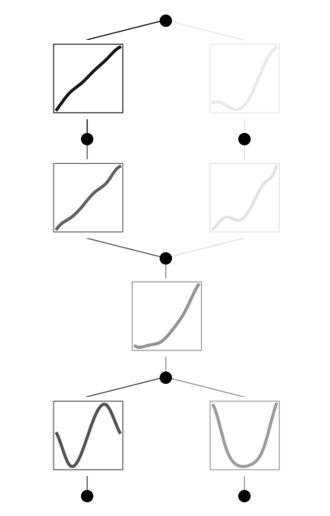
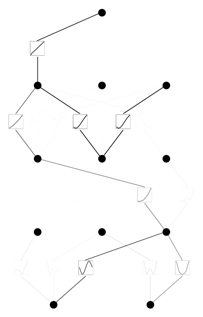
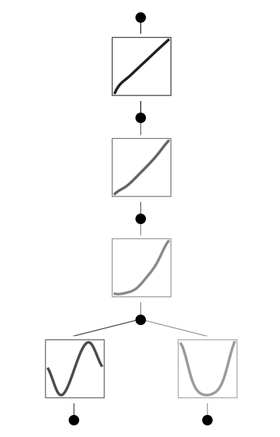

Example 11: Encouraging linearity
=================================

In cases where we don’t know how deep we should set KANs to be, one
strategy is to try from small models, grudually making models
wider/deeper until we find the minimal model that performs the task
quite well. Another strategy is to start from a big enough model and
prune it down. This jupyter notebook demonstrates cases where we go for
the second strategy. Besides sparsity along width, we also want
activation functions to be linear (‘shortcut’ along depth).

There are two relevant tricks:

(1) set the base function ‘base_fun’ to be linear;

(2) penalize spline coefficients. When spline coefficients are zero, the
    activation function is linear.

Case 1: 1D function
~~~~~~~~~~~~~~~~~~~

:math:`f(x)={\rm sin}(\pi x)`. Although we know a [1,1] KAN suffices, we
suppose we don’t know that and use a [1,1,1,1] KAN instead.

without trick

.. code:: ipython3

    from kan import *
    
    # create dataset f(x,y) = sin(pi*x). This task can be achieved by a [1,1] KAN
    f = lambda x: torch.sin(torch.pi*x[:,[0]])
    dataset = create_dataset(f, n_var=1)
    
    model = KAN(width=[1,1,1,1], grid=5, k=3, seed=0)
    
    model.train(dataset, opt="LBFGS", steps=20);

.. parsed-literal::

    train loss: 6.78e-04 | test loss: 7.09e-04 | reg: 1.29e+00 : 100%|██| 20/20 [00:03<00:00,  5.28it/s]

.. code:: ipython3

    model.plot()

with tricks

.. code:: ipython3

    from kan import *
    
    # create dataset f(x,y) = sin(pi*x). This task can be achieved by a [1,1] KAN
    f = lambda x: torch.sin(torch.pi*x[:,[0]])
    dataset = create_dataset(f, n_var=1)
    
    # set base_fun to be linear
    model = KAN(width=[1,1,1,1], grid=5, k=3, seed=0, base_fun=lambda x: x)
    
    # penality spline coefficients
    model.train(dataset, opt="LBFGS", steps=20, lamb=1e-4, lamb_coef=10.0);

.. parsed-literal::

    train loss: 4.40e-03 | test loss: 4.22e-03 | reg: 3.35e+00 : 100%|██| 20/20 [00:03<00:00,  5.78it/s]

.. code:: ipython3

    model.plot(beta=10)

Case 2: 2D function
~~~~~~~~~~~~~~~~~~~

:math:`f(x,y)={\rm exp}({\rm sin}(\pi x)+y^2)`. We know a [2,1,1] KAN
represents it. Let’s suppose we don’t know about that and use a
[2,3,3,3,1] KAN instead.

without tricks

.. code:: ipython3

    # create dataset f(x,y) = exp(sin(pi*x)+y^2)
    f = lambda x: torch.exp(torch.sin(torch.pi*x[:,[0]]) + x[:,[1]]**2)
    dataset = create_dataset(f, n_var=2)
    
    model = KAN(width=[2,3,3,3,1], grid=5, k=3, seed=0)
    model.train(dataset, opt="LBFGS", steps=20, lamb=0.01);

.. parsed-literal::

    train loss: 8.02e-02 | test loss: 8.01e-02 | reg: 1.24e+01 : 100%|██| 20/20 [00:33<00:00,  1.70s/it]

.. code:: ipython3

    model.plot()

.. code:: ipython3

    model = model.prune()
    model(dataset['train_input'])
    model.plot()

with tricks

.. code:: ipython3

    # create dataset f(x,y) = exp(sin(pi*x)+y^2)
    f = lambda x: torch.exp(torch.sin(torch.pi*x[:,[0]]) + x[:,[1]]**2)
    dataset = create_dataset(f, n_var=2)
    
    model = KAN(width=[2,3,3,3,1], grid=5, k=3, seed=0)
    model.train(dataset, opt="LBFGS", steps=20, lamb=0.01, lamb_coef=1.0);

.. parsed-literal::

    train loss: 8.19e-02 | test loss: 7.77e-02 | reg: 1.37e+01 : 100%|██| 20/20 [00:29<00:00,  1.47s/it]

.. code:: ipython3

    model.plot()

.. code:: ipython3

    model = model.prune()
    model(dataset['train_input'])
    model.plot()

