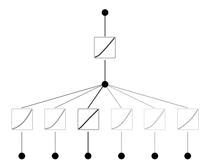
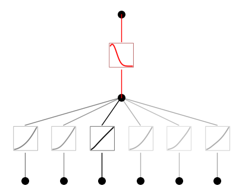
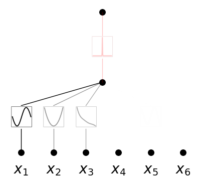
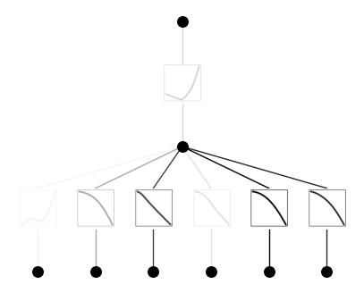
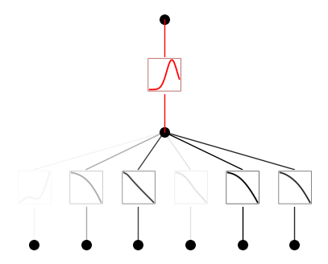
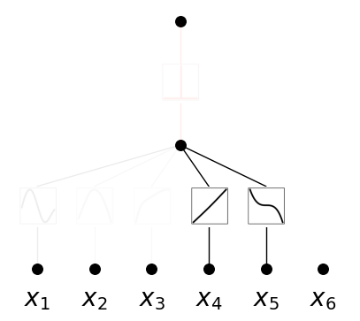

Example 12: Unsupervised learning
=================================

In this example, we will use KAN for unsupervised learning. Instead of
trying to figure out how a target variable :math:`y` depends on input
variables, we treat all variables on the equal footing (as input
variables). Below we contruct a synthetic dataset where we have six
variables :math:`x_1, x_2, x_3, x_4, x_5, x_6`. :math:`(x_1, x_2, x_3)`
are dependent such that :math:`x_3={\rm exp}({\rm sin}(\pi x_1)+x_2^2)`;
:math:`(x_4,x_5)` are dependent such that :math:`x_5=x_4^3`. And
:math:`x_6` is independent of all other variables. Can we use KANs to
discover these dependent groups?

The idea is that we treat the problem as a classification problem. The
dataset that satisfies these interdependent relations are ‘positive’
samples, while corrupted samples (by random permutation of features
across samples) are ‘negative’ samples. We want to train a KAN to output
1 when it is a positive sample, and output 0 when it is a negative
sample. We set the last layer activation to be Gaussian, so positive
samples will have zero activation in the second to last layer, while
negtive samples will have non-zero activation in the second to last
layer. We can then define the relation implicitly as :math:`g=0` where
:math:`g` is the activation in the second to last layer.

Intialize model and create dataset

.. code:: ipython3

    from kan import KAN
    import torch
    import copy
    
    
    seed = 1
    
    model = KAN(width=[6,1,1], grid=3, k=3, seed=seed)
    
    # create dataset
    
    
    def create_dataset(train_num=500, test_num=500):
        
        def generate_contrastive(x):
            # positive samples
            batch = x.shape[0]
            x[:,2] = torch.exp(torch.sin(torch.pi*x[:,0])+x[:,1]**2)
            x[:,3] = x[:,4]**3
    
            # negative samples
            def corrupt(tensor):
                y = copy.deepcopy(tensor)
                for i in range(y.shape[1]):
                    y[:,i] = y[:,i][torch.randperm(y.shape[0])]
                return y
    
            x_cor = corrupt(x)
            x = torch.cat([x, x_cor], dim=0)
            y = torch.cat([torch.ones(batch,), torch.zeros(batch,)], dim=0)[:,None]
            return x, y
            
        x = torch.rand(train_num, 6) * 2 - 1
        x_train, y_train = generate_contrastive(x)
        
        x = torch.rand(test_num, 6) * 2 - 1
        x_test, y_test = generate_contrastive(x)
        
        dataset = {}
        dataset['train_input'] = x_train
        dataset['test_input'] = x_test
        dataset['train_label'] = y_train
        dataset['test_label'] = y_test
        return dataset
    
    dataset = create_dataset()

.. code:: ipython3

    model(dataset['train_input'])
    model.plot(beta=10)

.. code:: ipython3

    # set the (1,0,0) activation to be gausssian
    #model.fix_symbolic(1,0,0,lambda x: torch.exp(-x**2/10),fit_params_bool=False)
    model.fix_symbolic(1,0,0,'gaussian',fit_params_bool=False)

.. code:: ipython3

    model(dataset['train_input'])
    model.plot(beta=10)

.. code:: ipython3

    model.fit(dataset, opt="LBFGS", steps=50, lamb=0.002, lamb_entropy=10.0);

.. parsed-literal::

    train loss: 1.68e-01 | test loss: 1.50e-01 | reg: 7.93e+00 : 100%|██| 50/50 [00:14<00:00,  3.37it/s]

.. code:: ipython3

    model.plot(in_vars=[r'$x_{}$'.format(i) for i in range(1,7)])

This gives the dependence among :math:`(x_1,x_2,x_3)`. Another random
seed can give dependence among :math:`(x_4,x_5)`.

.. code:: ipython3

    seed = 42
    model = KAN(width=[6,1,1], grid=3, k=3, seed=seed, noise_scale_base=1.0)
    dataset = create_dataset()

.. code:: ipython3

    model(dataset['train_input'])
    model.plot(beta=10)

.. code:: ipython3

    # set the (1,0,0) activation to be gausssian
    #model.fix_symbolic(1,0,0,lambda x: torch.exp(-x**2/10),fit_params_bool=False)
    model.fix_symbolic(1,0,0,'gaussian',fit_params_bool=False)

.. code:: ipython3

    model(dataset['train_input'])
    model.plot(beta=10)

.. code:: ipython3

    model.fit(dataset, opt="LBFGS", steps=100, lamb=0.001, lamb_entropy=10.0);

.. parsed-literal::

    train loss: 4.29e-02 | test loss: 9.15e-02 | reg: 1.45e+01 : 100%|█| 100/100 [00:25<00:00,  3.96it/s

.. code:: ipython3

    model.plot(in_vars=[r'$x_{}$'.format(i) for i in range(1,7)])

