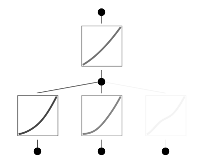
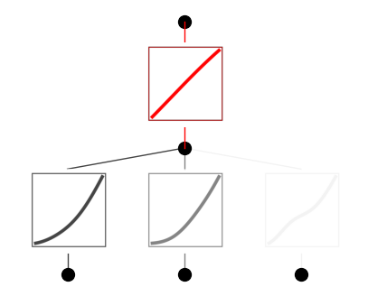
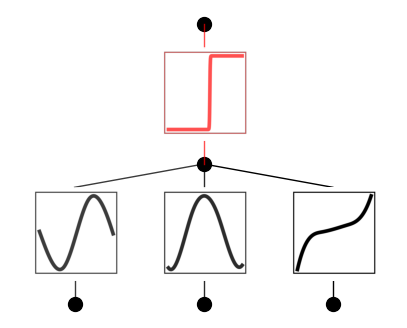

Example 13: Phase transition
============================

In this example, we will use KAN to learn phase transitions in data.
Phase transition is an important concept in science. We consider a toy
example :math:`f(x_1,x_2,x_3)` is 1 if :math:`g(x_1,x_2,x_3)>0`, and is
0 if :math:`g(x_1,x_2,x_3)<0`.
:math:`g(x_1,x_2,x_3)={\rm sin}(\pi x_1)+{\rm cos}(\pi x_2)+{\rm tan}(\frac{\pi}{2}x_3)`.

Intialize model and create dataset

.. code:: ipython3

    from kan import KAN, create_dataset
    import torch
    
    
    model = KAN(width=[3,1,1], grid=3, k=3)
    
    # create dataset
    f = lambda x: (torch.sin(torch.pi*x[:,[0]]) + torch.cos(torch.pi*x[:,[1]]) + torch.tan(torch.pi/2*x[:,[2]]) > 0).float()
    dataset = create_dataset(f, n_var=3)

.. code:: ipython3

    torch.mean(dataset['train_label'])

.. parsed-literal::

    tensor(0.4870, dtype=torch.float32)

.. code:: ipython3

    model(dataset['train_input'])
    model.plot(beta=10)

.. code:: ipython3

    # set the last activation to be sigmoid
    model.fix_symbolic(1,0,0,'sigmoid',fit_params_bool=False)

.. code:: ipython3

    model(dataset['train_input'])
    model.plot(beta=10)

.. code:: ipython3

    model.fit(dataset, opt="LBFGS", steps=50, lamb=0.001, lamb_entropy=10.);

.. parsed-literal::

    train loss: 5.92e-02 | test loss: 9.67e-02 | reg: 7.76e+00 : 100%|██| 50/50 [00:08<00:00,  5.79it/s]

.. code:: ipython3

    model.plot(beta=10)

