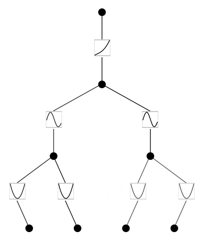
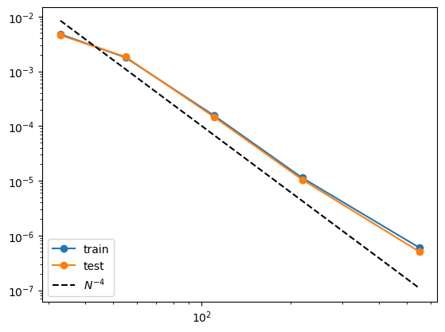
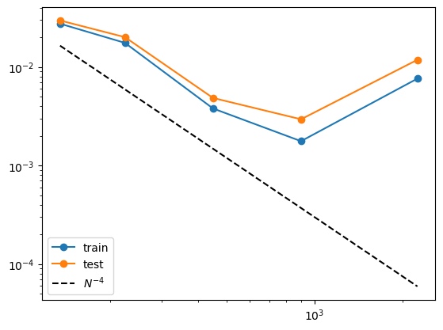

Example 2: Deep Formulas
========================

The orignal Kolmogorov-Arnold theorem says that it suffices to have
2-Layer function composition (inner and outer functions), but the
functions might be non-smooth or even fractal. We generalize KA
representation to arbitrary depths. An example a 2-Layer KAN (with
smooth activations) is unable to do is:
:math:`f(x_1,x_2,x_3,x_4)={\rm exp}({\rm sin}(x_1^2+x_2^2)+{\rm sin}(x_3^2+x_4^2))`,
which requires at least 3-Layer KANs.

Three-layer KAN
~~~~~~~~~~~~~~~

.. code:: ipython3

    from kan import KAN, create_dataset
    import torch
    
    # create a KAN: 2D inputs, 1D output, and 5 hidden neurons. cubic spline (k=3), 5 grid intervals (grid=5).
    model = KAN(width=[4,2,1,1], grid=3, k=3, seed=0)
    f = lambda x: torch.exp((torch.sin(torch.pi*(x[:,[0]]**2+x[:,[1]]**2))+torch.sin(torch.pi*(x[:,[2]]**2+x[:,[3]]**2)))/2)
    dataset = create_dataset(f, n_var=4, train_num=3000)
    
    # train the model
    model.fit(dataset, opt="LBFGS", steps=20, lamb=0.001, lamb_entropy=2.);

.. parsed-literal::

    train loss: 1.26e-02 | test loss: 1.20e-02 | reg: 6.73e+00 : 100%|██| 20/20 [00:32<00:00,  1.63s/it]

.. code:: ipython3

    model.plot(beta=10)

.. code:: ipython3

    # it seems that removing edge manually does not change results too much. We include both for completeness.
    remove_edge = True
    
    if remove_edge == True:
        model.remove_edge(0,0,1)
        model.remove_edge(0,1,1)
        model.remove_edge(0,2,0)
        model.remove_edge(0,3,0)
    else:
        pass

.. code:: ipython3

    grids = [3,5,10,20,50]
    #grids = [5]
    
    train_rmse = []
    test_rmse = []
    
    for i in range(len(grids)):
        model = KAN(width=[4,2,1,1], grid=grids[i], k=3, seed=0).initialize_from_another_model(model, dataset['train_input'])
        results = model.fit(dataset, opt="LBFGS", steps=50, stop_grid_update_step=30);
        train_rmse.append(results['train_loss'][-1].item())
        test_rmse.append(results['test_loss'][-1].item())

.. parsed-literal::

    train loss: 4.77e-03 | test loss: 4.57e-03 | reg: 7.07e+00 : 100%|██| 50/50 [00:42<00:00,  1.19it/s]
    train loss: 1.78e-03 | test loss: 1.84e-03 | reg: 7.15e+00 : 100%|██| 50/50 [00:46<00:00,  1.07it/s]
    train loss: 1.56e-04 | test loss: 1.47e-04 | reg: 7.04e+00 : 100%|██| 50/50 [01:10<00:00,  1.41s/it]
    train loss: 1.13e-05 | test loss: 1.05e-05 | reg: 7.05e+00 : 100%|██| 50/50 [01:27<00:00,  1.74s/it]
    train loss: 6.00e-07 | test loss: 5.07e-07 | reg: 7.05e+00 : 100%|██| 50/50 [01:50<00:00,  2.21s/it]

.. code:: ipython3

    import numpy as np
    import matplotlib.pyplot as plt
    
    n_params = np.array(grids) * (4*2+2*1+1*1)
    plt.plot(n_params, train_rmse, marker="o")
    plt.plot(n_params, test_rmse, marker="o")
    plt.plot(n_params, 10000*n_params**(-4.), color="black", ls="--")
    plt.legend(['train', 'test', r'$N^{-4}$'], loc="lower left")
    plt.xscale('log')
    plt.yscale('log')
    print(train_rmse)
    print(test_rmse)

.. parsed-literal::

    [0.004774762578012783, 0.0017847731212278354, 0.00015569770964015761, 1.1261090479694874e-05, 5.997260680598509e-07]
    [0.004566344580739028, 0.0018364543204432066, 0.00014685209697567987, 1.0454170453671914e-05, 5.074556425958742e-07]

Two-layer KAN
~~~~~~~~~~~~~

Now we show that a 2 two-layer KAN performs much worse for this task

.. code:: ipython3

    from kan import KAN, create_dataset
    import torch
    
    # create a KAN: 2D inputs, 1D output, and 5 hidden neurons. cubic spline (k=3), 5 grid intervals (grid=5).
    model = KAN(width=[4,9,1], grid=3, k=3, seed=0)
    f = lambda x: torch.exp((torch.sin(torch.pi*(x[:,[0]]**2+x[:,[1]]**2))+torch.sin(torch.pi*(x[:,[2]]**2+x[:,[3]]**2)))/2)
    dataset = create_dataset(f, n_var=4, train_num=3000)
    
    # train the model
    model.fit(dataset, opt="LBFGS", steps=20, lamb=0.001, lamb_entropy=2.);

.. parsed-literal::

    train loss: 7.41e-02 | test loss: 7.32e-02 | reg: 1.36e+01 : 100%|██| 20/20 [00:34<00:00,  1.74s/it]

.. code:: ipython3

    grids = [3,5,10,20,50]
    #grids = [5]
    
    train_rmse = []
    test_rmse = []
    
    for i in range(len(grids)):
        model = KAN(width=[4,9,1], grid=grids[i], k=3, seed=0).initialize_from_another_model(model, dataset['train_input'])
        results = model.fit(dataset, opt="LBFGS", steps=50, stop_grid_update_step=30);
        train_rmse.append(results['train_loss'][-1].item())
        test_rmse.append(results['test_loss'][-1].item())

.. parsed-literal::

    train loss: 2.75e-02 | test loss: 2.97e-02 | reg: 1.81e+01 : 100%|██| 50/50 [01:24<00:00,  1.69s/it]
    train loss: 1.76e-02 | test loss: 2.01e-02 | reg: 1.76e+01 : 100%|██| 50/50 [01:38<00:00,  1.97s/it]
    train loss: 3.79e-03 | test loss: 4.85e-03 | reg: 1.78e+01 : 100%|██| 50/50 [01:48<00:00,  2.16s/it]
    train loss: 1.77e-03 | test loss: 2.95e-03 | reg: 1.77e+01 : 100%|██| 50/50 [02:07<00:00,  2.55s/it]
    train loss: 7.62e-03 | test loss: 1.18e-02 | reg: 1.74e+01 : 100%|██| 50/50 [03:06<00:00,  3.73s/it]

.. code:: ipython3

    import numpy as np
    import matplotlib.pyplot as plt
    
    n_params = np.array(grids) * (4*9+9*1)
    plt.plot(n_params, train_rmse, marker="o")
    plt.plot(n_params, test_rmse, marker="o")
    plt.plot(n_params, 300*n_params**(-2.), color="black", ls="--")
    plt.legend(['train', 'test', r'$N^{-4}$'], loc="lower left")
    plt.xscale('log')
    plt.yscale('log')
    print(train_rmse)
    print(test_rmse)

.. parsed-literal::

    [0.027514415570597788, 0.0175788804953916, 0.0037939843087960545, 0.001766220055347071, 0.007622899974849284]
    [0.029668332328004216, 0.020098020933420547, 0.00485182714170569, 0.00294601553725477, 0.01183480890790476]

