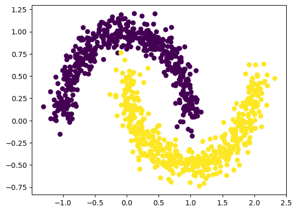

Example 3: Classification
=========================

Regression formulation
----------------------

Let’s first treat the problem as a regression problem (output dimension
= 1, MSE loss).

create the two moon dataset

.. code:: ipython3

    from kan import KAN
    import matplotlib.pyplot as plt
    from sklearn.datasets import make_moons
    import torch
    import numpy as np
    
    dataset = {}
    train_input, train_label = make_moons(n_samples=1000, shuffle=True, noise=0.1, random_state=None)
    test_input, test_label = make_moons(n_samples=1000, shuffle=True, noise=0.1, random_state=None)
    
    dataset['train_input'] = torch.from_numpy(train_input)
    dataset['test_input'] = torch.from_numpy(test_input)
    dataset['train_label'] = torch.from_numpy(train_label[:,None])
    dataset['test_label'] = torch.from_numpy(test_label[:,None])
    
    X = dataset['train_input']
    y = dataset['train_label']
    plt.scatter(X[:,0], X[:,1], c=y[:,0])

.. parsed-literal::

    <matplotlib.collections.PathCollection at 0x7f92658ae130>

.. image:: Example_3_classfication_files/Example_3_classfication_3_1.png

Train KAN

.. code:: ipython3

    model = KAN(width=[2,1], grid=3, k=3)
    
    def train_acc():
        return torch.mean((torch.round(model(dataset['train_input'])[:,0]) == dataset['train_label'][:,0]).float())
    
    def test_acc():
        return torch.mean((torch.round(model(dataset['test_input'])[:,0]) == dataset['test_label'][:,0]).float())
    
    results = model.train(dataset, opt="LBFGS", steps=20, metrics=(train_acc, test_acc));
    results['train_acc'][-1], results['test_acc'][-1]

.. parsed-literal::

    train loss: 1.56e-01 | test loss: 1.58e-01 | reg: 6.92e+00 : 100%|██| 20/20 [00:02<00:00,  9.97it/s]

.. parsed-literal::

    (1.0, 1.0)

Automatic symbolic regression

.. code:: ipython3

    lib = ['x','x^2','x^3','x^4','exp','log','sqrt','tanh','sin','tan','abs']
    model.auto_symbolic(lib=lib)
    formula = model.symbolic_formula()[0][0]
    formula

.. parsed-literal::

    fixing (0,0,0) with sin, r2=0.967966050300312
    fixing (0,1,0) with tan, r2=0.9801151730516574

.. math::

    \displaystyle 0.39 \sin{\left(3.08 x_{1} + 1.56 \right)} - 0.79 \tan{\left(0.94 x_{2} - 3.37 \right)} + 0.51

How accurate is this formula?

.. code:: ipython3

    # how accurate is this formula?
    def acc(formula, X, y):
        batch = X.shape[0]
        correct = 0
        for i in range(batch):
            correct += np.round(np.array(formula.subs('x_1', X[i,0]).subs('x_2', X[i,1])).astype(np.float64)) == y[i,0]
        return correct/batch
    
    print('train acc of the formula:', acc(formula, dataset['train_input'], dataset['train_label']))
    print('test acc of the formula:', acc(formula, dataset['test_input'], dataset['test_label']))

.. parsed-literal::

    train acc of the formula: tensor(1.)
    test acc of the formula: tensor(1.)

Classification formulation
--------------------------

Let’s then treat the problem as a regression problem (output dimension =
2, CrossEntropy loss).

Create the two moon datatset

.. code:: ipython3

    from kan import KAN
    import matplotlib.pyplot as plt
    from sklearn.datasets import make_moons
    import torch
    import numpy as np
    
    dataset = {}
    train_input, train_label = make_moons(n_samples=1000, shuffle=True, noise=0.1, random_state=None)
    test_input, test_label = make_moons(n_samples=1000, shuffle=True, noise=0.1, random_state=None)
    
    dataset['train_input'] = torch.from_numpy(train_input)
    dataset['test_input'] = torch.from_numpy(test_input)
    dataset['train_label'] = torch.from_numpy(train_label)
    dataset['test_label'] = torch.from_numpy(test_label)
    
    X = dataset['train_input']
    y = dataset['train_label']
    plt.scatter(X[:,0], X[:,1], c=y[:])

.. parsed-literal::

    <matplotlib.collections.PathCollection at 0x7f9211d28310>

Train KAN
~~~~~~~~~

.. code:: ipython3

    model = KAN(width=[2,2], grid=3, k=3)
    
    def train_acc():
        return torch.mean((torch.argmax(model(dataset['train_input']), dim=1) == dataset['train_label']).float())
    
    def test_acc():
        return torch.mean((torch.argmax(model(dataset['test_input']), dim=1) == dataset['test_label']).float())
    
    results = model.train(dataset, opt="LBFGS", steps=20, metrics=(train_acc, test_acc), loss_fn=torch.nn.CrossEntropyLoss());

.. parsed-literal::

    train loss: 4.71e-10 | test loss: 6.99e-01 | reg: 1.10e+03 : 100%|██| 20/20 [00:02<00:00,  9.84it/s]

Automatic symbolic regression

.. code:: ipython3

    lib = ['x','x^2','x^3','x^4','exp','log','sqrt','tanh','sin','abs']
    model.auto_symbolic(lib=lib)

.. parsed-literal::

    fixing (0,0,0) with sin, r2=0.8303828486153692
    fixing (0,0,1) with sin, r2=0.7801497677237067
    fixing (0,1,0) with x^3, r2=0.9535787267982471
    fixing (0,1,1) with x^3, r2=0.9533594412300308

.. code:: ipython3

    formula1, formula2 = model.symbolic_formula()[0]
    formula1

.. math::

    \displaystyle - 3113.07 \left(0.21 - x_{2}\right)^{3} - 807.36 \sin{\left(3.13 x_{1} + 1.42 \right)} - 120.29

.. code:: ipython3

    formula2

.. math::

    \displaystyle 3027.89 \left(0.21 - x_{2}\right)^{3} + 908.57 \sin{\left(3.19 x_{1} + 1.4 \right)} + 172.29

How accurate is this formula?

.. code:: ipython3

    # how accurate is this formula?
    def acc(formula1, formula2, X, y):
        batch = X.shape[0]
        correct = 0
        for i in range(batch):
            logit1 = np.array(formula1.subs('x_1', X[i,0]).subs('x_2', X[i,1])).astype(np.float64)
            logit2 = np.array(formula2.subs('x_1', X[i,0]).subs('x_2', X[i,1])).astype(np.float64)
            correct += (logit2 > logit1) == y[i]
        return correct/batch
    
    print('train acc of the formula:', acc(formula1, formula2, dataset['train_input'], dataset['train_label']))
    print('test acc of the formula:', acc(formula1, formula2, dataset['test_input'], dataset['test_label']))

.. parsed-literal::

    train acc of the formula: tensor(0.9700)
    test acc of the formula: tensor(0.9660)

