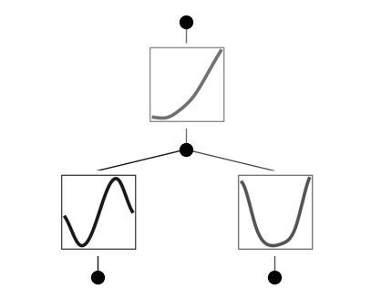
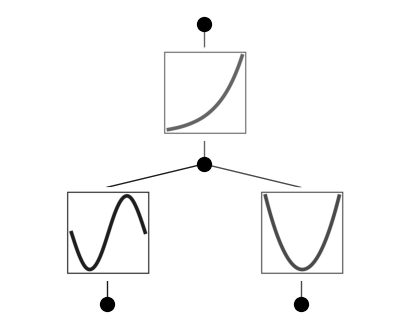
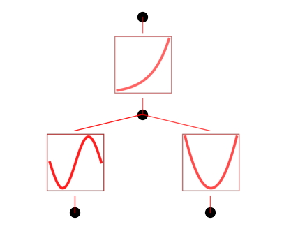
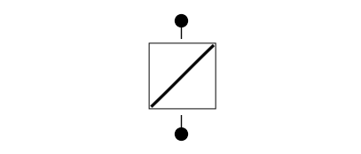
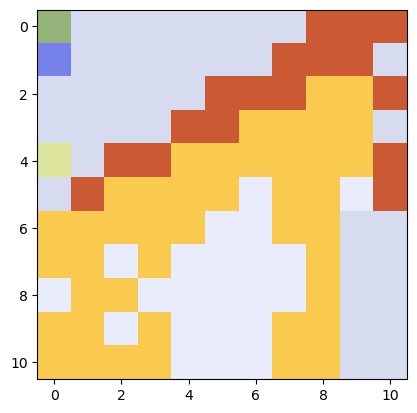
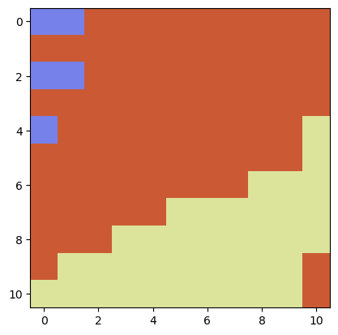

Example 4: Symbolic Regression
==============================

The symbolic space is very dense, which means getting the correct
symbolic formula (if existing at all) is a hard task. We will show how
sentitive symbolic regression is, especially in the presence of noise.
This is good or bad:

**Good**: One can easily find symbolic formulas that match with data
quite well (within some tolerable epsilon). When one does not care about
the exact symbolic formula, they might be happy with these approximate
symbolic formulas that fit their data well. These approximate symbolic
formulas provide some level of insight, have predictive power and are
easy to compute.

**Bad**: It’s hard to find the exact formula. When one does care about
the exact formula, we either care about (i) its generalizability in
future cases (like Newton’s gravity), or (ii) fitting the clean data or
solving a PDE as precise as machine precision. For case (i), it is
open-ended and requires case-by-case analysis. For case (ii), we can get
a (hopefully) clear signal of the correctness of a symbolic formula by
noticing the loss to go down to near machine precision. We will use an
example to demonstrate this below.

Part I: Automated vs manual symbolic regression (How can we know that we get the exact formula?)
------------------------------------------------------------------------------------------------

.. code:: ipython3

    from kan import *
    # create a KAN: 2D inputs, 1D output, and 5 hidden neurons. cubic spline (k=3), 5 grid intervals (grid=5).
    model = KAN(width=[2,5,1], grid=5, k=3, seed=0)
    
    # create dataset f(x,y) = exp(sin(pi*x)+y^2)
    f = lambda x: torch.exp(torch.sin(torch.pi*x[:,[0]]) + x[:,[1]]**2)
    dataset = create_dataset(f, n_var=2)
    dataset['train_input'].shape, dataset['train_label'].shape

.. parsed-literal::

    (torch.Size([1000, 2]), torch.Size([1000, 1]))

.. code:: ipython3

    # train the model
    model.fit(dataset, opt="LBFGS", steps=20, lamb=0.01, lamb_entropy=10.);

.. parsed-literal::

    train loss: 1.54e-01 | test loss: 1.30e-01 | reg: 2.02e+01 : 100%|██| 20/20 [00:15<00:00,  1.26it/s]

.. code:: ipython3

    model = model.prune()
    model(dataset['train_input'])
    model.plot()

.. code:: ipython3

    # sin appears at the top of the suggestion list, which is good!
    model.suggest_symbolic(0,0,0)

.. parsed-literal::

    function , r2
    sin , 0.9981093780355159
    gaussian , 0.9360582190339871
    tanh , 0.8616859029524302
    sigmoid , 0.8585390273680941
    arctan , 0.8428622193038047

.. parsed-literal::

    ('sin',
     (<function kan.utils.<lambda>(x)>, <function kan.utils.<lambda>(x)>),
     0.9981093780355159)

.. code:: ipython3

    # x^2 appears in the suggestion list (usually not top 1), but it is fine!
    model.suggest_symbolic(0,1,0)

.. parsed-literal::

    function , r2
    cosh , 0.9910665391502297
    x^2 , 0.9885210310683376
    gaussian , 0.9883627975330689
    sin , 0.9843196558672351
    x^4 , 0.9403353142717915

.. parsed-literal::

    ('cosh',
     (<function kan.utils.<lambda>(x)>, <function kan.utils.<lambda>(x)>),
     0.9910665391502297)

.. code:: ipython3

    # exp not even appears in the list (but note how high correlation of all these functions), which is sad!
    model.suggest_symbolic(1,0,0)

.. parsed-literal::

    function , r2
    sin , 0.9995702405196035
    x^2 , 0.9992413667649066
    cosh , 0.9990483455142343
    gaussian , 0.9989441353410312
    tanh , 0.9986571504172722

.. parsed-literal::

    ('sin',
     (<function kan.utils.<lambda>(x)>, <function kan.utils.<lambda>(x)>),
     0.9995702405196035)

.. code:: ipython3

    # let's try suggesting more by changing topk. Exp should appear in the list
    # But it's very unclear why should we prefer exp over others. All of them have quite high correlation with the learned spline.
    model.suggest_symbolic(1,0,0,topk=15)

.. parsed-literal::

    function , r2
    sin , 0.9995702405196035
    x^2 , 0.9992413667649066
    cosh , 0.9990483455142343
    gaussian , 0.9989441353410312
    tanh , 0.9986571504172722
    sigmoid , 0.998657149375774
    arctan , 0.9970617106973462
    x^3 , 0.9962099497478061
    x^4 , 0.9947572943342223
    exp , 0.9913715887470934
    1/x^4 , 0.9890801101893518
    1/x^3 , 0.9884748093165208
    1/x^2 , 0.9874565358732027
    1/x , 0.9853279073610555
    1/sqrt(x) , 0.9830898307444438

.. parsed-literal::

    ('sin',
     (<function kan.utils.<lambda>(x)>, <function kan.utils.<lambda>(x)>),
     0.9995702405196035)

Let’s train more! The loss goes down and the splines should be more
exact

.. code:: ipython3

    model.fit(dataset, opt="LBFGS", steps=20);
    model.plot()

.. parsed-literal::

    train loss: 4.74e-03 | test loss: 4.80e-03 | reg: 2.93e+00 : 100%|██| 20/20 [00:03<00:00,  6.47it/s]

.. code:: ipython3

    # sin appears at the top of the suggestion list, which is good!
    model.suggest_symbolic(0,0,0)

.. parsed-literal::

    function , r2
    sin , 0.999987075018884
    gaussian , 0.921655835107275
    tanh , 0.8631397517896181
    sigmoid , 0.8594117556407576
    arctan , 0.8440367634049246

.. parsed-literal::

    ('sin',
     (<function kan.utils.<lambda>(x)>, <function kan.utils.<lambda>(x)>),
     0.999987075018884)

.. code:: ipython3

    # x^2 appears at the top of the suggestion list, which is good!
    # But note how competitive cosh and gaussian are. They are also locally quadratic.
    model.suggest_symbolic(0,1,0)

.. parsed-literal::

    function , r2
    x^2 , 0.9999996930603142
    cosh , 0.9999917592117541
    gaussian , 0.9999827145861027
    sin , 0.9980876045759569
    abs , 0.9377603078924529

.. parsed-literal::

    ('x^2',
     (<function kan.utils.<lambda>(x)>, <function kan.utils.<lambda>(x)>),
     0.9999996930603142)

.. code:: ipython3

    # exp appears at the top of the suggestion list, which is good!
    model.suggest_symbolic(1,0,0)

.. parsed-literal::

    function , r2
    exp , 0.9999987580912774
    tanh , 0.9999187437583558
    cosh , 0.9999121147442106
    sigmoid , 0.9998776769631791
    gaussian , 0.9998535744392626

.. parsed-literal::

    ('exp',
     (<function kan.utils.<lambda>(x)>, <function kan.utils.<lambda>(x)>),
     0.9999987580912774)

The takeaway is that symbolic regression is very sensitive to noise, so
if we want to extract exact symbolic formulas from trained networks, the
networks need to be trained to quite high accuracy!

.. code:: ipython3

    # now let's replace every activation function with its top 1 symbolic suggestion. This is implmented in auto_symbolic()
    model.auto_symbolic()
    
    # if the user wants to constrain the symbolic space, they can pass in their symbolic libarary
    # lib = ['sin', 'x^2', 'exp']
    # model.auto_symbolic(lib=lib)

.. parsed-literal::

    fixing (0,0,0) with sin, r2=0.999987075018884
    fixing (0,1,0) with x^2, r2=0.9999996930603142
    fixing (1,0,0) with exp, r2=0.9999987580912774

After retraining, we get (almost) machine precision! This is the winning
signal that this formula is (very likely to be) exact!

.. code:: ipython3

    model.fit(dataset, opt="LBFGS", steps=20);
    model.plot()

.. parsed-literal::

    train loss: 2.13e-10 | test loss: 2.78e-11 | reg: 2.93e+00 : 100%|██| 20/20 [00:01<00:00, 11.85it/s]

.. code:: ipython3

    # obtaining symbolic formula
    formula, variables = model.symbolic_formula()
    formula[0]

.. math::

    \displaystyle 1.0 e^{1.0 x_{2}^{2} + 1.0 \sin{\left(3.14 x_{1} \right)}}

.. code:: ipython3

    # if you want to rename your variables, you could use the "var" argument
    formula, variables = model.symbolic_formula(var=['\\alpha','y'])
    formula[0]

.. math::

    \displaystyle 1.0 e^{1.0 y^{2} + 1.0 \sin{\left(3.14 \alpha \right)}}

.. code:: ipython3

    # one can even postprocess the formula (e.g., taking derivatives)
    from sympy import *
    diff(formula[0], variables[0])

.. math::

    \displaystyle 3.14013671875 e^{1.0 y^{2} + 1.0 \sin{\left(3.14 \alpha \right)}} \cos{\left(3.14 \alpha \right)}

When do we know the formula we guessed is wrong (not exact)? If the data
is clean (no noise), we should see the training loss does not reach
machine precision

.. code:: ipython3

    # let's replace (0,1,0) with cosh
    model.fix_symbolic(0,1,0,'cosh')

.. parsed-literal::

    r2 is 0.999993562134913

.. parsed-literal::

    tensor(1.0000)

.. code:: ipython3

    # this loss is stuck at around 1e-3 RMSE, which is good, but not machine precision.
    model.fit(dataset, opt="LBFGS", steps=20);
    model.plot()

.. parsed-literal::

    train loss: 1.26e-03 | test loss: 1.28e-03 | reg: 2.93e+00 : 100%|██| 20/20 [00:03<00:00,  6.54it/s]

Part II: How hard (ill-defined) is symbolic regression, really?
---------------------------------------------------------------

In part I, we show how people can use KANs for symbolic regression, but
caveat that we need to train KANs to quite high precision. This is not a
problem specific to KANs though; this issue originates from symbolic
regression. The space of symbolic formulas is actually quite dense, so
tiny noise can make one symbolic formula transit to another.

1D example: Adding noise to a bounded region sine
~~~~~~~~~~~~~~~~~~~~~~~~~~~~~~~~~~~~~~~~~~~~~~~~~

.. code:: ipython3

    def toy(bound=1., noise=0., fun=lambda x: torch.sin(torch.pi*x)):
    
        num_pts = 101
        x = torch.linspace(-bound,bound,steps=num_pts)
        x = x[:,None]
        y = fun(x) + torch.normal(0,1,size=(num_pts,)) * noise
        dataset = {}
        dataset['train_input'] = dataset['test_input'] = x
        dataset['train_label'] = dataset['test_label'] = y
        model = KAN(width=[1,1], grid=5, k=3, seed=0, grid_range=(-bound,bound))
        model.fit(dataset, opt="LBFGS", steps=20)
        model.suggest_symbolic(0,0,0)
        model.plot()

.. code:: ipython3

    # when the function is whole range "bound=1."" (captures a whole period of sine) and has zero noise "noise=0."
    # it is quite clear the function is clear
    toy()

.. parsed-literal::

    train loss: 2.79e-03 | test loss: 2.79e-03 | reg: 3.12e-01 : 100%|██| 20/20 [00:01<00:00, 13.38it/s]

.. parsed-literal::

    function , r2
    sin , 0.9999842278946689
    gaussian , 0.9184406012010798
    tanh , 0.8635381099424172
    sigmoid , 0.8601324746874981
    arctan , 0.845004037750832

.. code:: ipython3

    # even with large noise, sine can be revealed, yeah!
    toy(noise=1.)

.. parsed-literal::

    train loss: 9.30e-01 | test loss: 9.30e-01 | reg: 3.12e-01 : 100%|██| 20/20 [00:00<00:00, 40.68it/s]

.. parsed-literal::

    function , r2
    sin , 0.9999842278898873
    gaussian , 0.9184406080128915
    tanh , 0.8635381682633535
    sigmoid , 0.8601325311561702
    arctan , 0.8450040982073312

.. code:: ipython3

    # but when bound is small and there is noise, it starts to screw up (at least becomes less clear why we should prefer sine)
    toy(bound = 0.1, noise=0.1)

.. parsed-literal::

    train loss: 9.30e-02 | test loss: 9.30e-02 | reg: 7.15e-01 : 100%|██| 20/20 [00:00<00:00, 43.08it/s]

.. parsed-literal::

    function , r2
    sin , 0.9999916591202906
    arctan , 0.9999847147948822
    tanh , 0.999984517365484
    x , 0.9999796669306419
    abs , 0.9999796669306419

Phase diagram of symbolic regression (how fratcal/chaotic is my phase diagram?)
~~~~~~~~~~~~~~~~~~~~~~~~~~~~~~~~~~~~~~~~~~~~~~~~~~~~~~~~~~~~~~~~~~~~~~~~~~~~~~~

mix three functions :math:`f_1(x)={\rm sin}(x)`, :math:`f_2(x)=x^2`, and :math:`f_3(x)={\rm exp}(x)` such that :math:`f(x)=af_1(x)+bf_2(x)+(1-a-b)f_3(x)`. Symbolically regress :math:`f(x)`.
^^^^^^^^^^^^^^^^^^^^^^^^^^^^^^^^^^^^^^^^^^^^^^^^^^^^^^^^^^^^^^^^^^^^^^^^^^^^^^^^^^^^^^^^^^^^^^^^^^^^^^^^^^^^^^^^^^^^^^^^^^^^^^^^^^^^^^^^^^^^^^^^^^^^^^^^^^^^^^^^^^^^^^^^^^^^^^^^^^^^^^^^^^^^^

.. code:: ipython3

    def mix(a, b, bound=1):
        num_pts = 101
        x = torch.linspace(-bound,bound,steps=num_pts)
        x = x[:,None]
        y = a * torch.sin(x) + b * x**2 + (1-a-b) * torch.exp(x)
        dataset = {}
        dataset['train_input'] = dataset['test_input'] = x
        dataset['train_label'] = dataset['test_label'] = y
        model = KAN(width=[1,1], grid=10, k=3, seed=0, grid_range=(-bound,bound))
        model.fit(dataset, opt="LBFGS", steps=20)
        return model.suggest_symbolic(0,0,0)[0]
        

.. code:: ipython3

    mix(a=0.2, b=0.0)

.. parsed-literal::

    train loss: 2.40e-06 | test loss: 2.40e-06 | reg: 2.64e-01 : 100%|██| 20/20 [00:00<00:00, 29.47it/s]

.. parsed-literal::

    function , r2
    cosh , 0.999997477547859
    exp , 0.9999670134850122
    sigmoid , 0.9999606621996252
    tanh , 0.9999524925435431
    1/x^4 , 0.9999517925552405

.. parsed-literal::

    'cosh'

.. code:: ipython3

    # let's do a phase diagram, which looks quite "fractal"
    num = 11
    a_arr = np.linspace(0,1,num=num)
    b_arr = np.linspace(0,1,num=num)
    sf_mat = np.empty((num,num), dtype='U8')
    
    for i in range(num):
        for j in range(num):
            a = a_arr[i]; b = b_arr[j]
            sf_mat[i,j] = mix(a, b)

.. parsed-literal::

    train loss: 2.77e-06 | test loss: 2.77e-06 | reg: 2.72e-01 : 100%|██| 20/20 [00:00<00:00, 43.39it/s]

.. parsed-literal::

    function , r2
    exp , 0.9999999999827021
    cosh , 0.9999999999827017
    tanh , 0.999973163748351
    sigmoid , 0.9999497922899572
    1/x^4 , 0.9999369992759012

.. parsed-literal::

    train loss: 2.52e-06 | test loss: 2.52e-06 | reg: 2.45e-01 : 100%|██| 20/20 [00:01<00:00, 17.30it/s]

.. parsed-literal::

    function , r2
    cosh , 0.9999988787247418
    x^4 , 0.9999910879853997
    gaussian , 0.999967486241568
    tanh , 0.9999518786252838
    sigmoid , 0.999948450438625

.. parsed-literal::

    train loss: 2.28e-06 | test loss: 2.28e-06 | reg: 2.18e-01 : 100%|██| 20/20 [00:00<00:00, 43.13it/s]

.. parsed-literal::

    function , r2
    cosh , 0.9999946575638085
    x^3 , 0.9999164116905525
    gaussian , 0.9997468080512466
    x^4 , 0.9996076211798797
    tanh , 0.9995835694860234

.. parsed-literal::

    train loss: 2.04e-06 | test loss: 2.04e-06 | reg: 1.94e-01 : 100%|██| 20/20 [00:00<00:00, 39.90it/s]

.. parsed-literal::

    function , r2
    cosh , 0.9999854846669585
    x^3 , 0.9988138920172807
    gaussian , 0.9985227715662934
    x^2 , 0.998477650070286
    sin , 0.9981948138629363

.. parsed-literal::

    train loss: 1.80e-06 | test loss: 1.80e-06 | reg: 1.71e-01 : 100%|██| 20/20 [00:00<00:00, 39.65it/s]

.. parsed-literal::

    function , r2
    cosh , 0.9999662581221136
    x^2 , 0.9986097449347123
    sin , 0.998284128651733
    x^3 , 0.9936582971043266
    gaussian , 0.9936463187510403

.. parsed-literal::

    train loss: 1.55e-06 | test loss: 1.55e-06 | reg: 1.51e-01 : 100%|██| 20/20 [00:00<00:00, 44.84it/s]

.. parsed-literal::

    function , r2
    cosh , 0.9999418178114038
    x^2 , 0.9987944480619438
    sin , 0.9984323316332249
    gaussian , 0.9949686832586251
    tanh , 0.9764364382302457

.. parsed-literal::

    train loss: 1.31e-06 | test loss: 1.31e-06 | reg: 1.36e-01 : 100%|██| 20/20 [00:00<00:00, 39.78it/s]

.. parsed-literal::

    function , r2
    cosh , 0.9999041816268858
    x^2 , 0.9990436001283093
    sin , 0.9986633245000535
    gaussian , 0.9958810456319825
    tanh , 0.9380270364085883

.. parsed-literal::

    train loss: 1.07e-06 | test loss: 1.07e-06 | reg: 1.29e-01 : 100%|██| 20/20 [00:00<00:00, 40.74it/s]

.. parsed-literal::

    function , r2
    cosh , 0.9998655818685623
    x^2 , 0.9993505000566273
    sin , 0.9989811585960545
    gaussian , 0.9916259900602326
    x^4 , 0.9172564495092251

.. parsed-literal::

    train loss: 8.32e-07 | test loss: 8.32e-07 | reg: 1.27e-01 : 100%|██| 20/20 [00:00<00:00, 44.57it/s]

.. parsed-literal::

    function , r2
    x^2 , 0.9996700824962792
    sin , 0.9993888581205067
    cosh , 0.998561267814873
    gaussian , 0.9707186857583728
    abs , 0.9254006963892939

.. parsed-literal::

    train loss: 6.00e-07 | test loss: 6.00e-07 | reg: 1.30e-01 : 100%|██| 20/20 [00:00<00:00, 44.38it/s]

.. parsed-literal::

    function , r2
    x^2 , 0.9999132817985119
    sin , 0.9994936051757877
    gaussian , 0.9994851357951505
    cosh , 0.987913942212583
    abs , 0.933975094122013

.. parsed-literal::

    train loss: 3.79e-07 | test loss: 3.79e-07 | reg: 1.38e-01 : 100%|██| 20/20 [00:00<00:00, 43.23it/s]

.. parsed-literal::

    function , r2
    x^2 , 0.9999999998837575
    cosh , 0.9999099009608192
    gaussian , 0.9997105669072212
    sin , 0.9989290599804755
    abs , 0.93740817498461

.. parsed-literal::

    train loss: 2.58e-06 | test loss: 2.58e-06 | reg: 2.68e-01 : 100%|██| 20/20 [00:00<00:00, 27.79it/s]

.. parsed-literal::

    function , r2
    arctan , 0.9999798378098914
    cosh , 0.9999771001456361
    tanh , 0.9999633902076488
    sigmoid , 0.9999541433147963
    1/x^4 , 0.9999236487568766

.. parsed-literal::

    train loss: 2.34e-06 | test loss: 2.34e-06 | reg: 2.40e-01 : 100%|██| 20/20 [00:00<00:00, 20.99it/s]

.. parsed-literal::

    function , r2
    cosh , 0.9999937207935639
    x^4 , 0.9999862674170232
    gaussian , 0.9999638602636551
    sigmoid , 0.9999448387268524
    x^3 , 0.9999438604212395

.. parsed-literal::

    train loss: 2.10e-06 | test loss: 2.10e-06 | reg: 2.14e-01 : 100%|██| 20/20 [00:00<00:00, 40.36it/s]

.. parsed-literal::

    function , r2
    cosh , 0.9999949634057903
    x^3 , 0.9998843971854673
    gaussian , 0.9997599295163522
    tanh , 0.9996162757398458
    sigmoid , 0.9996147714224425

.. parsed-literal::

    train loss: 1.86e-06 | test loss: 1.86e-06 | reg: 1.89e-01 : 100%|██| 20/20 [00:00<00:00, 50.75it/s]

.. parsed-literal::

    function , r2
    cosh , 0.999982696239627
    x^2 , 0.9991234483879446
    sin , 0.9988859253126088
    x^3 , 0.9987772391387374
    gaussian , 0.998656639925584

.. parsed-literal::

    train loss: 1.61e-06 | test loss: 1.61e-06 | reg: 1.66e-01 : 100%|██| 20/20 [00:00<00:00, 43.78it/s]

.. parsed-literal::

    function , r2
    cosh , 0.9999905018303474
    x^2 , 0.9992854342507987
    sin , 0.998871759377929
    gaussian , 0.9985721495291437
    x^3 , 0.9939912670589373

.. parsed-literal::

    train loss: 1.37e-06 | test loss: 1.37e-06 | reg: 1.45e-01 : 100%|██| 20/20 [00:00<00:00, 36.50it/s]

.. parsed-literal::

    function , r2
    cosh , 0.9999796806444573
    x^2 , 0.999480532354729
    sin , 0.9991909206588246
    gaussian , 0.9964682981271429
    tanh , 0.9772535252536733

.. parsed-literal::

    train loss: 1.13e-06 | test loss: 1.13e-06 | reg: 1.29e-01 : 100%|██| 20/20 [00:00<00:00, 46.90it/s]

.. parsed-literal::

    function , r2
    cosh , 0.9999738670223917
    x^2 , 0.9996973599778907
    sin , 0.9994116683309964
    gaussian , 0.9973545677199919
    tanh , 0.9376915470857489

.. parsed-literal::

    train loss: 8.85e-07 | test loss: 8.85e-07 | reg: 1.22e-01 : 100%|██| 20/20 [00:00<00:00, 43.78it/s]

.. parsed-literal::

    function , r2
    x^2 , 0.9998957469235318
    cosh , 0.9998722722380837
    sin , 0.9996590283030754
    gaussian , 0.9939866829832639
    abs , 0.9232648879118915

.. parsed-literal::

    train loss: 6.46e-07 | test loss: 6.46e-07 | reg: 1.20e-01 : 100%|██| 20/20 [00:00<00:00, 36.61it/s]

.. parsed-literal::

    function , r2
    x^2 , 0.9999974059407801
    sin , 0.999834148899939
    cosh , 0.9962063866033833
    gaussian , 0.9754127817001195
    abs , 0.9311623016073874

.. parsed-literal::

    train loss: 4.18e-07 | test loss: 4.18e-07 | reg: 1.24e-01 : 100%|██| 20/20 [00:00<00:00, 41.57it/s]

.. parsed-literal::

    function , r2
    x^2 , 0.9999226429006036
    sin , 0.9998636426802294
    cosh , 0.9997752175292851
    gaussian , 0.999679958882009
    abs , 0.9372397600766894

.. parsed-literal::

    train loss: 2.23e-07 | test loss: 2.23e-07 | reg: 1.33e-01 : 100%|██| 20/20 [00:00<00:00, 40.07it/s]

.. parsed-literal::

    function , r2
    cosh , 0.9995568150249838
    gaussian , 0.9993467471612426
    sin , 0.9985870166410652
    x^2 , 0.9984339446779963
    abs , 0.9362895855226272

.. parsed-literal::

    train loss: 2.41e-06 | test loss: 2.41e-06 | reg: 2.64e-01 : 100%|██| 20/20 [00:00<00:00, 50.70it/s]

.. parsed-literal::

    function , r2
    cosh , 0.9999974775415001
    exp , 0.9999951134484997
    sigmoid , 0.9999606621811076
    tanh , 0.9999524925186463
    1/x^4 , 0.9999517925693375

.. parsed-literal::

    train loss: 2.16e-06 | test loss: 2.16e-06 | reg: 2.36e-01 : 100%|██| 20/20 [00:00<00:00, 38.09it/s]

.. parsed-literal::

    function , r2
    cosh , 0.9999987855303939
    x^3 , 0.9999772484086487
    x^4 , 0.9999697464110736
    gaussian , 0.9999593591292381
    sigmoid , 0.9999388880060787

.. parsed-literal::

    train loss: 1.92e-06 | test loss: 1.92e-06 | reg: 2.09e-01 : 100%|██| 20/20 [00:00<00:00, 43.12it/s]

.. parsed-literal::

    function , r2
    cosh , 0.99999935535384
    x^3 , 0.9998219698585193
    gaussian , 0.9997659958370352
    tanh , 0.9996382852712733
    sigmoid , 0.999636745445751

.. parsed-literal::

    train loss: 1.66e-06 | test loss: 1.66e-06 | reg: 1.84e-01 : 100%|██| 20/20 [00:01<00:00, 17.83it/s]

.. parsed-literal::

    function , r2
    cosh , 0.9999988957805453
    x^2 , 0.9996199310076759
    sin , 0.9994371092496096
    gaussian , 0.9987635279928482
    x^3 , 0.9986602848898886

.. parsed-literal::

    train loss: 1.43e-06 | test loss: 1.43e-06 | reg: 1.60e-01 : 100%|██| 20/20 [00:00<00:00, 40.57it/s]

.. parsed-literal::

    function , r2
    cosh , 0.9999954784528895
    x^2 , 0.9997669036986749
    sin , 0.9994959364448105
    gaussian , 0.9992839638818944
    x^3 , 0.9941048878141949

.. parsed-literal::

    train loss: 1.19e-06 | test loss: 1.19e-06 | reg: 1.39e-01 : 100%|██| 20/20 [00:00<00:00, 40.14it/s]

.. parsed-literal::

    function , r2
    x^2 , 0.9999057877413986
    cosh , 0.9997878856454342
    sin , 0.9997010374773055
    gaussian , 0.9978271729275431
    sigmoid , 0.9780411748220801

.. parsed-literal::

    train loss: 9.43e-07 | test loss: 9.43e-07 | reg: 1.23e-01 : 100%|██| 20/20 [00:00<00:00, 42.49it/s]

.. parsed-literal::

    function , r2
    x^2 , 0.9999916810769826
    sin , 0.9998540286212848
    gaussian , 0.9985646631915182
    cosh , 0.9978692658702253
    tanh , 0.9372183456949574

.. parsed-literal::

    train loss: 7.05e-07 | test loss: 7.05e-07 | reg: 1.15e-01 : 100%|██| 20/20 [00:00<00:00, 46.45it/s]

.. parsed-literal::

    function , r2
    x^2 , 0.9999411945915794
    sin , 0.999917846530661
    cosh , 0.9993168732975628
    gaussian , 0.9961111289682559
    abs , 0.9302392302167873

.. parsed-literal::

    train loss: 4.75e-07 | test loss: 4.75e-07 | reg: 1.13e-01 : 100%|██| 20/20 [00:00<00:00, 48.74it/s]

.. parsed-literal::

    function , r2
    sin , 0.9997864168657743
    x^2 , 0.9996579498087828
    cosh , 0.9942754283755333
    gaussian , 0.9798855202432393
    abs , 0.9369096690204137

.. parsed-literal::

    train loss: 2.64e-07 | test loss: 2.64e-07 | reg: 1.18e-01 : 100%|██| 20/20 [00:00<00:00, 43.76it/s]

.. parsed-literal::

    function , r2
    sin , 0.9992177278915768
    x^2 , 0.999137470112453
    gaussian , 0.999088490162276
    cosh , 0.9988973034727238
    abs , 0.9396624038444488

.. parsed-literal::

    train loss: 1.78e-07 | test loss: 1.78e-07 | reg: 1.27e-01 : 100%|██| 20/20 [00:00<00:00, 45.43it/s]

.. parsed-literal::

    function , r2
    x^2 , 0.998540782190707
    cosh , 0.998497783054037
    sin , 0.9981679237204564
    gaussian , 0.9980799911419045
    abs , 0.9348151361956722

.. parsed-literal::

    train loss: 2.22e-06 | test loss: 2.22e-06 | reg: 2.60e-01 : 100%|██| 20/20 [00:00<00:00, 47.65it/s]

.. parsed-literal::

    function , r2
    cosh , 0.9999930298639131
    exp , 0.9999836112405796
    tanh , 0.9999821515315185
    x^4 , 0.9999746028947676
    arctan , 0.9999713956244152

.. parsed-literal::

    train loss: 1.98e-06 | test loss: 1.98e-06 | reg: 2.32e-01 : 100%|██| 20/20 [00:00<00:00, 47.28it/s]

.. parsed-literal::

    function , r2
    cosh , 0.9999962889824672
    x^3 , 0.9999811150224204
    gaussian , 0.9999534848375812
    tanh , 0.9999336923279952
    sigmoid , 0.9999305175966535

.. parsed-literal::

    train loss: 1.74e-06 | test loss: 1.74e-06 | reg: 2.05e-01 : 100%|██| 20/20 [00:00<00:00, 40.82it/s]

.. parsed-literal::

    function , r2
    cosh , 0.9999962156472607
    x^2 , 0.9998260034206992
    gaussian , 0.9997664875004227
    x^3 , 0.9997117036934391
    sin , 0.9997113407524149

.. parsed-literal::

    train loss: 1.49e-06 | test loss: 1.49e-06 | reg: 1.79e-01 : 100%|██| 20/20 [00:00<00:00, 47.64it/s]

.. parsed-literal::

    function , r2
    cosh , 0.9999544661515833
    x^2 , 0.9999233768388777
    sin , 0.9998096068574465
    gaussian , 0.998846633386868
    x^3 , 0.9984457355669536

.. parsed-literal::

    train loss: 1.25e-06 | test loss: 1.25e-06 | reg: 1.55e-01 : 100%|██| 20/20 [00:00<00:00, 39.89it/s]

.. parsed-literal::

    function , r2
    x^2 , 0.9999875880501998
    cosh , 0.9999623957580879
    sin , 0.9998842247678139
    gaussian , 0.9997446918456595
    x^3 , 0.9939812278070211

.. parsed-literal::

    train loss: 1.01e-06 | test loss: 1.01e-06 | reg: 1.33e-01 : 100%|██| 20/20 [00:00<00:00, 47.68it/s]

.. parsed-literal::

    function , r2
    x^2 , 0.9999658213074126
    sin , 0.9998830954293118
    cosh , 0.9991428566544741
    gaussian , 0.9988921913945791
    tanh , 0.9787975107817283

.. parsed-literal::

    train loss: 7.68e-07 | test loss: 7.68e-07 | reg: 1.16e-01 : 100%|██| 20/20 [00:00<00:00, 44.81it/s]

.. parsed-literal::

    function , r2
    sin , 0.9999324078991241
    x^2 , 0.9997596795941941
    cosh , 0.9994865919109623
    gaussian , 0.9994862477413593
    tanh , 0.9365762760176262

.. parsed-literal::

    train loss: 5.36e-07 | test loss: 5.36e-07 | reg: 1.08e-01 : 100%|██| 20/20 [00:00<00:00, 43.66it/s]

.. parsed-literal::

    function , r2
    sin , 0.9997548044475728
    x^2 , 0.9992301995166885
    cosh , 0.9979137733537407
    gaussian , 0.9977997203751177
    abs , 0.9377138311216435

.. parsed-literal::

    train loss: 3.19e-07 | test loss: 3.19e-07 | reg: 1.07e-01 : 100%|██| 20/20 [00:00<00:00, 41.27it/s]

.. parsed-literal::

    function , r2
    sin , 0.9990790086224685
    x^2 , 0.998306797086686
    cosh , 0.9912197954445299
    gaussian , 0.983836484418377
    abs , 0.9422994090520702

.. parsed-literal::

    train loss: 1.88e-07 | test loss: 1.88e-07 | reg: 1.12e-01 : 100%|██| 20/20 [00:00<00:00, 38.48it/s]

.. parsed-literal::

    function , r2
    sin , 0.9974240586295893
    gaussian , 0.9973311148206122
    x^2 , 0.9971996559803431
    cosh , 0.9968911992725868
    abs , 0.9402041148610969

.. parsed-literal::

    train loss: 2.92e-07 | test loss: 2.92e-07 | reg: 1.21e-01 : 100%|██| 20/20 [00:00<00:00, 40.66it/s]

.. parsed-literal::

    function , r2
    cosh , 0.9964799073278351
    x^2 , 0.9963340407057836
    sin , 0.9959863127871974
    gaussian , 0.9956440035977147
    abs , 0.9297638765888608

.. parsed-literal::

    train loss: 2.04e-06 | test loss: 2.04e-06 | reg: 2.57e-01 : 100%|██| 20/20 [00:01<00:00, 19.44it/s]

.. parsed-literal::

    function , r2
    x^4 , 0.9999894819511871
    x^3 , 0.9999835048772354
    tanh , 0.9999809889835496
    cosh , 0.9999804113519436
    sigmoid , 0.9999728460390712

.. parsed-literal::

    train loss: 1.80e-06 | test loss: 1.80e-06 | reg: 2.28e-01 : 100%|██| 20/20 [00:00<00:00, 36.75it/s]

.. parsed-literal::

    function , r2
    cosh , 0.9999673825431549
    gaussian , 0.9999462038064604
    x^2 , 0.9999377574579958
    x^3 , 0.999934739879401
    tanh , 0.9999253640056137

.. parsed-literal::

    train loss: 1.56e-06 | test loss: 1.56e-06 | reg: 2.00e-01 : 100%|██| 20/20 [00:00<00:00, 40.62it/s]

.. parsed-literal::

    function , r2
    x^2 , 0.9999856957320528
    cosh , 0.9999806264360336
    sin , 0.9999333905161271
    gaussian , 0.9997629877627796
    tanh , 0.9996615330714775

.. parsed-literal::

    train loss: 1.31e-06 | test loss: 1.31e-06 | reg: 1.74e-01 : 100%|██| 20/20 [00:00<00:00, 42.76it/s]

.. parsed-literal::

    function , r2
    x^2 , 0.9999803474424048
    sin , 0.9999690179361935
    cosh , 0.9996537442008128
    gaussian , 0.9989097397461996
    tanh , 0.9985534483580678

.. parsed-literal::

    train loss: 1.07e-06 | test loss: 1.07e-06 | reg: 1.50e-01 : 100%|██| 20/20 [00:00<00:00, 52.19it/s]

.. parsed-literal::

    function , r2
    sin , 0.9999726154715255
    gaussian , 0.9999250404431426
    x^2 , 0.9998623405070776
    cosh , 0.9996561770567938
    tanh , 0.9942785952521871

.. parsed-literal::

    train loss: 8.35e-07 | test loss: 8.35e-07 | reg: 1.28e-01 : 100%|██| 20/20 [00:00<00:00, 48.08it/s]

.. parsed-literal::

    function , r2
    sin , 0.9999424641676066
    gaussian , 0.9999091837427161
    x^2 , 0.9995191008698547
    cosh , 0.9978922471122651
    tanh , 0.9795181094994256

.. parsed-literal::

    train loss: 6.03e-07 | test loss: 6.03e-07 | reg: 1.10e-01 : 100%|██| 20/20 [00:00<00:00, 42.09it/s]

.. parsed-literal::

    function , r2
    sin , 0.9998135112170027
    gaussian , 0.999787323738521
    x^2 , 0.9987606438444635
    cosh , 0.9982635098451202
    abs , 0.9422869570493372

.. parsed-literal::

    train loss: 3.87e-07 | test loss: 3.87e-07 | reg: 1.01e-01 : 100%|██| 20/20 [00:00<00:00, 40.12it/s]

.. parsed-literal::

    function , r2
    sin , 0.9992995819998103
    gaussian , 0.9987377926584199
    x^2 , 0.9973752641583749
    cosh , 0.995255140131929
    abs , 0.9455257642420224

.. parsed-literal::

    train loss: 2.37e-07 | test loss: 2.37e-07 | reg: 1.00e-01 : 100%|██| 20/20 [00:00<00:00, 39.05it/s]

.. parsed-literal::

    function , r2
    sin , 0.9974728070753829
    x^2 , 0.995416161237695
    gaussian , 0.9867522256462564
    cosh , 0.986582711416683
    abs , 0.9468472932133176

.. parsed-literal::

    train loss: 2.80e-07 | test loss: 2.80e-07 | reg: 1.05e-01 : 100%|██| 20/20 [00:00<00:00, 43.89it/s]

.. parsed-literal::

    function , r2
    sin , 0.9938672203947038
    gaussian , 0.9937913539713064
    x^2 , 0.9936057905336317
    cosh , 0.9932430068628105
    abs , 0.9381962721720656

.. parsed-literal::

    train loss: 4.63e-07 | test loss: 4.63e-07 | reg: 1.16e-01 : 100%|██| 20/20 [00:00<00:00, 40.83it/s]

.. parsed-literal::

    function , r2
    x^2 , 0.992730560931046
    sin , 0.9922829131306503
    gaussian , 0.9916990159565282
    cosh , 0.98563942691924
    abs , 0.9212244844946261

.. parsed-literal::

    train loss: 1.86e-06 | test loss: 1.86e-06 | reg: 2.53e-01 : 100%|██| 20/20 [00:00<00:00, 41.47it/s]

.. parsed-literal::

    function , r2
    cosh , 0.9999888112900659
    x^2 , 0.9999849501568968
    tanh , 0.9999760956345113
    x^3 , 0.9999758615432004
    sigmoid , 0.9999716645393338

.. parsed-literal::

    train loss: 1.62e-06 | test loss: 1.62e-06 | reg: 2.24e-01 : 100%|██| 20/20 [00:00<00:00, 40.52it/s]

.. parsed-literal::

    function , r2
    x^2 , 0.9999870715347138
    sin , 0.9999811871919927
    cosh , 0.9999553343368358
    gaussian , 0.9999383081018585
    tanh , 0.9999177958840636

.. parsed-literal::

    train loss: 1.38e-06 | test loss: 1.38e-06 | reg: 1.96e-01 : 100%|██| 20/20 [00:00<00:00, 44.48it/s]

.. parsed-literal::

    function , r2
    sin , 0.9999859303543726
    gaussian , 0.9999644813363999
    x^2 , 0.9999214589741492
    tanh , 0.9996703332150525
    sigmoid , 0.9996690041252987

.. parsed-literal::

    train loss: 1.14e-06 | test loss: 1.14e-06 | reg: 1.69e-01 : 100%|██| 20/20 [00:00<00:00, 41.08it/s]

.. parsed-literal::

    function , r2
    sin , 0.9999802936975296
    x^2 , 0.9997259928372615
    cosh , 0.9993475620341137
    gaussian , 0.9989573036832605
    tanh , 0.9986543793643053

.. parsed-literal::

    train loss: 9.05e-07 | test loss: 9.05e-07 | reg: 1.44e-01 : 100%|██| 20/20 [00:00<00:00, 44.49it/s]

.. parsed-literal::

    function , r2
    sin , 0.9999585866499787
    gaussian , 0.9999486876810368
    x^2 , 0.9992827278167005
    cosh , 0.9988740875766842
    tanh , 0.9946613426702609

.. parsed-literal::

    train loss: 6.75e-07 | test loss: 6.75e-07 | reg: 1.22e-01 : 100%|██| 20/20 [00:00<00:00, 42.73it/s]

.. parsed-literal::

    function , r2
    sin , 0.9998822169169899
    gaussian , 0.999878040103399
    x^2 , 0.99837407546255
    cosh , 0.9979460330489591
    tanh , 0.9802089053769921

.. parsed-literal::

    train loss: 4.60e-07 | test loss: 4.60e-07 | reg: 1.04e-01 : 100%|██| 20/20 [00:00<00:00, 42.62it/s]

.. parsed-literal::

    function , r2
    gaussian , 0.999597666676653
    sin , 0.9995937068570286
    x^2 , 0.99664915970953
    cosh , 0.9958802001000374
    abs , 0.9512847855771679

.. parsed-literal::

    train loss: 2.98e-07 | test loss: 2.98e-07 | reg: 9.48e-02 : 100%|██| 20/20 [00:00<00:00, 46.20it/s]

.. parsed-literal::

    function , r2
    sin , 0.9984509165908535
    gaussian , 0.9959578952120252
    x^2 , 0.9937818028920754
    cosh , 0.9907205081520056
    abs , 0.9534651069741744

.. parsed-literal::

    train loss: 2.89e-07 | test loss: 2.89e-07 | reg: 9.37e-02 : 100%|██| 20/20 [00:00<00:00, 40.23it/s]

.. parsed-literal::

    function , r2
    sin , 0.9943901136276602
    x^2 , 0.990205343640921
    gaussian , 0.987762675373181
    cosh , 0.9761222166037805
    abs , 0.9497419182649224

.. parsed-literal::

    train loss: 4.40e-07 | test loss: 4.40e-07 | reg: 9.91e-02 : 100%|██| 20/20 [00:00<00:00, 43.16it/s]

.. parsed-literal::

    function , r2
    gaussian , 0.9876449536124641
    sin , 0.9874566180838149
    cosh , 0.9873751146532993
    x^2 , 0.9871135812467379
    abs , 0.9320312251409515

.. parsed-literal::

    train loss: 6.40e-07 | test loss: 6.40e-07 | reg: 1.10e-01 : 100%|██| 20/20 [00:00<00:00, 47.36it/s]

.. parsed-literal::

    function , r2
    x^2 , 0.9873681256920457
    sin , 0.9867104677131169
    cosh , 0.9863604874844045
    gaussian , 0.9859360750741196
    x^4 , 0.9239128488596182

.. parsed-literal::

    train loss: 1.69e-06 | test loss: 1.69e-06 | reg: 2.50e-01 : 100%|██| 20/20 [00:00<00:00, 38.33it/s]

.. parsed-literal::

    function , r2
    sin , 0.999990707616756
    tanh , 0.9999723043366056
    sigmoid , 0.9999701323519831
    gaussian , 0.9999551813924956
    x^2 , 0.9999522532756852

.. parsed-literal::

    train loss: 1.44e-06 | test loss: 1.44e-06 | reg: 2.20e-01 : 100%|██| 20/20 [00:00<00:00, 20.47it/s]

.. parsed-literal::

    function , r2
    sin , 0.9999900693982379
    gaussian , 0.9999311426065755
    tanh , 0.9999145249443635
    sigmoid , 0.9999130489202535
    x^2 , 0.9998377031202675

.. parsed-literal::

    train loss: 1.21e-06 | test loss: 1.21e-06 | reg: 1.92e-01 : 100%|██| 20/20 [00:00<00:00, 45.23it/s]

.. parsed-literal::

    function , r2
    sin , 0.9999862820440971
    gaussian , 0.9997517753887365
    tanh , 0.9996841983206314
    sigmoid , 0.9996830107874256
    x^2 , 0.999585767134396

.. parsed-literal::

    train loss: 9.77e-07 | test loss: 9.77e-07 | reg: 1.65e-01 : 100%|██| 20/20 [00:00<00:00, 55.67it/s]

.. parsed-literal::

    function , r2
    sin , 0.9999745726295028
    x^2 , 0.9990823277390866
    gaussian , 0.9989945842715465
    cosh , 0.9988728127858241
    tanh , 0.9987539221752944

.. parsed-literal::

    train loss: 7.49e-07 | test loss: 7.49e-07 | reg: 1.39e-01 : 100%|██| 20/20 [00:00<00:00, 40.60it/s]

.. parsed-literal::

    function , r2
    sin , 0.9999370198218576
    x^2 , 0.9981115478889542
    cosh , 0.9974772652014616
    gaussian , 0.995731717057559
    tanh , 0.9950291700743682

.. parsed-literal::

    train loss: 5.36e-07 | test loss: 5.36e-07 | reg: 1.16e-01 : 100%|██| 20/20 [00:00<00:00, 44.68it/s]

.. parsed-literal::

    function , r2
    gaussian , 0.9998221482804251
    sin , 0.9998030639266311
    x^2 , 0.9962716348456105
    cosh , 0.9957027344640318
    tanh , 0.9808861574166389

.. parsed-literal::

    train loss: 3.67e-07 | test loss: 3.67e-07 | reg: 9.76e-02 : 100%|██| 20/20 [00:00<00:00, 40.80it/s]

.. parsed-literal::

    function , r2
    gaussian , 0.9993158902101864
    sin , 0.9992737234348714
    x^2 , 0.9929134959392898
    cosh , 0.9918352264630244
    abs , 0.9605168885411256

.. parsed-literal::

    train loss: 3.18e-07 | test loss: 3.18e-07 | reg: 8.81e-02 : 100%|██| 20/20 [00:00<00:00, 37.24it/s]

.. parsed-literal::

    function , r2
    sin , 0.9970616380122096
    gaussian , 0.9966420291540972
    x^2 , 0.9875208727310729
    cosh , 0.983348154979657
    abs , 0.9611248513995477

.. parsed-literal::

    train loss: 4.31e-07 | test loss: 4.31e-07 | reg: 8.70e-02 : 100%|██| 20/20 [00:00<00:00, 43.04it/s]

.. parsed-literal::

    function , r2
    sin , 0.9888254509108924
    x^2 , 0.981424420858435
    gaussian , 0.9756945249179574
    cosh , 0.9653653219988936
    abs , 0.949892059404306

.. parsed-literal::

    train loss: 6.17e-07 | test loss: 6.17e-07 | reg: 9.30e-02 : 100%|██| 20/20 [00:00<00:00, 42.47it/s]

.. parsed-literal::

    function , r2
    cosh , 0.9783739534751957
    gaussian , 0.9779770648401149
    sin , 0.9773944419005031
    x^2 , 0.9772100499611249
    abs , 0.9197221129892613

.. parsed-literal::

    train loss: 8.36e-07 | test loss: 8.36e-07 | reg: 1.06e-01 : 100%|██| 20/20 [00:00<00:00, 45.89it/s]

.. parsed-literal::

    function , r2
    cosh , 0.9847797381605126
    x^2 , 0.979881475095261
    sin , 0.9789559646121901
    gaussian , 0.9779176281844336
    x^4 , 0.9285991153021671

.. parsed-literal::

    train loss: 1.52e-06 | test loss: 1.52e-06 | reg: 2.46e-01 : 100%|██| 20/20 [00:00<00:00, 43.84it/s]

.. parsed-literal::

    function , r2
    sin , 0.9999930938197495
    gaussian , 0.9999927495837864
    tanh , 0.9999730056399402
    sigmoid , 0.9999716131493217
    arctan , 0.9999521920308199

.. parsed-literal::

    train loss: 1.28e-06 | test loss: 1.28e-06 | reg: 2.17e-01 : 100%|██| 20/20 [00:00<00:00, 47.20it/s]

.. parsed-literal::

    function , r2
    sin , 0.9999916138797103
    gaussian , 0.999926218584326
    tanh , 0.9999191528924947
    sigmoid , 0.9999179925256542
    arctan , 0.9998352652530494

.. parsed-literal::

    train loss: 1.05e-06 | test loss: 1.05e-06 | reg: 1.88e-01 : 100%|██| 20/20 [00:00<00:00, 49.52it/s]

.. parsed-literal::

    function , r2
    gaussian , 0.9999899760530466
    sin , 0.9999866880205311
    tanh , 0.9997096545485408
    sigmoid , 0.9997086093190996
    arctan , 0.9993950375881484

.. parsed-literal::

    train loss: 8.25e-07 | test loss: 8.25e-07 | reg: 1.60e-01 : 100%|██| 20/20 [00:00<00:00, 50.16it/s]

.. parsed-literal::

    function , r2
    sin , 0.9999712618941392
    gaussian , 0.9990277391373628
    tanh , 0.9988653756689869
    sigmoid , 0.9988643627333774
    x^2 , 0.9979566871598838

.. parsed-literal::

    train loss: 6.15e-07 | test loss: 6.15e-07 | reg: 1.34e-01 : 100%|██| 20/20 [00:00<00:00, 44.33it/s]

.. parsed-literal::

    function , r2
    gaussian , 0.9999414756950388
    sin , 0.9999185788926284
    x^2 , 0.9961768265523611
    tanh , 0.9954056127804757
    sigmoid , 0.9954045447762155

.. parsed-literal::

    train loss: 4.42e-07 | test loss: 4.42e-07 | reg: 1.11e-01 : 100%|██| 20/20 [00:00<00:00, 36.47it/s]

.. parsed-literal::

    function , r2
    gaussian , 0.9997728550720852
    sin , 0.9997168387512211
    x^2 , 0.9928623326890238
    cosh , 0.9921522541074415
    tanh , 0.9815839509974684

.. parsed-literal::

    train loss: 3.64e-07 | test loss: 3.64e-07 | reg: 9.13e-02 : 100%|██| 20/20 [00:00<00:00, 51.37it/s]

.. parsed-literal::

    function , r2
    gaussian , 0.9989709402248369
    sin , 0.9988544685797407
    x^2 , 0.9868026386831295
    cosh , 0.985345236582632
    abs , 0.9698770230380636

.. parsed-literal::

    train loss: 4.35e-07 | test loss: 4.35e-07 | reg: 8.13e-02 : 100%|██| 20/20 [00:00<00:00, 40.11it/s]

.. parsed-literal::

    function , r2
    gaussian , 0.9949371389273981
    sin , 0.9949107782356766
    x^2 , 0.977112955292746
    cosh , 0.9716178500832297
    abs , 0.967722640360993

.. parsed-literal::

    train loss: 6.03e-07 | test loss: 6.03e-07 | reg: 8.00e-02 : 100%|██| 20/20 [00:00<00:00, 43.30it/s]

.. parsed-literal::

    function , r2
    sin , 0.9790424824765466
    gaussian , 0.9715243025795919
    x^2 , 0.9671692490974791
    cosh , 0.9450165956953308
    abs , 0.9448625902159359

.. parsed-literal::

    train loss: 8.07e-07 | test loss: 8.07e-07 | reg: 8.69e-02 : 100%|██| 20/20 [00:00<00:00, 43.17it/s]

.. parsed-literal::

    function , r2
    cosh , 0.965461717507565
    x^2 , 0.9648932341203752
    sin , 0.963856710506799
    gaussian , 0.9636801162210671
    x^4 , 0.9002751610118467

.. parsed-literal::

    train loss: 1.03e-06 | test loss: 1.03e-06 | reg: 1.03e-01 : 100%|██| 20/20 [00:00<00:00, 41.77it/s]

.. parsed-literal::

    function , r2
    cosh , 0.9807409640082864
    x^2 , 0.9699721931104404
    sin , 0.9677166767908957
    gaussian , 0.9394860427747876
    x^4 , 0.9351858394996657

.. parsed-literal::

    train loss: 1.36e-06 | test loss: 1.36e-06 | reg: 2.43e-01 : 100%|██| 20/20 [00:00<00:00, 44.90it/s]

.. parsed-literal::

    function , r2
    gaussian , 0.9999978669498215
    sin , 0.9999956722754607
    tanh , 0.9999799263714397
    sigmoid , 0.9999789216022107
    arctan , 0.9999642054598574

.. parsed-literal::

    train loss: 1.13e-06 | test loss: 1.13e-06 | reg: 2.13e-01 : 100%|██| 20/20 [00:00<00:00, 44.99it/s]

.. parsed-literal::

    function , r2
    sin , 0.9999943906884494
    tanh , 0.9999343640823076
    sigmoid , 0.9999334248881454
    gaussian , 0.9999249439932951
    arctan , 0.9998684985487326

.. parsed-literal::

    train loss: 9.03e-07 | test loss: 9.03e-07 | reg: 1.84e-01 : 100%|██| 20/20 [00:00<00:00, 45.74it/s]

.. parsed-literal::

    function , r2
    sin , 0.9999896507243767
    tanh , 0.9997526274283742
    sigmoid , 0.9997517092998544
    gaussian , 0.9997514568009086
    arctan , 0.9994994651669644

.. parsed-literal::

    train loss: 6.94e-07 | test loss: 6.94e-07 | reg: 1.56e-01 : 100%|██| 20/20 [00:00<00:00, 45.29it/s]

.. parsed-literal::

    function , r2
    gaussian , 0.9999899485873852
    sin , 0.9999314322918655
    tanh , 0.9990030069449396
    sigmoid , 0.9990020609332764
    arctan , 0.9981096381936067

.. parsed-literal::

    train loss: 5.19e-07 | test loss: 5.19e-07 | reg: 1.30e-01 : 100%|██| 20/20 [00:00<00:00, 36.49it/s]

.. parsed-literal::

    function , r2
    gaussian , 0.9999536171672674
    sin , 0.9999094157336442
    tanh , 0.9958217326666846
    sigmoid , 0.9958206863529286
    x^2 , 0.9932659752647721

.. parsed-literal::

    train loss: 4.21e-07 | test loss: 4.21e-07 | reg: 1.06e-01 : 100%|██| 20/20 [00:00<00:00, 49.72it/s]

.. parsed-literal::

    function , r2
    gaussian , 0.9997544064398111
    sin , 0.9996390145601096
    x^2 , 0.9876782817075724
    cosh , 0.986829120472927
    tanh , 0.9823615338330297

.. parsed-literal::

    train loss: 4.54e-07 | test loss: 4.54e-07 | reg: 8.52e-02 : 100%|██| 20/20 [00:00<00:00, 42.86it/s]

.. parsed-literal::

    function , r2
    gaussian , 0.9985268503112813
    sin , 0.9983499410484818
    abs , 0.9785902377362155
    x^2 , 0.9771995020822951
    cosh , 0.9752846715582264

.. parsed-literal::

    train loss: 5.93e-07 | test loss: 5.93e-07 | reg: 7.45e-02 : 100%|██| 20/20 [00:00<00:00, 40.78it/s]

.. parsed-literal::

    function , r2
    gaussian , 0.991738617202277
    sin , 0.9916999095855713
    abs , 0.9717770596320756
    x^2 , 0.9601566417330277
    cosh , 0.9530802418693475

.. parsed-literal::

    train loss: 7.85e-07 | test loss: 7.85e-07 | reg: 7.31e-02 : 100%|██| 20/20 [00:00<00:00, 44.58it/s]

.. parsed-literal::

    function , r2
    sin , 0.9620464258065169
    gaussian , 0.9582876791641027
    x^2 , 0.9445008625317239
    cosh , 0.9430687242552336
    abs , 0.9308710215935037

.. parsed-literal::

    train loss: 9.96e-07 | test loss: 9.96e-07 | reg: 8.13e-02 : 100%|██| 20/20 [00:00<00:00, 43.11it/s]

.. parsed-literal::

    function , r2
    cosh , 0.9480750122921905
    x^2 , 0.9456250628531494
    sin , 0.9445956284973298
    gaussian , 0.9434289429080119
    x^4 , 0.9009688699792165

.. parsed-literal::

    train loss: 1.22e-06 | test loss: 1.22e-06 | reg: 1.02e-01 : 100%|██| 20/20 [00:00<00:00, 37.36it/s]

.. parsed-literal::

    function , r2
    cosh , 0.9766929896410047
    x^2 , 0.957514493788183
    sin , 0.9559851348570871
    x^4 , 0.9438827362855521
    gaussian , 0.9167827938895323

.. parsed-literal::

    train loss: 1.20e-06 | test loss: 1.20e-06 | reg: 2.39e-01 : 100%|██| 20/20 [00:00<00:00, 46.26it/s]

.. parsed-literal::

    function , r2
    sin , 0.9999984333249491
    sigmoid , 0.9999901865767792
    arctan , 0.9999829580110535
    gaussian , 0.9999746546393077
    tanh , 0.9999393123160958

.. parsed-literal::

    train loss: 9.82e-07 | test loss: 9.82e-07 | reg: 2.10e-01 : 100%|██| 20/20 [00:00<00:00, 43.17it/s]

.. parsed-literal::

    function , r2
    sin , 0.9999977984107461
    gaussian , 0.999996383890805
    tanh , 0.9999585593099201
    sigmoid , 0.9999577735635269
    arctan , 0.9999150645734015

.. parsed-literal::

    train loss: 7.75e-07 | test loss: 7.75e-07 | reg: 1.80e-01 : 100%|██| 20/20 [00:00<00:00, 43.96it/s]

.. parsed-literal::

    function , r2
    gaussian , 0.9999953796079631
    sin , 0.9999944856461577
    tanh , 0.9998140271258696
    sigmoid , 0.9998132139651115
    arctan , 0.9996263187286749

.. parsed-literal::

    train loss: 5.99e-07 | test loss: 5.99e-07 | reg: 1.52e-01 : 100%|██| 20/20 [00:00<00:00, 39.44it/s]

.. parsed-literal::

    function , r2
    sin , 0.9999799131978417
    tanh , 0.9991760870939851
    sigmoid , 0.999175206451367
    gaussian , 0.9991099365080184
    arctan , 0.9984657428834645

.. parsed-literal::

    train loss: 4.86e-07 | test loss: 4.86e-07 | reg: 1.25e-01 : 100%|██| 20/20 [00:00<00:00, 56.80it/s]

.. parsed-literal::

    function , r2
    gaussian , 0.9999683931970753
    sin , 0.9999135788767782
    tanh , 0.996308913203486
    sigmoid , 0.9963078955424317
    arctan , 0.9939227717854873

.. parsed-literal::

    train loss: 4.85e-07 | test loss: 4.85e-07 | reg: 1.00e-01 : 100%|██| 20/20 [00:00<00:00, 44.41it/s]

.. parsed-literal::

    function , r2
    gaussian , 0.9997689201745247
    sin , 0.9995873145216307
    abs , 0.9849023647718247
    tanh , 0.9833009867719864
    sigmoid , 0.9832997013656896

.. parsed-literal::

    train loss: 5.93e-07 | test loss: 5.93e-07 | reg: 7.91e-02 : 100%|██| 20/20 [00:00<00:00, 47.72it/s]

.. parsed-literal::

    function , r2
    gaussian , 0.9982643783383393
    sin , 0.9977962501289016
    abs , 0.9854353082947718
    x^2 , 0.9624423927207054
    cosh , 0.9600011409875004

.. parsed-literal::

    train loss: 7.70e-07 | test loss: 7.70e-07 | reg: 6.75e-02 : 100%|██| 20/20 [00:00<00:00, 39.11it/s]

.. parsed-literal::

    function , r2
    sin , 0.9870493767685123
    gaussian , 0.9870320319171259
    abs , 0.9705633369555351
    x^2 , 0.932694450295423
    cosh , 0.9237291936352401

.. parsed-literal::

    train loss: 9.74e-07 | test loss: 9.74e-07 | reg: 6.60e-02 : 100%|██| 20/20 [00:00<00:00, 42.96it/s]

.. parsed-literal::

    function , r2
    sin , 0.9329023836770476
    gaussian , 0.9251125534459796
    x^2 , 0.9090404451604721
    cosh , 0.9075530370365199
    abs , 0.902215514501183

.. parsed-literal::

    train loss: 1.19e-06 | test loss: 1.19e-06 | reg: 7.68e-02 : 100%|██| 20/20 [00:00<00:00, 45.43it/s]

.. parsed-literal::

    function , r2
    cosh , 0.936942764457975
    x^2 , 0.9195925986987522
    sin , 0.9179859981970137
    gaussian , 0.916197691863038
    x^4 , 0.9043637756591075

.. parsed-literal::

    train loss: 1.42e-06 | test loss: 1.42e-06 | reg: 1.03e-01 : 100%|██| 20/20 [00:00<00:00, 42.15it/s]

.. parsed-literal::

    function , r2
    cosh , 0.9746783379118565
    x^4 , 0.9547067294869719
    x^2 , 0.9426800819283715
    sin , 0.9405877648417602
    gaussian , 0.9047220443136558

.. parsed-literal::

    train loss: 1.06e-06 | test loss: 1.06e-06 | reg: 2.36e-01 : 100%|██| 20/20 [00:00<00:00, 44.17it/s]

.. parsed-literal::

    function , r2
    sin , 0.9999998722503725
    tanh , 0.9999959867450359
    sigmoid , 0.9999953377679788
    arctan , 0.9999901647899601
    gaussian , 0.9999791487269069

.. parsed-literal::

    train loss: 8.56e-07 | test loss: 8.56e-07 | reg: 2.06e-01 : 100%|██| 20/20 [00:00<00:00, 50.53it/s]

.. parsed-literal::

    function , r2
    sin , 0.9999997233652407
    tanh , 0.9999795491992056
    sigmoid , 0.9999788713253935
    arctan , 0.9999539297010896
    gaussian , 0.9999367314200862

.. parsed-literal::

    train loss: 6.79e-07 | test loss: 6.79e-07 | reg: 1.77e-01 : 100%|██| 20/20 [00:00<00:00, 47.96it/s]

.. parsed-literal::

    function , r2
    sin , 0.9999983352488726
    gaussian , 0.9999608456659727
    tanh , 0.9998803010371731
    sigmoid , 0.9998795700743581
    arctan , 0.9997532798065882

.. parsed-literal::

    train loss: 5.56e-07 | test loss: 5.56e-07 | reg: 1.48e-01 : 100%|██| 20/20 [00:00<00:00, 47.37it/s]

.. parsed-literal::

    function , r2
    sin , 0.9999886905327071
    gaussian , 0.9999526296594224
    tanh , 0.9993739474035951
    sigmoid , 0.9993731243691055
    arctan , 0.998837883424404

.. parsed-literal::

    train loss: 5.28e-07 | test loss: 5.28e-07 | reg: 1.20e-01 : 100%|██| 20/20 [00:00<00:00, 47.09it/s]

.. parsed-literal::

    function , r2
    gaussian , 0.9999347944113626
    sin , 0.9999299845850768
    tanh , 0.9968744391727294
    sigmoid , 0.9968734504088798
    arctan , 0.9949201894762312

.. parsed-literal::

    train loss: 6.08e-07 | test loss: 6.08e-07 | reg: 9.51e-02 : 100%|██| 20/20 [00:00<00:00, 34.26it/s]

.. parsed-literal::

    function , r2
    gaussian , 0.9997595833681479
    sin , 0.9993617636896577
    abs , 0.9889704797728257
    sigmoid , 0.9844737269360767
    tanh , 0.9844552121850878

.. parsed-literal::

    train loss: 7.61e-07 | test loss: 7.61e-07 | reg: 7.30e-02 : 100%|██| 20/20 [00:00<00:00, 39.79it/s]

.. parsed-literal::

    function , r2
    gaussian , 0.9979451890061467
    sin , 0.9972568796736283
    abs , 0.9882338451079785
    x^2 , 0.9400830044171552
    cosh , 0.9380462665721708

.. parsed-literal::

    train loss: 9.51e-07 | test loss: 9.51e-07 | reg: 6.06e-02 : 100%|██| 20/20 [00:00<00:00, 42.43it/s]

.. parsed-literal::

    function , r2
    sin , 0.9805383456413282
    gaussian , 0.9793534545721814
    abs , 0.9588682058685749
    x^2 , 0.8881789600114199
    cosh , 0.8769912910873774

.. parsed-literal::

    train loss: 1.16e-06 | test loss: 1.16e-06 | reg: 5.94e-02 : 100%|██| 20/20 [00:00<00:00, 42.80it/s]

.. parsed-literal::

    function , r2
    sin , 0.8848700744056857
    gaussian , 0.8765425797595888
    x^2 , 0.854821484894479
    cosh , 0.8535224650797281
    abs , 0.8493986649063162

.. parsed-literal::

    train loss: 1.38e-06 | test loss: 1.38e-06 | reg: 7.70e-02 : 100%|██| 20/20 [00:00<00:00, 48.12it/s]

.. parsed-literal::

    function , r2
    cosh , 0.9268644000446836
    x^4 , 0.9112716246650874
    x^2 , 0.8865324039130013
    sin , 0.8842948895377678
    gaussian , 0.8094804211038418

.. parsed-literal::

    train loss: 1.60e-06 | test loss: 1.60e-06 | reg: 1.05e-01 : 100%|██| 20/20 [00:00<00:00, 44.20it/s]

.. parsed-literal::

    function , r2
    cosh , 0.9740201843349593
    x^4 , 0.9673225582521513
    gaussian , 0.952288197814531
    tanh , 0.9497276520343576
    sigmoid , 0.9497237037538462

.. code:: ipython3

    classes = list(set(sf_mat.reshape(-1,)))
    n_class = len(classes)
    
    colors = np.random.rand(n_class,4)
    dic = {}
    for i in range(n_class):
        dic[classes[i]] = colors[i]
        
    
    img = np.zeros((num,num,4))
    for i in range(num):
        for j in range(num):
            img[i][j] = dic[sf_mat[i][j]]
    plt.imshow(img)

.. parsed-literal::

    <matplotlib.image.AxesImage at 0x7fd438377a90>

Does this mean symbolic regression is screwed? The hope is that by
incorporating reasonable inductive biases (hence reducing the symbolic
search space), SR will become more robust.

.. code:: ipython3

    # we have used the default symbolic library whch contains the following functions
    SYMBOLIC_LIB.keys()

.. parsed-literal::

    dict_keys(['x', 'x^2', 'x^3', 'x^4', '1/x', '1/x^2', '1/x^3', '1/x^4', 'sqrt', '1/sqrt(x)', 'exp', 'log', 'abs', 'sin', 'tan', 'tanh', 'sigmoid', 'sgn', 'arcsin', 'arctan', 'arctanh', '0', 'gaussian', 'cosh'])

.. code:: ipython3

    # we may constrain to a smaller library (pass as parameter "lib=lib" in suggest_symbolic)
    lib = ['exp', 'x^2', 'sin']
    def mix(a, b, bound=1):
        num_pts = 101
        x = torch.linspace(-bound,bound,steps=num_pts)
        x = x[:,None]
        y = a * torch.sin(x) + b * x**2 + (1-a-b) * torch.exp(x)
        dataset = {}
        dataset['train_input'] = dataset['test_input'] = x
        dataset['train_label'] = dataset['test_label'] = y
        model = KAN(width=[1,1], grid=10, k=3, seed=0, grid_range=(-bound,bound))
        model.fit(dataset, opt="LBFGS", steps=20)
        return model.suggest_symbolic(0,0,0,lib=lib)[0]

.. code:: ipython3

    # we can redo the analysis for a more contrained (bound) region. The phase diagram becomes even more "fractal"
    num = 11
    a_arr = np.linspace(0,1,num=num)
    b_arr = np.linspace(0,1,num=num)
    sf_mat = np.empty((num,num), dtype='U8')
    
    for i in range(num):
        for j in range(num):
            a = a_arr[i]; b = b_arr[j]
            sf_mat[i,j] = mix(a, b, bound=0.3)

.. parsed-literal::

    train loss: 2.17e-08 | test loss: 2.17e-08 | reg: 2.58e-01 : 100%|██| 20/20 [00:00<00:00, 45.44it/s]

.. parsed-literal::

    function , r2
    exp , 0.9999999999999639
    x^2 , 0.9999841274399789
    sin , 0.9999195962429422

.. parsed-literal::

    train loss: 2.02e-08 | test loss: 2.02e-08 | reg: 2.30e-01 : 100%|██| 20/20 [00:00<00:00, 43.80it/s]

.. parsed-literal::

    function , r2
    exp , 0.9999940363902637
    x^2 , 0.9999842116986534
    sin , 0.9999055408903353

.. parsed-literal::

    train loss: 1.87e-08 | test loss: 1.87e-08 | reg: 2.03e-01 : 100%|██| 20/20 [00:00<00:00, 30.85it/s]

.. parsed-literal::

    function , r2
    x^2 , 0.9999842858440444
    exp , 0.9999260405306123
    sin , 0.999886385951903

.. parsed-literal::

    train loss: 1.71e-08 | test loss: 1.71e-08 | reg: 1.76e-01 : 100%|██| 20/20 [00:00<00:00, 40.10it/s]

.. parsed-literal::

    function , r2
    x^2 , 0.9999843962720248
    exp , 0.9999007440044174
    sin , 0.9998593570241779

.. parsed-literal::

    train loss: 1.56e-08 | test loss: 1.56e-08 | reg: 1.50e-01 : 100%|██| 20/20 [00:00<00:00, 40.88it/s]

.. parsed-literal::

    function , r2
    x^2 , 0.9999845742894306
    sin , 0.9998195334563984
    exp , 0.9996560303116143

.. parsed-literal::

    train loss: 1.41e-08 | test loss: 1.41e-08 | reg: 1.24e-01 : 100%|██| 20/20 [00:00<00:00, 37.10it/s]

.. parsed-literal::

    function , r2
    x^2 , 0.9999848839841157
    sin , 0.9997576089235269
    exp , 0.9990747506002051

.. parsed-literal::

    train loss: 1.26e-08 | test loss: 1.26e-08 | reg: 9.83e-02 : 100%|██| 20/20 [00:00<00:00, 38.95it/s]

.. parsed-literal::

    function , r2
    x^2 , 0.9999854490365007
    sin , 0.9996549423479186
    exp , 0.9970989669443501

.. parsed-literal::

    train loss: 1.11e-08 | test loss: 1.11e-08 | reg: 7.39e-02 : 100%|██| 20/20 [00:00<00:00, 42.44it/s]

.. parsed-literal::

    function , r2
    x^2 , 0.9999865646301423
    sin , 0.9994730789192812
    exp , 0.9895624276437505

.. parsed-literal::

    train loss: 9.54e-09 | test loss: 9.54e-09 | reg: 5.21e-02 : 100%|██| 20/20 [00:00<00:00, 46.35it/s]

.. parsed-literal::

    function , r2
    x^2 , 0.9999889651827465
    sin , 0.999120594481087
    exp , 0.9559414617900991

.. parsed-literal::

    train loss: 8.03e-09 | test loss: 8.03e-09 | reg: 4.00e-02 : 100%|██| 20/20 [00:00<00:00, 48.92it/s]

.. parsed-literal::

    function , r2
    x^2 , 0.9999924793158511
    sin , 0.9987167102775933
    exp , 0.7906888762229085

.. parsed-literal::

    train loss: 6.57e-09 | test loss: 6.57e-09 | reg: 3.95e-02 : 100%|██| 20/20 [00:00<00:00, 34.37it/s]

.. parsed-literal::

    function , r2
    x^2 , 0.9999982519802602
    sin , 0.9975488884124427
    exp , 0.2695851370154267

.. parsed-literal::

    train loss: 2.04e-08 | test loss: 2.04e-08 | reg: 2.55e-01 : 100%|██| 20/20 [00:00<00:00, 35.39it/s]

.. parsed-literal::

    function , r2
    x^2 , 0.9999897864586992
    exp , 0.999941148365934
    sin , 0.999933060918167

.. parsed-literal::

    train loss: 1.88e-08 | test loss: 1.88e-08 | reg: 2.28e-01 : 100%|██| 20/20 [00:00<00:00, 36.69it/s]

.. parsed-literal::

    function , r2
    x^2 , 0.9999903651856844
    exp , 0.9999481583538449
    sin , 0.9999215913152464

.. parsed-literal::

    train loss: 1.73e-08 | test loss: 1.73e-08 | reg: 2.01e-01 : 100%|██| 20/20 [00:00<00:00, 42.49it/s]

.. parsed-literal::

    function , r2
    x^2 , 0.9999910667256126
    exp , 0.9999745307384252
    sin , 0.9999059037181064

.. parsed-literal::

    train loss: 1.58e-08 | test loss: 1.58e-08 | reg: 1.75e-01 : 100%|██| 20/20 [00:00<00:00, 40.01it/s]

.. parsed-literal::

    function , r2
    x^2 , 0.9999919340015667
    sin , 0.9998836753524568
    exp , 0.9998682812651544

.. parsed-literal::

    train loss: 1.43e-08 | test loss: 1.43e-08 | reg: 1.49e-01 : 100%|██| 20/20 [00:00<00:00, 44.22it/s]

.. parsed-literal::

    function , r2
    x^2 , 0.9999930282260644
    sin , 0.9998507984084428
    exp , 0.9997376724009996

.. parsed-literal::

    train loss: 1.28e-08 | test loss: 1.28e-08 | reg: 1.23e-01 : 100%|██| 20/20 [00:00<00:00, 42.51it/s]

.. parsed-literal::

    function , r2
    x^2 , 0.9999944249680105
    sin , 0.9997993496969405
    exp , 0.9992295248908697

.. parsed-literal::

    train loss: 1.12e-08 | test loss: 1.12e-08 | reg: 9.78e-02 : 100%|██| 20/20 [00:00<00:00, 34.00it/s]

.. parsed-literal::

    function , r2
    x^2 , 0.9999962146964306
    sin , 0.9997131766871225
    exp , 0.9975441981216764

.. parsed-literal::

    train loss: 9.73e-09 | test loss: 9.73e-09 | reg: 7.42e-02 : 100%|██| 20/20 [00:00<00:00, 48.14it/s]

.. parsed-literal::

    function , r2
    x^2 , 0.9999983708153872
    sin , 0.9995575032145757
    exp , 0.9909835169112797

.. parsed-literal::

    train loss: 8.22e-09 | test loss: 8.22e-09 | reg: 5.33e-02 : 100%|██| 20/20 [00:00<00:00, 37.91it/s]

.. parsed-literal::

    function , r2
    x^2 , 0.9999990354001381
    sin , 0.9992662822226276
    exp , 0.960527319751894

.. parsed-literal::

    train loss: 6.73e-09 | test loss: 6.73e-09 | reg: 4.04e-02 : 100%|██| 20/20 [00:00<00:00, 40.84it/s]

.. parsed-literal::

    function , r2
    x^2 , 0.9999913264861179
    sin , 0.9988721445986375
    exp , 0.80011712829603

.. parsed-literal::

    train loss: 5.20e-09 | test loss: 5.20e-09 | reg: 4.08e-02 : 100%|██| 20/20 [00:00<00:00, 40.37it/s]

.. parsed-literal::

    function , r2
    x^2 , 0.9998163363479399
    sin , 0.9978431561059808
    exp , 0.2814546223704926

.. parsed-literal::

    train loss: 1.90e-08 | test loss: 1.90e-08 | reg: 2.53e-01 : 100%|██| 20/20 [00:00<00:00, 43.20it/s]

.. parsed-literal::

    function , r2
    exp , 0.9999999483032596
    x^2 , 0.9999941967836338
    sin , 0.9999450777771645

.. parsed-literal::

    train loss: 1.75e-08 | test loss: 1.75e-08 | reg: 2.26e-01 : 100%|██| 20/20 [00:00<00:00, 36.22it/s]

.. parsed-literal::

    function , r2
    exp , 0.9999968986658919
    x^2 , 0.9999950270576494
    sin , 0.9999359202086953

.. parsed-literal::

    train loss: 1.60e-08 | test loss: 1.60e-08 | reg: 2.00e-01 : 100%|██| 20/20 [00:00<00:00, 46.59it/s]

.. parsed-literal::

    function , r2
    x^2 , 0.9999959671234449
    exp , 0.9999689579268118
    sin , 0.9999233338974699

.. parsed-literal::

    train loss: 1.45e-08 | test loss: 1.45e-08 | reg: 1.73e-01 : 100%|██| 20/20 [00:00<00:00, 39.89it/s]

.. parsed-literal::

    function , r2
    x^2 , 0.9999970388609115
    exp , 0.9999277672142578
    sin , 0.9999054264402666

.. parsed-literal::

    train loss: 1.30e-08 | test loss: 1.30e-08 | reg: 1.48e-01 : 100%|██| 20/20 [00:00<00:00, 43.91it/s]

.. parsed-literal::

    function , r2
    x^2 , 0.9999981866112407
    sin , 0.9998787853748133
    exp , 0.9997940227934969

.. parsed-literal::

    train loss: 1.14e-08 | test loss: 1.14e-08 | reg: 1.22e-01 : 100%|██| 20/20 [00:00<00:00, 43.28it/s]

.. parsed-literal::

    function , r2
    x^2 , 0.9999993305928151
    sin , 0.999836805899482
    exp , 0.9993569516643317

.. parsed-literal::

    train loss: 9.92e-09 | test loss: 9.92e-09 | reg: 9.77e-02 : 100%|██| 20/20 [00:00<00:00, 43.76it/s]

.. parsed-literal::

    function , r2
    x^2 , 0.9999999767252477
    sin , 0.9997657565532695
    exp , 0.9979264009346674

.. parsed-literal::

    train loss: 8.41e-09 | test loss: 8.41e-09 | reg: 7.48e-02 : 100%|██| 20/20 [00:00<00:00, 48.04it/s]

.. parsed-literal::

    function , r2
    x^2 , 0.9999970458743549
    sin , 0.9996348080941417
    exp , 0.9922256134147542

.. parsed-literal::

    train loss: 6.90e-09 | test loss: 6.90e-09 | reg: 5.51e-02 : 100%|██| 20/20 [00:00<00:00, 44.51it/s]

.. parsed-literal::

    function , r2
    x^2 , 0.9999882011585163
    sin , 0.9993792035049228
    exp , 0.9648688511956083

.. parsed-literal::

    train loss: 5.37e-09 | test loss: 5.37e-09 | reg: 4.22e-02 : 100%|██| 20/20 [00:00<00:00, 40.25it/s]

.. parsed-literal::

    function , r2
    x^2 , 0.9999431478128625
    sin , 0.9989853642931659
    exp , 0.8099064637358544

.. parsed-literal::

    train loss: 3.88e-09 | test loss: 3.88e-09 | reg: 4.35e-02 : 100%|██| 20/20 [00:00<00:00, 44.15it/s]

.. parsed-literal::

    function , r2
    x^2 , 0.9991878132353741
    sin , 0.9979687146035487
    exp , 0.2948244018433414

.. parsed-literal::

    train loss: 1.77e-08 | test loss: 1.77e-08 | reg: 2.51e-01 : 100%|██| 20/20 [00:00<00:00, 40.99it/s]

.. parsed-literal::

    function , r2
    x^2 , 0.9999973837949323
    sin , 0.9999556108208976
    exp , 0.9999423526826876

.. parsed-literal::

    train loss: 1.62e-08 | test loss: 1.62e-08 | reg: 2.25e-01 : 100%|██| 20/20 [00:00<00:00, 36.59it/s]

.. parsed-literal::

    function , r2
    x^2 , 0.9999981726743682
    sin , 0.9999484842856431
    exp , 0.9999473753358622

.. parsed-literal::

    train loss: 1.47e-08 | test loss: 1.47e-08 | reg: 1.98e-01 : 100%|██| 20/20 [00:00<00:00, 44.23it/s]

.. parsed-literal::

    function , r2
    x^2 , 0.9999989595646115
    exp , 0.9999492978808466
    sin , 0.9999386215876175

.. parsed-literal::

    train loss: 1.32e-08 | test loss: 1.32e-08 | reg: 1.72e-01 : 100%|██| 20/20 [00:00<00:00, 44.73it/s]

.. parsed-literal::

    function , r2
    x^2 , 0.9999996254779309
    exp , 0.9999403199854738
    sin , 0.9999245063324657

.. parsed-literal::

    train loss: 1.16e-08 | test loss: 1.16e-08 | reg: 1.47e-01 : 100%|██| 20/20 [00:00<00:00, 53.99it/s]

.. parsed-literal::

    function , r2
    x^2 , 0.9999999902142925
    sin , 0.9999033788427966
    exp , 0.9998233862273559

.. parsed-literal::

    train loss: 1.01e-08 | test loss: 1.01e-08 | reg: 1.22e-01 : 100%|██| 20/20 [00:00<00:00, 43.09it/s]

.. parsed-literal::

    function , r2
    x^2 , 0.9999993945260922
    sin , 0.9998698461072781
    exp , 0.9994604176643853

.. parsed-literal::

    train loss: 8.60e-09 | test loss: 8.60e-09 | reg: 9.78e-02 : 100%|██| 20/20 [00:00<00:00, 40.29it/s]

.. parsed-literal::

    function , r2
    x^2 , 0.9999962624913747
    sin , 0.999812394838402
    exp , 0.9982470612489773

.. parsed-literal::

    train loss: 7.09e-09 | test loss: 7.09e-09 | reg: 7.58e-02 : 100%|██| 20/20 [00:00<00:00, 39.31it/s]

.. parsed-literal::

    function , r2
    x^2 , 0.9999855256919693
    sin , 0.9997042323555781
    exp , 0.9934084524703305

.. parsed-literal::

    train loss: 5.56e-09 | test loss: 5.56e-09 | reg: 5.74e-02 : 100%|██| 20/20 [00:00<00:00, 48.21it/s]

.. parsed-literal::

    function , r2
    x^2 , 0.9999509121969333
    sin , 0.9994826743156423
    exp , 0.9690407199009088

.. parsed-literal::

    train loss: 4.05e-09 | test loss: 4.05e-09 | reg: 4.54e-02 : 100%|██| 20/20 [00:00<00:00, 39.78it/s]

.. parsed-literal::

    function , r2
    x^2 , 0.9998306455096987
    sin , 0.9990671369324535
    exp , 0.8200102819209695

.. parsed-literal::

    train loss: 2.55e-09 | test loss: 2.55e-09 | reg: 4.76e-02 : 100%|██| 20/20 [00:00<00:00, 36.39it/s]

.. parsed-literal::

    function , r2
    x^2 , 0.9979550584268881
    sin , 0.9978931765377275
    exp , 0.30997176980589874

.. parsed-literal::

    train loss: 1.64e-08 | test loss: 1.64e-08 | reg: 2.50e-01 : 100%|██| 20/20 [00:00<00:00, 40.35it/s]

.. parsed-literal::

    function , r2
    exp , 0.9999995435772306
    x^2 , 0.9999993202720766
    sin , 0.9999646329733246

.. parsed-literal::

    train loss: 1.49e-08 | test loss: 1.49e-08 | reg: 2.23e-01 : 100%|██| 20/20 [00:00<00:00, 41.62it/s]

.. parsed-literal::

    function , r2
    x^2 , 0.999999776416721
    exp , 0.9999936654595362
    sin , 0.9999592519777621

.. parsed-literal::

    train loss: 1.34e-08 | test loss: 1.34e-08 | reg: 1.97e-01 : 100%|██| 20/20 [00:00<00:00, 44.66it/s]

.. parsed-literal::

    function , r2
    x^2 , 0.9999999292547446
    exp , 0.9999841395212624
    sin , 0.999951727445816

.. parsed-literal::

    train loss: 1.19e-08 | test loss: 1.19e-08 | reg: 1.71e-01 : 100%|██| 20/20 [00:00<00:00, 44.92it/s]

.. parsed-literal::

    function , r2
    x^2 , 0.9999996917196639
    sin , 0.9999408710455521
    exp , 0.9999069779386928

.. parsed-literal::

    train loss: 1.03e-08 | test loss: 1.03e-08 | reg: 1.46e-01 : 100%|██| 20/20 [00:00<00:00, 47.71it/s]

.. parsed-literal::

    function , r2
    x^2 , 0.9999982862472424
    sin , 0.999924500202756
    exp , 0.9998279543178681

.. parsed-literal::

    train loss: 8.80e-09 | test loss: 8.80e-09 | reg: 1.21e-01 : 100%|██| 20/20 [00:00<00:00, 42.92it/s]

.. parsed-literal::

    function , r2
    x^2 , 0.999994399261074
    sin , 0.9998982872842133
    exp , 0.9995430618744594

.. parsed-literal::

    train loss: 7.28e-09 | test loss: 7.28e-09 | reg: 9.82e-02 : 100%|██| 20/20 [00:00<00:00, 44.87it/s]

.. parsed-literal::

    function , r2
    x^2 , 0.9999846769079466
    sin , 0.9998527941960059
    exp , 0.998507365877467

.. parsed-literal::

    train loss: 5.76e-09 | test loss: 5.76e-09 | reg: 7.72e-02 : 100%|██| 20/20 [00:00<00:00, 40.42it/s]

.. parsed-literal::

    function , r2
    x^2 , 0.9999591064202273
    sin , 0.9997651030691422
    exp , 0.994405837621339

.. parsed-literal::

    train loss: 4.24e-09 | test loss: 4.24e-09 | reg: 6.02e-02 : 100%|██| 20/20 [00:00<00:00, 42.98it/s]

.. parsed-literal::

    function , r2
    x^2 , 0.9998837805081656
    sin , 0.9995754338853143
    exp , 0.972913947729953

.. parsed-literal::

    train loss: 2.73e-09 | test loss: 2.73e-09 | reg: 5.00e-02 : 100%|██| 20/20 [00:00<00:00, 41.06it/s]

.. parsed-literal::

    function , r2
    x^2 , 0.9996498645481074
    sin , 0.9991201921166716
    exp , 0.8303506225546471

.. parsed-literal::

    train loss: 1.24e-09 | test loss: 1.24e-09 | reg: 5.35e-02 : 100%|██| 20/20 [00:00<00:00, 33.88it/s]

.. parsed-literal::

    function , r2
    sin , 0.9975671382600958
    x^2 , 0.9959025139156165
    exp , 0.3272398323990947

.. parsed-literal::

    train loss: 1.51e-08 | test loss: 1.51e-08 | reg: 2.48e-01 : 100%|██| 20/20 [00:00<00:00, 33.97it/s]

.. parsed-literal::

    function , r2
    x^2 , 0.9999999273977364
    sin , 0.999972137087767
    exp , 0.9999416230314031

.. parsed-literal::

    train loss: 1.36e-08 | test loss: 1.36e-08 | reg: 2.22e-01 : 100%|██| 20/20 [00:00<00:00, 40.23it/s]

.. parsed-literal::

    function , r2
    x^2 , 0.9999998145393945
    sin , 0.9999682142467496
    exp , 0.9999659993562859

.. parsed-literal::

    train loss: 1.21e-08 | test loss: 1.21e-08 | reg: 1.96e-01 : 100%|██| 20/20 [00:00<00:00, 44.89it/s]

.. parsed-literal::

    function , r2
    x^2 , 0.9999990327979635
    sin , 0.9999626403806093
    exp , 0.9999479302673148

.. parsed-literal::

    train loss: 1.05e-08 | test loss: 1.05e-08 | reg: 1.71e-01 : 100%|██| 20/20 [00:00<00:00, 41.24it/s]

.. parsed-literal::

    function , r2
    x^2 , 0.9999971222660284
    sin , 0.9999545031184953
    exp , 0.9999322662928528

.. parsed-literal::

    train loss: 9.01e-09 | test loss: 9.01e-09 | reg: 1.46e-01 : 100%|██| 20/20 [00:00<00:00, 43.63it/s]

.. parsed-literal::

    function , r2
    x^2 , 0.9999928506457437
    sin , 0.9999421177337516
    exp , 0.9998097288010696

.. parsed-literal::

    train loss: 7.49e-09 | test loss: 7.49e-09 | reg: 1.21e-01 : 100%|██| 20/20 [00:00<00:00, 44.46it/s]

.. parsed-literal::

    function , r2
    x^2 , 0.9999822360404783
    sin , 0.9999220769608526
    exp , 0.9996077177342251

.. parsed-literal::

    train loss: 5.96e-09 | test loss: 5.96e-09 | reg: 9.89e-02 : 100%|██| 20/20 [00:00<00:00, 53.97it/s]

.. parsed-literal::

    function , r2
    x^2 , 0.999964802453253
    sin , 0.9998867957502443
    exp , 0.9987081345779585

.. parsed-literal::

    train loss: 4.44e-09 | test loss: 4.44e-09 | reg: 7.88e-02 : 100%|██| 20/20 [00:00<00:00, 43.92it/s]

.. parsed-literal::

    function , r2
    x^2 , 0.9999175944145272
    sin , 0.9998169466724585
    exp , 0.9952629708219127

.. parsed-literal::

    train loss: 2.92e-09 | test loss: 2.92e-09 | reg: 6.33e-02 : 100%|██| 20/20 [00:00<00:00, 40.19it/s]

.. parsed-literal::

    function , r2
    x^2 , 0.9997839395304963
    sin , 0.9996559816500792
    exp , 0.9765461190280487

.. parsed-literal::

    train loss: 1.43e-09 | test loss: 1.43e-09 | reg: 5.57e-02 : 100%|██| 20/20 [00:00<00:00, 31.57it/s]

.. parsed-literal::

    function , r2
    x^2 , 0.9993615297170999
    sin , 0.9992162433614376
    exp , 0.8408048845759444

.. parsed-literal::

    train loss: 3.44e-10 | test loss: 3.44e-10 | reg: 6.15e-02 : 100%|██| 20/20 [00:00<00:00, 23.83it/s]

.. parsed-literal::

    function , r2
    sin , 0.9969431394468133
    x^2 , 0.9927325368990941
    exp , 0.34705555016523576

.. parsed-literal::

    train loss: 1.38e-08 | test loss: 1.38e-08 | reg: 2.47e-01 : 100%|██| 20/20 [00:00<00:00, 27.06it/s]

.. parsed-literal::

    function , r2
    x^2 , 0.9999993835845823
    exp , 0.9999979009384041
    sin , 0.9999781529177164

.. parsed-literal::

    train loss: 1.23e-08 | test loss: 1.23e-08 | reg: 2.21e-01 : 100%|██| 20/20 [00:00<00:00, 28.15it/s]

.. parsed-literal::

    function , r2
    x^2 , 0.9999982596377558
    exp , 0.9999826642402296
    sin , 0.999975403004672

.. parsed-literal::

    train loss: 1.07e-08 | test loss: 1.07e-08 | reg: 1.95e-01 : 100%|██| 20/20 [00:00<00:00, 28.02it/s]

.. parsed-literal::

    function , r2
    x^2 , 0.9999960480978767
    sin , 0.9999713985665561
    exp , 0.9999678693890908

.. parsed-literal::

    train loss: 9.22e-09 | test loss: 9.22e-09 | reg: 1.70e-01 : 100%|██| 20/20 [00:00<00:00, 35.18it/s]

.. parsed-literal::

    function , r2
    x^2 , 0.999991537192374
    sin , 0.999965455283627
    exp , 0.9999527752253392

.. parsed-literal::

    train loss: 7.70e-09 | test loss: 7.70e-09 | reg: 1.45e-01 : 100%|██| 20/20 [00:00<00:00, 30.27it/s]

.. parsed-literal::

    function , r2
    x^2 , 0.9999840061625307
    sin , 0.9999562904170857
    exp , 0.999848705695026

.. parsed-literal::

    train loss: 6.17e-09 | test loss: 6.17e-09 | reg: 1.22e-01 : 100%|██| 20/20 [00:00<00:00, 24.01it/s]

.. parsed-literal::

    function , r2
    x^2 , 0.9999686012309674
    sin , 0.9999412814570412
    exp , 0.9996568552973389

.. parsed-literal::

    train loss: 4.65e-09 | test loss: 4.65e-09 | reg: 9.98e-02 : 100%|██| 20/20 [00:00<00:00, 28.32it/s]

.. parsed-literal::

    function , r2
    x^2 , 0.999936210582381
    sin , 0.999914407864863
    exp , 0.998905881229885

.. parsed-literal::

    train loss: 3.14e-09 | test loss: 3.13e-09 | reg: 8.08e-02 : 100%|██| 20/20 [00:00<00:00, 37.47it/s]

.. parsed-literal::

    function , r2
    x^2 , 0.9998600127039595
    sin , 0.9998596147774699
    exp , 0.9960274461980388

.. parsed-literal::

    train loss: 1.63e-09 | test loss: 1.63e-09 | reg: 6.69e-02 : 100%|██| 20/20 [00:00<00:00, 39.89it/s]

.. parsed-literal::

    function , r2
    sin , 0.9997236129916397
    x^2 , 0.9996456211560416
    exp , 0.9798815731174731

.. parsed-literal::

    train loss: 3.91e-10 | test loss: 3.91e-10 | reg: 6.21e-02 : 100%|██| 20/20 [00:00<00:00, 37.63it/s]

.. parsed-literal::

    function , r2
    sin , 0.9992448590848789
    x^2 , 0.9989434205375304
    exp , 0.851363652171008

.. parsed-literal::

    train loss: 1.48e-09 | test loss: 1.48e-09 | reg: 6.99e-02 : 100%|██| 20/20 [00:00<00:00, 41.08it/s]

.. parsed-literal::

    function , r2
    sin , 0.9959631103992738
    x^2 , 0.9880298934280559
    exp , 0.3699525677002401

.. parsed-literal::

    train loss: 1.25e-08 | test loss: 1.25e-08 | reg: 2.46e-01 : 100%|██| 20/20 [00:00<00:00, 37.73it/s]

.. parsed-literal::

    function , r2
    x^2 , 0.9999974755376599
    sin , 0.999982771618615
    exp , 0.9999378510072501

.. parsed-literal::

    train loss: 1.10e-08 | test loss: 1.10e-08 | reg: 2.20e-01 : 100%|██| 20/20 [00:00<00:00, 46.47it/s]

.. parsed-literal::

    function , r2
    x^2 , 0.9999950949412941
    sin , 0.9999809179819591
    exp , 0.9999775858852623

.. parsed-literal::

    train loss: 9.43e-09 | test loss: 9.43e-09 | reg: 1.94e-01 : 100%|██| 20/20 [00:00<00:00, 48.24it/s]

.. parsed-literal::

    function , r2
    x^2 , 0.9999909995161567
    sin , 0.99997811973606
    exp , 0.9999745650796973

.. parsed-literal::

    train loss: 7.91e-09 | test loss: 7.91e-09 | reg: 1.69e-01 : 100%|██| 20/20 [00:00<00:00, 40.15it/s]

.. parsed-literal::

    function , r2
    x^2 , 0.9999839054191747
    sin , 0.9999738708591638
    exp , 0.9999301819009739

.. parsed-literal::

    train loss: 6.39e-09 | test loss: 6.39e-09 | reg: 1.45e-01 : 100%|██| 20/20 [00:00<00:00, 49.67it/s]

.. parsed-literal::

    function , r2
    x^2 , 0.9999712511423499
    sin , 0.9999672116732772
    exp , 0.9998759476535651

.. parsed-literal::

    train loss: 4.87e-09 | test loss: 4.87e-09 | reg: 1.22e-01 : 100%|██| 20/20 [00:00<00:00, 41.32it/s]

.. parsed-literal::

    function , r2
    sin , 0.9999561449575607
    x^2 , 0.9999474340188654
    exp , 0.9996925240661405

.. parsed-literal::

    train loss: 3.36e-09 | test loss: 3.36e-09 | reg: 1.01e-01 : 100%|██| 20/20 [00:00<00:00, 37.69it/s]

.. parsed-literal::

    function , r2
    sin , 0.9999359791634311
    x^2 , 0.9998987103013962
    exp , 0.9990779156635234

.. parsed-literal::

    train loss: 1.86e-09 | test loss: 1.86e-09 | reg: 8.32e-02 : 100%|██| 20/20 [00:00<00:00, 41.55it/s]

.. parsed-literal::

    function , r2
    sin , 0.999893422872044
    x^2 , 0.9997851521886209
    exp , 0.9966235714622826

.. parsed-literal::

    train loss: 5.79e-10 | test loss: 5.79e-10 | reg: 7.13e-02 : 100%|██| 20/20 [00:00<00:00, 39.52it/s]

.. parsed-literal::

    function , r2
    sin , 0.9997784124877638
    x^2 , 0.9994637170628504
    exp , 0.9828804558908593

.. parsed-literal::

    train loss: 1.33e-09 | test loss: 1.33e-09 | reg: 6.87e-02 : 100%|██| 20/20 [00:00<00:00, 37.55it/s]

.. parsed-literal::

    function , r2
    sin , 0.9992376323441506
    x^2 , 0.9983591814967973
    exp , 0.862391351818434

.. parsed-literal::

    train loss: 2.79e-09 | test loss: 2.79e-09 | reg: 7.94e-02 : 100%|██| 20/20 [00:00<00:00, 39.73it/s]

.. parsed-literal::

    function , r2
    sin , 0.9944110485646586
    x^2 , 0.9816962474224649
    exp , 0.3965991904252684

.. parsed-literal::

    train loss: 1.12e-08 | test loss: 1.12e-08 | reg: 2.45e-01 : 100%|██| 20/20 [00:00<00:00, 30.38it/s]

.. parsed-literal::

    function , r2
    x^2 , 0.9999942564460803
    exp , 0.9999934337977243
    sin , 0.9999861648364792

.. parsed-literal::

    train loss: 9.65e-09 | test loss: 9.65e-09 | reg: 2.19e-01 : 100%|██| 20/20 [00:00<00:00, 35.73it/s]

.. parsed-literal::

    function , r2
    x^2 , 0.9999902923652078
    sin , 0.9999849518514359
    exp , 0.9999613659020306

.. parsed-literal::

    train loss: 8.13e-09 | test loss: 8.13e-09 | reg: 1.94e-01 : 100%|██| 20/20 [00:00<00:00, 31.24it/s]

.. parsed-literal::

    function , r2
    x^2 , 0.9999837274020729
    sin , 0.9999830308299852
    exp , 0.9999154398628454

.. parsed-literal::

    train loss: 6.61e-09 | test loss: 6.61e-09 | reg: 1.69e-01 : 100%|██| 20/20 [00:00<00:00, 28.46it/s]

.. parsed-literal::

    function , r2
    sin , 0.9999800294497047
    x^2 , 0.9999731551293094
    exp , 0.9999043625986571

.. parsed-literal::

    train loss: 5.09e-09 | test loss: 5.09e-09 | reg: 1.45e-01 : 100%|██| 20/20 [00:00<00:00, 36.01it/s]

.. parsed-literal::

    function , r2
    sin , 0.9999752362233539
    x^2 , 0.9999543237918428
    exp , 0.9998837024119729

.. parsed-literal::

    train loss: 3.59e-09 | test loss: 3.59e-09 | reg: 1.23e-01 : 100%|██| 20/20 [00:00<00:00, 33.71it/s]

.. parsed-literal::

    function , r2
    sin , 0.9999671472397126
    x^2 , 0.999920520242572
    exp , 0.9997162974965994

.. parsed-literal::

    train loss: 2.11e-09 | test loss: 2.11e-09 | reg: 1.02e-01 : 100%|██| 20/20 [00:00<00:00, 29.70it/s]

.. parsed-literal::

    function , r2
    sin , 0.9999521118045746
    x^2 , 0.9998517198959569
    exp , 0.9991994724291818

.. parsed-literal::

    train loss: 8.18e-10 | test loss: 8.18e-10 | reg: 8.60e-02 : 100%|██| 20/20 [00:00<00:00, 27.73it/s]

.. parsed-literal::

    function , r2
    sin , 0.9999191931580688
    x^2 , 0.9996922419099825
    exp , 0.9971630293162339

.. parsed-literal::

    train loss: 1.23e-09 | test loss: 1.23e-09 | reg: 7.58e-02 : 100%|██| 20/20 [00:00<00:00, 27.04it/s]

.. parsed-literal::

    function , r2
    sin , 0.9998214259046335
    x^2 , 0.9992365904461334
    exp , 0.9855351478460005

.. parsed-literal::

    train loss: 2.62e-09 | test loss: 2.62e-09 | reg: 7.77e-02 : 100%|██| 20/20 [00:00<00:00, 24.95it/s]

.. parsed-literal::

    function , r2
    sin , 0.9992094653374828
    x^2 , 0.997561488327335
    exp , 0.8738196605080718

.. parsed-literal::

    train loss: 4.10e-09 | test loss: 4.10e-09 | reg: 9.07e-02 : 100%|██| 20/20 [00:00<00:00, 34.69it/s]

.. parsed-literal::

    function , r2
    sin , 0.9922364482738998
    x^2 , 0.9865738449440605
    exp , 0.42783037973898724

.. parsed-literal::

    train loss: 9.87e-09 | test loss: 9.87e-09 | reg: 2.44e-01 : 100%|██| 20/20 [00:00<00:00, 48.50it/s]

.. parsed-literal::

    function , r2
    x^2 , 0.9999896926875822
    sin , 0.9999885782292838
    exp , 0.9999292279786546

.. parsed-literal::

    train loss: 8.35e-09 | test loss: 8.35e-09 | reg: 2.18e-01 : 100%|██| 20/20 [00:00<00:00, 33.16it/s]

.. parsed-literal::

    function , r2
    sin , 0.9999877872886065
    x^2 , 0.9999838323248553
    exp , 0.9999789165976448

.. parsed-literal::

    train loss: 6.84e-09 | test loss: 6.84e-09 | reg: 1.93e-01 : 100%|██| 20/20 [00:00<00:00, 46.33it/s]

.. parsed-literal::

    function , r2
    sin , 0.9999864664396515
    x^2 , 0.9999745891023756
    exp , 0.9999649555496989

.. parsed-literal::

    train loss: 5.32e-09 | test loss: 5.32e-09 | reg: 1.69e-01 : 100%|██| 20/20 [00:00<00:00, 40.58it/s]

.. parsed-literal::

    function , r2
    sin , 0.9999843410323541
    x^2 , 0.9999595824867687
    exp , 0.9999363993653761

.. parsed-literal::

    train loss: 3.83e-09 | test loss: 3.83e-09 | reg: 1.46e-01 : 100%|██| 20/20 [00:00<00:00, 41.01it/s]

.. parsed-literal::

    function , r2
    sin , 0.9999808836617524
    x^2 , 0.9999340658950667
    exp , 0.9998727806292239

.. parsed-literal::

    train loss: 2.36e-09 | test loss: 2.36e-09 | reg: 1.24e-01 : 100%|██| 20/20 [00:00<00:00, 45.26it/s]

.. parsed-literal::

    function , r2
    sin , 0.9999749630672443
    x^2 , 0.9998877158288519
    exp , 0.9997292201760375

.. parsed-literal::

    train loss: 1.08e-09 | test loss: 1.08e-09 | reg: 1.04e-01 : 100%|██| 20/20 [00:00<00:00, 40.71it/s]

.. parsed-literal::

    function , r2
    sin , 0.9999637514193707
    x^2 , 0.9997949968711753
    exp , 0.9992688918286982

.. parsed-literal::

    train loss: 1.18e-09 | test loss: 1.18e-09 | reg: 8.91e-02 : 100%|██| 20/20 [00:00<00:00, 40.07it/s]

.. parsed-literal::

    function , r2
    sin , 0.9999382587554829
    x^2 , 0.9995804083543193
    exp , 0.997562547933165

.. parsed-literal::

    train loss: 2.49e-09 | test loss: 2.49e-09 | reg: 8.13e-02 : 100%|██| 20/20 [00:00<00:00, 39.32it/s]

.. parsed-literal::

    function , r2
    sin , 0.9998545572827711
    x^2 , 0.9989551972006018
    exp , 0.9878365883665239

.. parsed-literal::

    train loss: 3.94e-09 | test loss: 3.94e-09 | reg: 8.77e-02 : 100%|██| 20/20 [00:00<00:00, 41.76it/s]

.. parsed-literal::

    function , r2
    sin , 0.999179162081282
    x^2 , 0.9964947779569694
    exp , 0.8855949580343588

.. parsed-literal::

    train loss: 5.41e-09 | test loss: 5.41e-09 | reg: 1.03e-01 : 100%|██| 20/20 [00:00<00:00, 44.07it/s]

.. parsed-literal::

    function , r2
    x^2 , 0.9896743802302694
    sin , 0.9893409020756886
    exp , 0.4646785423849215

.. parsed-literal::

    train loss: 8.57e-09 | test loss: 8.57e-09 | reg: 2.43e-01 : 100%|██| 20/20 [00:00<00:00, 37.81it/s]

.. parsed-literal::

    function , r2
    sin , 0.9999902713620692
    x^2 , 0.9999807202372036
    exp , 0.9997379079627818

.. parsed-literal::

    train loss: 7.06e-09 | test loss: 7.06e-09 | reg: 2.18e-01 : 100%|██| 20/20 [00:00<00:00, 47.32it/s]

.. parsed-literal::

    function , r2
    sin , 0.999989739250175
    x^2 , 0.9999756704785013
    exp , 0.999926363885015

.. parsed-literal::

    train loss: 5.56e-09 | test loss: 5.56e-09 | reg: 1.93e-01 : 100%|██| 20/20 [00:00<00:00, 52.19it/s]

.. parsed-literal::

    function , r2
    sin , 0.9999888074224221
    x^2 , 0.9999631678786869
    exp , 0.9999447765899155

.. parsed-literal::

    train loss: 4.07e-09 | test loss: 4.07e-09 | reg: 1.69e-01 : 100%|██| 20/20 [00:00<00:00, 37.65it/s]

.. parsed-literal::

    function , r2
    sin , 0.9999872737863882
    x^2 , 0.9999431335080622
    exp , 0.9999263142234696

.. parsed-literal::

    train loss: 2.62e-09 | test loss: 2.62e-09 | reg: 1.46e-01 : 100%|██| 20/20 [00:00<00:00, 30.64it/s]

.. parsed-literal::

    function , r2
    sin , 0.9999847406083843
    x^2 , 0.999909483042181
    exp , 0.9998436631999283

.. parsed-literal::

    train loss: 1.34e-09 | test loss: 1.34e-09 | reg: 1.25e-01 : 100%|██| 20/20 [00:00<00:00, 28.07it/s]

.. parsed-literal::

    function , r2
    sin , 0.9999803638564161
    x^2 , 0.999848886198266
    exp , 0.9997317587005629

.. parsed-literal::

    train loss: 1.19e-09 | test loss: 1.19e-09 | reg: 1.06e-01 : 100%|██| 20/20 [00:00<00:00, 27.57it/s]

.. parsed-literal::

    function , r2
    sin , 0.9999719462457353
    x^2 , 0.9997282247718177
    exp , 0.9992837377086745

.. parsed-literal::

    train loss: 2.37e-09 | test loss: 2.37e-09 | reg: 9.29e-02 : 100%|██| 20/20 [00:00<00:00, 29.79it/s]

.. parsed-literal::

    function , r2
    sin , 0.9999521133602743
    x^2 , 0.999448434641883
    exp , 0.9978756985305871

.. parsed-literal::

    train loss: 3.79e-09 | test loss: 3.79e-09 | reg: 8.83e-02 : 100%|██| 20/20 [00:00<00:00, 43.22it/s]

.. parsed-literal::

    function , r2
    sin , 0.99988019998444
    x^2 , 0.998618508248868
    exp , 0.9897729427792255

.. parsed-literal::

    train loss: 5.25e-09 | test loss: 5.25e-09 | reg: 9.97e-02 : 100%|██| 20/20 [00:00<00:00, 39.55it/s]

.. parsed-literal::

    function , r2
    sin , 0.9991252607520362
    x^2 , 0.995078459413144
    exp , 0.8974993831807665

.. parsed-literal::

    train loss: 6.71e-09 | test loss: 6.71e-09 | reg: 1.16e-01 : 100%|██| 20/20 [00:00<00:00, 42.40it/s]

.. parsed-literal::

    function , r2
    x^2 , 0.9896966425177599
    sin , 0.985121456003004
    exp , 0.508387788052642

.. code:: ipython3

    classes = list(set(sf_mat.reshape(-1,)))
    n_class = len(classes)
    
    colors = np.random.rand(n_class,4)
    dic = {}
    for i in range(n_class):
        dic[classes[i]] = colors[i]
        
    
    img = np.zeros((num,num,4))
    for i in range(num):
        for j in range(num):
            img[i][j] = dic[sf_mat[i][j]]
    plt.imshow(img)

.. parsed-literal::

    <matplotlib.image.AxesImage at 0x7fd49dd97160>

