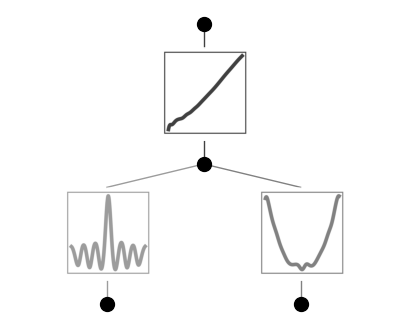
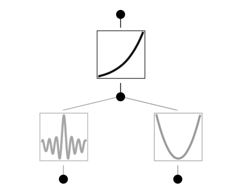
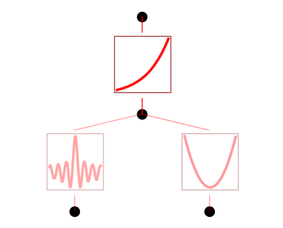
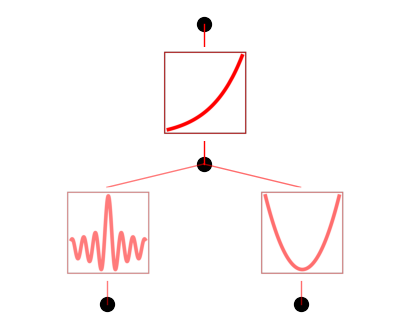

Example 5: Special functions
============================

Let’s construct a dataset which contains special functions
:math:`f(x,y)={\rm exp}(J_0(20x)+y^2)`, where :math:`J_0(x)` is the
Bessel function.

.. code:: ipython3

    from kan import KAN, create_dataset, SYMBOLIC_LIB, add_symbolic
    import torch
    
    # create a KAN: 2D inputs, 1D output, and 5 hidden neurons. cubic spline (k=3), 5 grid intervals (grid=5).
    model = KAN(width=[2,5,1], grid=20, k=3, seed=0)
    f = lambda x: torch.exp(torch.special.bessel_j0(20*x[:,[0]]) + x[:,[1]]**2)
    dataset = create_dataset(f, n_var=2)
    
    # train the model
    model.fit(dataset, opt="LBFGS", steps=20, lamb=0.01, lamb_entropy=10.);

.. parsed-literal::

    train loss: 1.40e-01 | test loss: 1.38e-01 | reg: 2.88e+01 : 100%|██| 20/20 [00:30<00:00,  1.50s/it]

Plot trained KAN, the bessel function shows up in the bettom left

.. code:: ipython3

    model = model.prune()
    model(dataset['train_input'])
    model.plot()

suggest_symbolic does not return anything that matches with it, since
Bessel function isn’t included in the default SYMBOLIC_LIB. We want to
add Bessel to it.

.. code:: ipython3

    model.suggest_symbolic(0,0,0)

.. parsed-literal::

    function , r2
    gaussian , 0.7090268761989152
    1/x^2 , 0.21051195154680438
    sin , 0.1822506022370818
    abs , 0.12418544555819415
    tan , 0.10407480103502795

.. parsed-literal::

    ('gaussian',
     (<function kan.utils.<lambda>(x)>, <function kan.utils.<lambda>(x)>),
     0.7090268761989152)

.. code:: ipython3

    SYMBOLIC_LIB.keys()

.. parsed-literal::

    dict_keys(['x', 'x^2', 'x^3', 'x^4', '1/x', '1/x^2', '1/x^3', '1/x^4', 'sqrt', '1/sqrt(x)', 'exp', 'log', 'abs', 'sin', 'tan', 'tanh', 'sigmoid', 'sgn', 'arcsin', 'arctan', 'arctanh', '0', 'gaussian', 'cosh'])

.. code:: ipython3

    # add bessel function J0 to the symbolic library
    # we should include a name and a pytorch implementation
    add_symbolic('J0', torch.special.bessel_j0)

After adding Bessel, we check suggest_symbolic again

.. code:: ipython3

    # J0 shows up but not top 1, why?
    
    model.suggest_symbolic(0,0,0)

.. parsed-literal::

    function , r2
    gaussian , 0.7090268761989152
    J0 , 0.2681378679614782
    1/x^2 , 0.21051195154680438
    sin , 0.1822506022370818
    abs , 0.12418544555819415

.. parsed-literal::

    ('gaussian',
     (<function kan.utils.<lambda>(x)>, <function kan.utils.<lambda>(x)>),
     0.7090268761989152)

.. code:: ipython3

    # This is because the ground truth is J0(20x) which involves 20 which is too large.
    # our default search is in (-10,10)
    # so we need to set the search range bigger in order to include 20
    # now J0 appears at the top of the list
    
    model.suggest_symbolic(0,0,0,a_range=(-40,40))

.. parsed-literal::

    function , r2
    J0 , 0.9717763100936939
    gaussian , 0.7494106253678943
    sin , 0.49679878395526067
    1/x^2 , 0.21051195158162733
    abs , 0.12435207425739554

.. parsed-literal::

    ('J0',
     (<function torch._C._special.special_bessel_j0>, J0),
     0.9717763100936939)

.. code:: ipython3

    model.fit(dataset, opt="LBFGS", steps=20);

.. parsed-literal::

    train loss: 1.67e-02 | test loss: 1.80e-02 | reg: 2.87e+00 : 100%|██| 20/20 [00:08<00:00,  2.25it/s]

.. code:: ipython3

    model.plot()

.. code:: ipython3

    model.suggest_symbolic(0,0,0,a_range=(-40,40))

.. parsed-literal::

    function , r2
    J0 , 0.9985560043309399
    gaussian , 0.6101756259771707
    sin , 0.5737221152646913
    tan , 0.08366297315238909
    1/x , 0.08315973336762218

.. parsed-literal::

    ('J0',
     (<function torch._C._special.special_bessel_j0>, J0),
     0.9985560043309399)

Finish the rest of symbolic regression

.. code:: ipython3

    model.fix_symbolic(0,0,0,'J0',a_range=(-40,40))

.. parsed-literal::

    r2 is 0.9985560043309399

.. parsed-literal::

    tensor(0.9986)

.. code:: ipython3

    model.auto_symbolic()

.. parsed-literal::

    skipping (0,0,0) since already symbolic
    fixing (0,1,0) with x^2, r2=0.9999802186534139
    fixing (1,0,0) with sigmoid, r2=0.9999663092809886

.. code:: ipython3

    model.plot()

.. code:: ipython3

    model.fit(dataset, opt="LBFGS", steps=20);

.. parsed-literal::

    train loss: 1.12e-03 | test loss: 1.17e-03 | reg: 4.76e+01 : 100%|██| 20/20 [00:08<00:00,  2.38it/s]

.. code:: ipython3

    model.plot()

.. code:: ipython3

    model.suggest_symbolic(1,0,0)

.. parsed-literal::

    function , r2
    exp , 0.9999988610586863
    cosh , 0.9999699077016541
    sigmoid , 0.9999693609882967
    arctan , 0.9999174139339265
    gaussian , 0.9999096961395885

.. parsed-literal::

    ('exp',
     (<function kan.utils.<lambda>(x)>, <function kan.utils.<lambda>(x)>),
     0.9999988610586863)

.. code:: ipython3

    model.fix_symbolic(1,0,0,'exp')

.. parsed-literal::

    r2 is 0.9999988610586863

.. parsed-literal::

    tensor(1.0000, grad_fn=<SelectBackward0>)

.. code:: ipython3

    # why can't we reach machine precision (because LBFGS early stops?)? The symbolic formula is correct though.
    model.fit(dataset, opt="LBFGS", steps=20);
    model.symbolic_formula()[0][0]

.. parsed-literal::

    train loss: 8.09e-04 | test loss: 8.51e-04 | reg: 4.68e+01 : 100%|██| 20/20 [00:05<00:00,  3.96it/s]

.. math::

    \displaystyle 1.0 e^{1.0 x_{2}^{2} + 1.0 J_{0}{\left(- 20.0 x_{1} \right)}}

