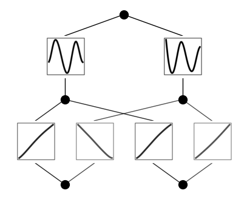

Example 6: Solving Partial Differential Equation (PDE)
======================================================

We aim to solve a 2D poisson equation
:math:`\nabla^2 f(x,y) = -2\pi^2{\rm sin}(\pi x){\rm sin}(\pi y)`, with
boundary condition :math:`f(-1,y)=f(1,y)=f(x,-1)=f(x,1)=0`. The ground
truth solution is :math:`f(x,y)={\rm sin}(\pi x){\rm sin}(\pi y)`.

.. code:: ipython3

    from kan import KAN, LBFGS
    import torch
    import matplotlib.pyplot as plt
    from torch import autograd
    from tqdm import tqdm
    
    dim = 2
    np_i = 21 # number of interior points (along each dimension)
    np_b = 21 # number of boundary points (along each dimension)
    ranges = [-1, 1]
    
    model = KAN(width=[2,2,1], grid=5, k=3, grid_eps=1.0, noise_scale_base=0.25)
    
    def batch_jacobian(func, x, create_graph=False):
        # x in shape (Batch, Length)
        def _func_sum(x):
            return func(x).sum(dim=0)
        return autograd.functional.jacobian(_func_sum, x, create_graph=create_graph).permute(1,0,2)
    
    # define solution
    sol_fun = lambda x: torch.sin(torch.pi*x[:,[0]])*torch.sin(torch.pi*x[:,[1]])
    source_fun = lambda x: -2*torch.pi**2 * torch.sin(torch.pi*x[:,[0]])*torch.sin(torch.pi*x[:,[1]])
    
    # interior
    sampling_mode = 'random' # 'radnom' or 'mesh'
    
    x_mesh = torch.linspace(ranges[0],ranges[1],steps=np_i)
    y_mesh = torch.linspace(ranges[0],ranges[1],steps=np_i)
    X, Y = torch.meshgrid(x_mesh, y_mesh, indexing="ij")
    if sampling_mode == 'mesh':
        #mesh
        x_i = torch.stack([X.reshape(-1,), Y.reshape(-1,)]).permute(1,0)
    else:
        #random
        x_i = torch.rand((np_i**2,2))*2-1
    
    # boundary, 4 sides
    helper = lambda X, Y: torch.stack([X.reshape(-1,), Y.reshape(-1,)]).permute(1,0)
    xb1 = helper(X[0], Y[0])
    xb2 = helper(X[-1], Y[0])
    xb3 = helper(X[:,0], Y[:,0])
    xb4 = helper(X[:,0], Y[:,-1])
    x_b = torch.cat([xb1, xb2, xb3, xb4], dim=0)
    
    steps = 20
    alpha = 0.1
    log = 1
    
    def train():
        optimizer = LBFGS(model.parameters(), lr=1, history_size=10, line_search_fn="strong_wolfe", tolerance_grad=1e-32, tolerance_change=1e-32, tolerance_ys=1e-32)
    
        pbar = tqdm(range(steps), desc='description')
    
        for _ in pbar:
            def closure():
                global pde_loss, bc_loss
                optimizer.zero_grad()
                # interior loss
                sol = sol_fun(x_i)
                sol_D1_fun = lambda x: batch_jacobian(model, x, create_graph=True)[:,0,:]
                sol_D1 = sol_D1_fun(x_i)
                sol_D2 = batch_jacobian(sol_D1_fun, x_i, create_graph=True)[:,:,:]
                lap = torch.sum(torch.diagonal(sol_D2, dim1=1, dim2=2), dim=1, keepdim=True)
                source = source_fun(x_i)
                pde_loss = torch.mean((lap - source)**2)
    
                # boundary loss
                bc_true = sol_fun(x_b)
                bc_pred = model(x_b)
                bc_loss = torch.mean((bc_pred-bc_true)**2)
    
                loss = alpha * pde_loss + bc_loss
                loss.backward()
                return loss
    
            if _ % 5 == 0 and _ < 50:
                model.update_grid_from_samples(x_i)
    
            optimizer.step(closure)
            sol = sol_fun(x_i)
            loss = alpha * pde_loss + bc_loss
            l2 = torch.mean((model(x_i) - sol)**2)
    
            if _ % log == 0:
                pbar.set_description("pde loss: %.2e | bc loss: %.2e | l2: %.2e " % (pde_loss.cpu().detach().numpy(), bc_loss.cpu().detach().numpy(), l2.detach().numpy()))
    
    train()

.. parsed-literal::

    pde loss: 5.92e+00 | bc loss: 7.98e-02 | l2: 3.07e-02 : 100%|█| 20/20 [00:18<00:

Plot the trained KAN

.. code:: ipython3

    model.plot(beta=10)

Fix the first layer activation to be linear function, and the second
layer to be sine functions (caveat: this is quite sensitive to
hypreparams)

.. code:: ipython3

    for i in range(2):
        for j in range(2):
            model.fix_symbolic(0,i,j,'x')
            
    for i in range(2):
        model.fix_symbolic(1,i,0,'sin')

.. parsed-literal::

    Best value at boundary.
    r2 is 0.9969676978399866
    Best value at boundary.
    r2 is 0.9983639008937205
    Best value at boundary.
    r2 is 0.9974491732032462
    Best value at boundary.
    r2 is 0.9978791881996706
    r2 is 0.9723468700787765
    r2 is 0.9844055428126749

After setting all to be symbolic, we further train the model (affine
parameters are still trainable). The model can now reach machine
precision!

.. code:: ipython3

    train()

.. parsed-literal::

    pde loss: 1.37e-16 | bc loss: 3.89e-18 | l2: 7.38e-18 : 100%|█| 20/20 [00:07<00:

Print out the symbolic formula

.. code:: ipython3

    formula, var = model.symbolic_formula(floating_digit=5)
    formula[0]

.. math::

    \displaystyle 0.5 \sin{\left(3.14159 x_{1} - 3.14159 x_{2} + 7.85398 \right)} - 0.5 \sin{\left(3.14159 x_{1} + 3.14159 x_{2} + 1.5708 \right)}

