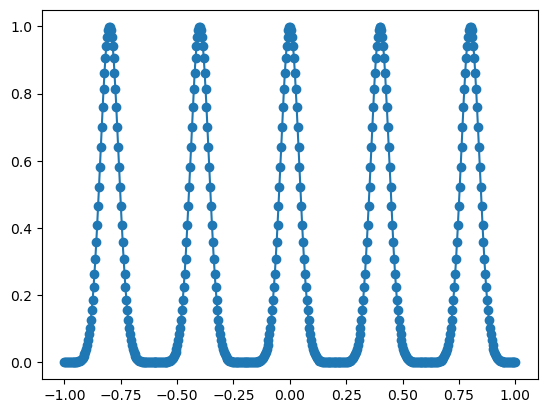
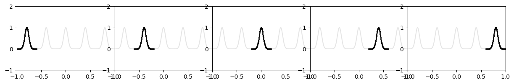
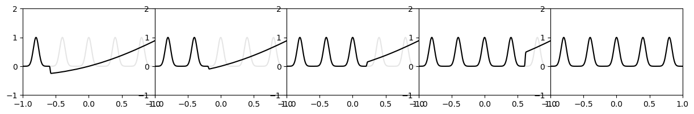

Example 7: Continual Learning
=============================

Setup: Our goal is to learn a 1D function from samples. The 1D function
has 5 Gaussian peaks. Instead of presenting all samples to NN all at
once, we have five phases of learning. In each phase only samples around
one peak is presented to KAN. We find that KANs can do continual
learning thanks to locality of splines.

.. code:: ipython3

    from kan import *
    import numpy as np
    import torch
    import matplotlib.pyplot as plt
    
    
    datasets = []
    
    n_peak = 5
    n_num_per_peak = 100
    n_sample = n_peak * n_num_per_peak
    
    x_grid = torch.linspace(-1,1,steps=n_sample)
    
    x_centers = 2/n_peak * (np.arange(n_peak) - n_peak/2+0.5)
    
    x_sample = torch.stack([torch.linspace(-1/n_peak,1/n_peak,steps=n_num_per_peak)+center for center in x_centers]).reshape(-1,)
    
    
    y = 0.
    for center in x_centers:
        y += torch.exp(-(x_grid-center)**2*300)
        
    y_sample = 0.
    for center in x_centers:
        y_sample += torch.exp(-(x_sample-center)**2*300)
        
    
    plt.plot(x_grid.detach().numpy(), y.detach().numpy())
    plt.scatter(x_sample.detach().numpy(), y_sample.detach().numpy())

.. parsed-literal::

    <matplotlib.collections.PathCollection at 0x7ff40b9ea430>

Sequentially prensenting different peaks to KAN

.. code:: ipython3

    plt.subplots(1, 5, figsize=(15, 2))
    plt.subplots_adjust(wspace=0, hspace=0)
    
    for i in range(1,6):
        plt.subplot(1,5,i)
        group_id = i - 1
        plt.plot(x_grid.detach().numpy(), y.detach().numpy(), color='black', alpha=0.1)
        plt.scatter(x_sample[group_id*n_num_per_peak:(group_id+1)*n_num_per_peak].detach().numpy(), y_sample[group_id*n_num_per_peak:(group_id+1)*n_num_per_peak].detach().numpy(), color="black", s=2)
        plt.xlim(-1,1)
        plt.ylim(-1,2)

Training KAN

.. code:: ipython3

    ys = []
    
    # setting bias_trainable=False, sp_trainable=False, sb_trainable=False is important.
    # otherwise KAN will have random scaling and shift for samples in previous stages
    
    model = KAN(width=[1,1], grid=200, k=3, noise_scale=0.1, bias_trainable=False, sp_trainable=False, sb_trainable=False)
    
    for group_id in range(n_peak):
        dataset = {}
        dataset['train_input'] = x_sample[group_id*n_num_per_peak:(group_id+1)*n_num_per_peak][:,None]
        dataset['train_label'] = y_sample[group_id*n_num_per_peak:(group_id+1)*n_num_per_peak][:,None]
        dataset['test_input'] = x_sample[group_id*n_num_per_peak:(group_id+1)*n_num_per_peak][:,None]
        dataset['test_label'] = y_sample[group_id*n_num_per_peak:(group_id+1)*n_num_per_peak][:,None]
        model.fit(dataset, opt = 'LBFGS', steps=100, update_grid=False);
        y_pred = model(x_grid[:,None])
        ys.append(y_pred.detach().numpy()[:,0])

.. parsed-literal::

    train loss: 3.99e-06 | test loss: 3.99e-06 | reg: 1.26e-01 : 100%|█| 100/100 [00:01<00:00, 59.94it/s
    train loss: 3.99e-06 | test loss: 3.99e-06 | reg: 1.26e-01 : 100%|█| 100/100 [00:01<00:00, 70.47it/s
    train loss: 3.99e-06 | test loss: 3.99e-06 | reg: 1.26e-01 : 100%|█| 100/100 [00:01<00:00, 74.04it/s
    train loss: 3.99e-06 | test loss: 3.99e-06 | reg: 1.26e-01 : 100%|█| 100/100 [00:01<00:00, 76.05it/s
    train loss: 3.99e-06 | test loss: 3.99e-06 | reg: 1.26e-01 : 100%|█| 100/100 [00:01<00:00, 81.69it/s

Prediction of KAN after each stage

.. code:: ipython3

    plt.subplots(1, 5, figsize=(15, 2))
    plt.subplots_adjust(wspace=0, hspace=0)
    
    for i in range(1,6):
        plt.subplot(1,5,i)
        group_id = i - 1
        plt.plot(x_grid.detach().numpy(), y.detach().numpy(), color='black', alpha=0.1)
        plt.plot(x_grid.detach().numpy(), ys[i-1], color='black')
        plt.xlim(-1,1)
        plt.ylim(-1,2)

