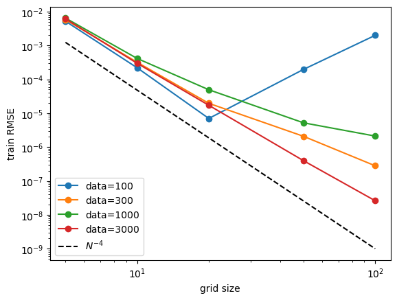
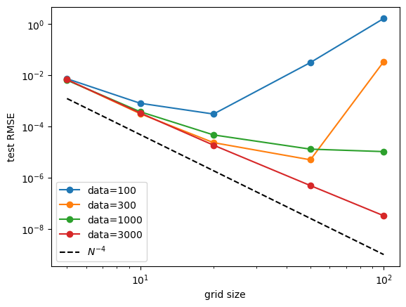
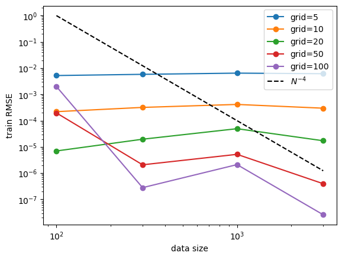
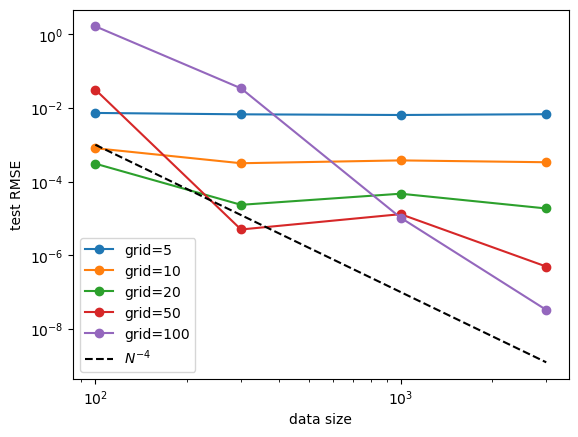

Example 8: KANs’ Scaling Laws
=============================

In this example, we show KAN’s scaling laws (wrt model params and data
size)

.. code:: ipython3

    from kan import *
    
    # initialize KAN with G=3
    model = KAN(width=[2,1,1], grid=3, k=3)
    
    data_sizes = np.array([100,300,1000,3000])
    grids = np.array([5,10,20,50,100])
    
    train_losses = np.zeros((data_sizes.shape[0], grids.shape[0]))
    test_losses = np.zeros((data_sizes.shape[0], grids.shape[0]))
    steps = 50
    k = 3
    
    for j in range(data_sizes.shape[0]):
        data_size = data_sizes[j]
        print(f'data_size={data_size}')
        # create dataset
        f = lambda x: torch.exp(torch.sin(torch.pi*x[:,[0]]) + x[:,[1]]**2)
        dataset = create_dataset(f, n_var=2, train_num=data_size)
        
        for i in range(grids.shape[0]):
            print(f'grid_size={grids[i]}')
            if i == 0:
                model = KAN(width=[2,1,1], grid=grids[i], k=k)
            if i != 0:
                model = KAN(width=[2,1,1], grid=grids[i], k=k).initialize_from_another_model(model, dataset['train_input'])
            results = model.fit(dataset, opt="LBFGS", steps=steps, stop_grid_update_step = 30)
            train_losses[j][i] = results['train_loss'][-1]
            test_losses[j][i] = results['test_loss'][-1]

.. parsed-literal::

    data_size=100
    grid_size=5

.. parsed-literal::

    train loss: 5.22e-03 | test loss: 7.32e-03 | reg: 2.91e+00 : 100%|██| 50/50 [00:07<00:00,  7.10it/s]

.. parsed-literal::

    grid_size=10

.. parsed-literal::

    train loss: 2.20e-04 | test loss: 8.06e-04 | reg: 2.90e+00 : 100%|██| 50/50 [00:06<00:00,  7.48it/s]

.. parsed-literal::

    grid_size=20

.. parsed-literal::

    train loss: 7.01e-06 | test loss: 3.07e-04 | reg: 2.90e+00 : 100%|██| 50/50 [00:07<00:00,  6.73it/s]

.. parsed-literal::

    grid_size=50

.. parsed-literal::

    train loss: 1.97e-04 | test loss: 3.15e-02 | reg: 2.90e+00 : 100%|██| 50/50 [00:07<00:00,  6.45it/s]

.. parsed-literal::

    grid_size=100

.. parsed-literal::

    train loss: 2.00e-03 | test loss: 1.65e+00 | reg: 3.05e+00 : 100%|██| 50/50 [00:07<00:00,  6.35it/s]

.. parsed-literal::

    data_size=300
    grid_size=5

.. parsed-literal::

    train loss: 5.80e-03 | test loss: 6.71e-03 | reg: 2.88e+00 : 100%|██| 50/50 [00:06<00:00,  7.23it/s]

.. parsed-literal::

    grid_size=10

.. parsed-literal::

    train loss: 3.19e-04 | test loss: 3.15e-04 | reg: 2.89e+00 : 100%|██| 50/50 [00:06<00:00,  7.31it/s]

.. parsed-literal::

    grid_size=20

.. parsed-literal::

    train loss: 1.96e-05 | test loss: 2.34e-05 | reg: 2.89e+00 : 100%|██| 50/50 [00:07<00:00,  6.67it/s]

.. parsed-literal::

    grid_size=50

.. parsed-literal::

    train loss: 2.08e-06 | test loss: 5.00e-06 | reg: 2.89e+00 : 100%|██| 50/50 [00:11<00:00,  4.37it/s]

.. parsed-literal::

    grid_size=100

.. parsed-literal::

    train loss: 2.81e-07 | test loss: 3.41e-02 | reg: 2.89e+00 : 100%|██| 50/50 [00:17<00:00,  2.83it/s]

.. parsed-literal::

    data_size=1000
    grid_size=5

.. parsed-literal::

    train loss: 6.45e-03 | test loss: 6.44e-03 | reg: 2.91e+00 : 100%|██| 50/50 [00:07<00:00,  6.72it/s]

.. parsed-literal::

    grid_size=10

.. parsed-literal::

    train loss: 4.14e-04 | test loss: 3.76e-04 | reg: 2.94e+00 : 100%|██| 50/50 [00:07<00:00,  6.54it/s]

.. parsed-literal::

    grid_size=20

.. parsed-literal::

    train loss: 4.94e-05 | test loss: 4.69e-05 | reg: 2.93e+00 : 100%|██| 50/50 [00:14<00:00,  3.44it/s]

.. parsed-literal::

    grid_size=50

.. parsed-literal::

    train loss: 5.21e-06 | test loss: 1.30e-05 | reg: 2.93e+00 : 100%|██| 50/50 [00:49<00:00,  1.01it/s]

.. parsed-literal::

    grid_size=100

.. parsed-literal::

    train loss: 2.12e-06 | test loss: 1.05e-05 | reg: 2.93e+00 : 100%|██| 50/50 [01:15<00:00,  1.51s/it]

.. parsed-literal::

    data_size=3000
    grid_size=5

.. parsed-literal::

    train loss: 6.12e-03 | test loss: 6.77e-03 | reg: 2.79e+00 : 100%|██| 50/50 [00:16<00:00,  2.99it/s]

.. parsed-literal::

    grid_size=10

.. parsed-literal::

    train loss: 2.98e-04 | test loss: 3.35e-04 | reg: 2.78e+00 : 100%|██| 50/50 [00:34<00:00,  1.44it/s]

.. parsed-literal::

    grid_size=20

.. parsed-literal::

    train loss: 1.72e-05 | test loss: 1.86e-05 | reg: 2.78e+00 : 100%|██| 50/50 [00:38<00:00,  1.31it/s]

.. parsed-literal::

    grid_size=50

.. parsed-literal::

    train loss: 3.97e-07 | test loss: 4.93e-07 | reg: 2.78e+00 : 100%|██| 50/50 [00:51<00:00,  1.03s/it]

.. parsed-literal::

    grid_size=100

.. parsed-literal::

    train loss: 2.61e-08 | test loss: 3.27e-08 | reg: 2.78e+00 : 100%|██| 50/50 [00:26<00:00,  1.85it/s]

Fix data size, study model (grid) size scaling. Roughly display
:math:`N^{-4}` scaling.

.. code:: ipython3

    for i in range(data_sizes.shape[0]):
        plt.plot(grids, train_losses[i,:], marker="o")
    plt.xscale('log')
    plt.yscale('log')
    plt.plot(np.array([5,100]), 0.1*np.array([3,100])**(-4.), ls="--", color="black")
    plt.legend([f'data={data_sizes[i]}' for i in range(data_sizes.shape[0])]+[r'$N^{-4}$'])
    plt.ylabel('train RMSE')
    plt.xlabel('grid size')

.. parsed-literal::

    Text(0.5, 0, 'grid size')

.. code:: ipython3

    for i in range(data_sizes.shape[0]):
        plt.plot(grids, test_losses[i,:], marker="o")
    plt.xscale('log')
    plt.yscale('log')
    plt.plot(np.array([5,100]), 0.1*np.array([3,100])**(-4.), ls="--", color="black")
    plt.legend([f'data={data_sizes[i]}' for i in range(data_sizes.shape[0])]+[r'$N^{-4}$'])
    plt.ylabel('test RMSE')
    plt.xlabel('grid size')

.. parsed-literal::

    Text(0.5, 0, 'grid size')

Fix model (grid) size, study data size scaling. No clear power law
scaling. But we observe that: (1) increasing data size has no harm to
performance. (2) powerful model (larger grid size) can benefit more from
data size increase. Ideally one would want to increase data size and
model size together so that their complexity always match.

.. code:: ipython3

    for i in range(grids.shape[0]):
        plt.plot(data_sizes, train_losses[:,i], marker="o")
    plt.xscale('log')
    plt.yscale('log')
    plt.plot(np.array([100,3000]), 1e8*np.array([100,3000])**(-4.), ls="--", color="black")
    plt.legend([f'grid={grids[i]}' for i in range(grids.shape[0])]+[r'$N^{-4}$'])
    plt.ylabel('train RMSE')
    plt.xlabel('data size')

.. parsed-literal::

    Text(0.5, 0, 'data size')

.. code:: ipython3

    for i in range(grids.shape[0]):
        plt.plot(data_sizes, test_losses[:,i], marker="o")
    plt.xscale('log')
    plt.yscale('log')
    plt.plot(np.array([100,3000]), 1e5*np.array([100,3000])**(-4.), ls="--", color="black")
    plt.legend([f'grid={grids[i]}' for i in range(grids.shape[0])]+[r'$N^{-4}$'])
    plt.ylabel('test RMSE')
    plt.xlabel('data size')

.. parsed-literal::

    Text(0.5, 0, 'data size')

