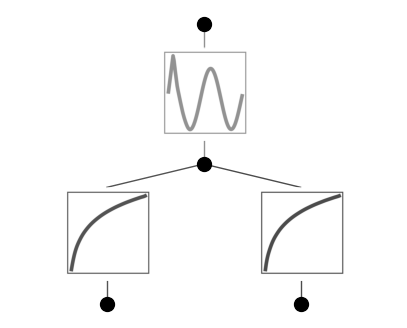
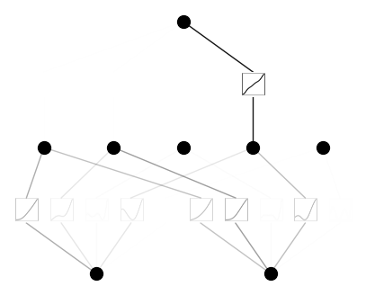
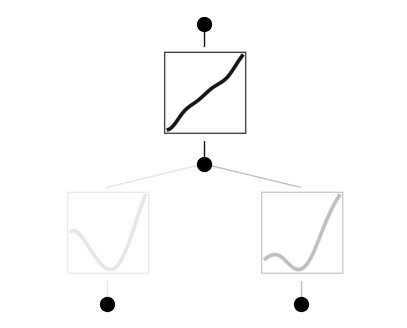
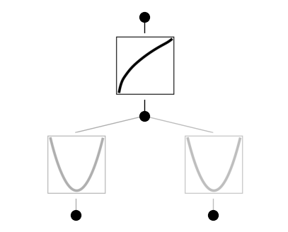

Example 9: Singularity
======================

Let’s construct a dataset which contains singularity
:math:`f(x,y)=sin(log(x)+log(y))  (x>0,y>0)`

.. code:: ipython3

    from kan import KAN, create_dataset, SYMBOLIC_LIB, add_symbolic
    import torch
    
    # create a KAN: 2D inputs, 1D output, and 5 hidden neurons. cubic spline (k=3), 5 grid intervals (grid=5).
    model = KAN(width=[2,1,1], grid=20, k=3, seed=0)
    f = lambda x: torch.sin(2*(torch.log(x[:,[0]])+torch.log(x[:,[1]])))
    dataset = create_dataset(f, n_var=2, ranges=[0.2,5])
    
    # train the model
    model.train(dataset, opt="LBFGS", steps=20);

.. parsed-literal::

    train loss: 5.00e-03 | test loss: 3.94e-02 | reg: 2.72e+00 : 100%|██| 20/20 [00:11<00:00,  1.78it/s]

.. code:: ipython3

    model.plot()

.. code:: ipython3

    model.fix_symbolic(0,0,0,'log')
    model.fix_symbolic(0,1,0,'log')
    model.fix_symbolic(1,0,0,'sin')

.. parsed-literal::

    r2 is 0.999988712412588
    r2 is 0.9999928603717329
    r2 is 0.9968394556850537

.. parsed-literal::

    tensor(0.9968, grad_fn=<SelectBackward0>)

.. code:: ipython3

    model.train(dataset, opt="LBFGS", steps=20);

.. parsed-literal::

    train loss: 2.46e-15 | test loss: 6.78e-16 | reg: 2.72e+00 : 100%|██| 20/20 [00:02<00:00,  8.21it/s]

.. code:: ipython3

    model.symbolic_formula()[0][0]

.. math::

    \displaystyle 1.0 \sin{\left(2.0 \log{\left(2.01 x_{1} \right)} + 2.0 \log{\left(0.62 x_{2} \right)} + 5.85 \right)}

We were lucky – singularity does not seem to be a problem in this case.
But let’s instead consider :math:`f(x,y)=\sqrt{x^2+y^2}`. :math:`x=y=0`
is a singularity point.

.. code:: ipython3

    from kan import KAN, create_dataset, SYMBOLIC_LIB, add_symbolic
    import torch
    
    # create a KAN: 2D inputs, 1D output, and 5 hidden neurons. cubic spline (k=3), 5 grid intervals (grid=5).
    model = KAN(width=[2,5,1], grid=5, k=3, seed=1)
    f = lambda x: torch.sqrt(x[:,[0]]**2+x[:,[1]]**2)
    dataset = create_dataset(f, n_var=2)
    
    # train the model
    model.train(dataset, opt="LBFGS", steps=20, lamb=0.01, lamb_entropy=10.);

.. parsed-literal::

    train loss: 2.08e-01 | test loss: 2.18e-01 | reg: 2.75e+01 : 100%|██| 20/20 [00:38<00:00,  1.92s/it]

.. code:: ipython3

    model.plot()

.. code:: ipython3

    model = model.prune()
    model(dataset['train_input'])
    model.plot()

.. code:: ipython3

    model.train(dataset, opt="LBFGS", steps=20);

.. parsed-literal::

    train loss: 3.72e-03 | test loss: 3.45e-03 | reg: 3.42e+00 : 100%|██| 20/20 [00:03<00:00,  5.13it/s]

.. code:: ipython3

    model.plot()

.. code:: ipython3

    model.auto_symbolic()

.. parsed-literal::

    fixing (0,0,0) with x^2, r2=0.9999921393183026
    fixing (0,1,0) with x^2, r2=0.9999940727994734
    fixing (1,0,0) with sqrt, r2=0.9998914314178492

.. code:: ipython3

    model.symbolic_formula()[0][0]

.. math::

    \displaystyle 1.01 \sqrt{x_{1}^{2} + 1.0 x_{2}^{2}} - 0.01

.. code:: ipython3

    # will give nan, it's a bug that should be resolved later. 
    # But happy to see the above already give a formula that is close enough to ground truth
    model.train(dataset, opt="LBFGS", steps=20, lr=1e-3, update_grid=False);

.. parsed-literal::

    train loss: nan | test loss: nan | reg: nan : 100%|█████████████████| 20/20 [00:03<00:00,  5.70it/s]

