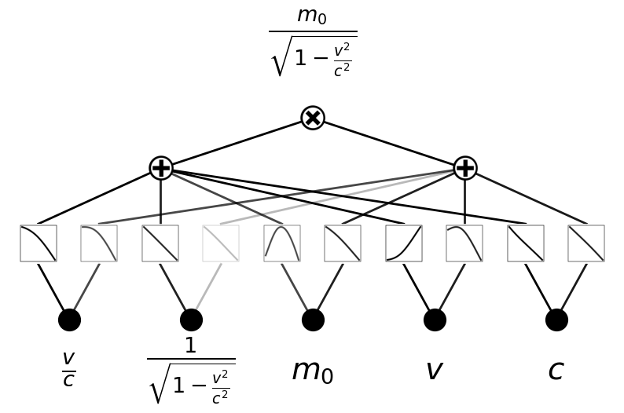
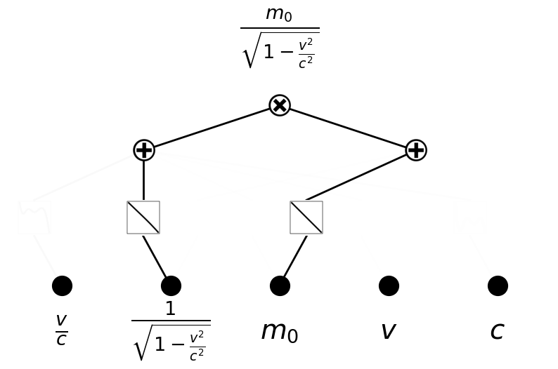

Interpretability 8: Adding auxiliary variables
==============================================

When we do a regression task, it might be good to include auxiliary
input variables, even though they might be dependent on other variables.
For example, to regress :math:`m(m_0, v, c)=m_0/\sqrt{1-(v/c)^2}`, it is
desirable to include the dimensionaless varabile :math:`\beta = v/c` as
a separate input variable. If we also know this is a task in relativity,
we may also include :math:`\gamma=1/\sqrt{1-(v/c)^2}` because
:math:`\gamma` appears frequently in relativity.

.. code:: ipython3

    from kan.MultKAN import MultKAN
    from sympy import *
    from kan.utils import create_dataset, augment_input
    import torch
    
    seed = 1
    torch.manual_seed(seed)
    torch.set_default_dtype(torch.float64)
    
    input_variables = m0, v, c = symbols('m0 v c')
    
    # define auxillary variables
    beta = v/c
    gamma = 1/sqrt(1-beta**2)
    
    aux_vars = (beta, gamma)
    
    f = lambda x: x[:,[0]]/torch.sqrt(1-x[:,[1]]**2/x[:,[2]]**2)
    dataset = create_dataset(f, n_var=3, ranges=[[0,1],[0,0.9],[1.1,2]])
    
    # add auxillary variables
    dataset = augment_input(input_variables, aux_vars, dataset)
    input_variables = aux_vars + input_variables

.. code:: ipython3

    model = MultKAN(width=[5,[0,1]], mult_arity=2, grid=3, k=3, seed=seed)

.. parsed-literal::

    checkpoint directory created: ./model
    saving model version 0.0

.. code:: ipython3

    model(dataset['train_input'])
    model.plot(in_vars=input_variables, out_vars=[m0/sqrt(1-v**2/c**2)], scale=1.0, varscale=0.7)

.. code:: ipython3

    model.fit(dataset, steps=50, lamb=1e-5, lamb_coef=1.0);

.. parsed-literal::

    | train_loss: 5.13e-04 | test_loss: 6.64e-04 | reg: 3.18e+00 | : 100%|█| 50/50 [00:07<00:00,  7.10it

.. parsed-literal::

    saving model version 0.1

.. parsed-literal::

    

.. code:: ipython3

    model.plot(in_vars=input_variables, out_vars=[m0/sqrt(1-v**2/c**2)], scale=1.0, varscale=0.7)

.. code:: ipython3

    model = model.prune(edge_th=5e-2)

.. parsed-literal::

    saving model version 0.2

.. code:: ipython3

    model.plot(in_vars=input_variables, out_vars=[m0/sqrt(1-v**2/c**2)], scale=1.0, varscale=0.7)

.. code:: ipython3

    model.fit(dataset, steps=100, lamb=0e-3);

.. parsed-literal::

    | train_loss: 3.15e-06 | test_loss: 1.99e-05 | reg: 2.74e+00 | : 100%|█| 100/100 [00:10<00:00,  9.48

.. parsed-literal::

    saving model version 0.3

.. parsed-literal::

    

.. code:: ipython3

    model.auto_symbolic()

.. parsed-literal::

    fixing (0,0,0) with 0
    fixing (0,0,1) with 0
    fixing (0,1,0) with x, r2=0.999998976626967, c=1
    fixing (0,1,1) with 0
    fixing (0,2,0) with 0
    fixing (0,2,1) with x, r2=0.9999999998075859, c=1
    fixing (0,3,0) with 0
    fixing (0,3,1) with 0
    fixing (0,4,0) with 0
    fixing (0,4,1) with 0
    saving model version 0.4

.. code:: ipython3

    sf = model.symbolic_formula(var=input_variables)[0][0]
    sf

.. math::

    \displaystyle 1.0 \cdot \left(0.000189505852432992 - \frac{0.817980335069318}{\sqrt{1 - \frac{v^{2}}{c^{2}}}}\right) \left(- 1.22278885546569 m_{0} - 2.33019836537451 \cdot 10^{-7}\right)

.. code:: ipython3

    from kan.utils import ex_round
    
    nsimplify(ex_round(ex_round(ex_round(sf,6),3),3))

.. math::

    \displaystyle \frac{m_{0}}{\sqrt{1 - \frac{v^{2}}{c^{2}}}}

