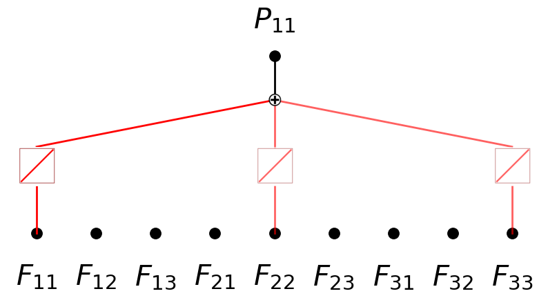
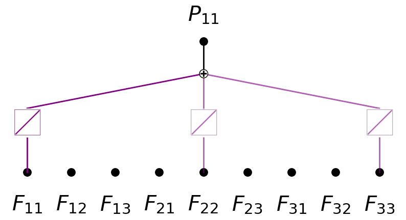
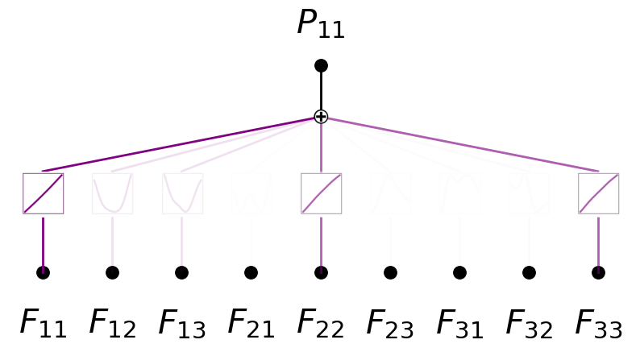
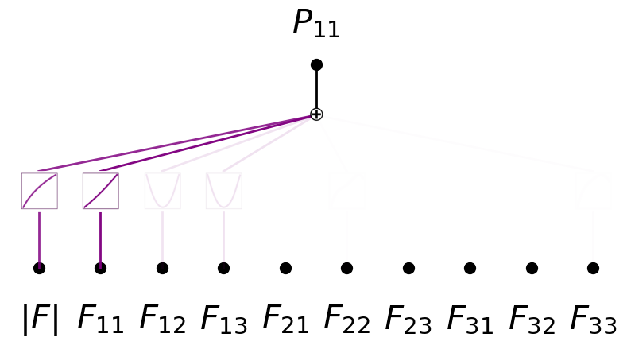
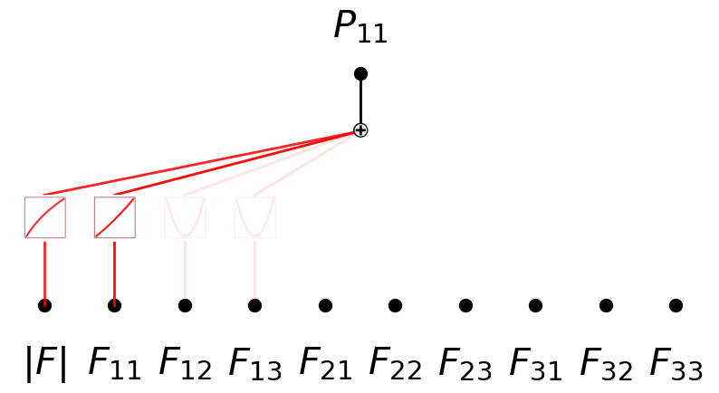

Physics 4A: Constitutive Law P11
================================

.. code:: ipython3

    from constitutive_laws_generator import LinearElasticConstitutiveLaw, NeoHookeanConstitutiveLaw
    import torch
    import matplotlib.pyplot as plt
    import numpy as np
    import random
    from sympy import *
    from kan import *
    from kan.compiler import kanpiler
    
    random.seed(0)
    np.random.seed(0)
    torch.manual_seed(0)
    torch.use_deterministic_algorithms(True)
    torch.set_default_dtype(torch.float64)
    
    N = 1000
    sigma = 0.2
    
    F = torch.eye(3,3)[None,:,:].expand(N,3,3) + (torch.rand(N,3,3)*2-1)*sigma
    det = torch.det(F)
    F *= (det > 0)[:,None,None]
    
    linear = LinearElasticConstitutiveLaw(young_modulus=1.0, poisson_ratio=0.2)
    P_l = linear(F)
    P11_l = P_l[:,[0],[0]]
    P12_l = P_l[:,[0],[1]]
    
    neo = NeoHookeanConstitutiveLaw(young_modulus=1.0, poisson_ratio=0.2)
    P_n = neo(F)
    P11_n = P_n[:,[0],[0]]
    P12_n = P_n[:,[0],[1]]
    
    # P11
    # linear: P11 = 2 * mu * (F11 - 1) + lambda * (F11 + F22 + F33 - 3)
    # neohookean: P11 = mu * (F11^2 + F21^2 + F31^2 - 1) + lambda * log(|F|)
    
    # P12
    # linear: P12 = mu * (F12 + F21)
    # neohookean: P12 = mu * (F12 * F11 + F22 * F21 + F32 * F31)
    

.. code:: ipython3

    mu, lambda_ = linear.get_lame_parameters()
    input_vars = F11, F12, F13, F21, F22, F23, F31, F32, F33 = symbols('F11 F12 F13 F21 F22 F23 F31 F32 F33')
    P11_l_expr = 2 * mu * (F11 - 1) + lambda_ * (F11 + F22 + F33 - 3)
    model = kanpiler(input_vars, P11_l_expr)
    
    F_flatten = F.reshape(N, -1)
    
    model.get_act(F_flatten)
    model.plot(in_vars=input_vars, out_vars=[r'$P_{11}$'], varscale=0.75, scale=1.0, out_vars_offset=0.08)

.. parsed-literal::

    saving model version 0.1

.. code:: ipython3

    model.perturb()
    model.get_act(F_flatten)
    model.plot(in_vars=input_vars, out_vars=[r'$P_{11}$'], varscale=0.75, scale=1.0, out_vars_offset=0.08)

.. parsed-literal::

    saving model version 0.2

.. code:: ipython3

    from kan.utils import create_dataset_from_data
    
    dataset = create_dataset_from_data(F_flatten, P11_n)
    model.fit(dataset, steps=20);

.. parsed-literal::

    | train_loss: 6.38e-03 | test_loss: 6.99e-03 | reg: 1.36e+00 | : 100%|█| 20/20 [00:06<00:00,  3.00it

.. parsed-literal::

    saving model version 0.3

.. parsed-literal::

    

.. code:: ipython3

    model.plot(in_vars=input_vars, out_vars=[r'$P_{11}$'], varscale=0.75, scale=1.0, out_vars_offset=0.08)

.. code:: ipython3

    detF = F11 * F22 * F33 + F12 * F23 * F31 + F13 * F21 * F32 - F11 * F23 * F32 - F12 * F21 * F33 - F13 * F22 * F31
    D = symbols('|F|')
    
    dataset = augment_input(input_vars, [detF], dataset)

.. code:: ipython3

    model.expand_width(0,1,perturb=True)

.. parsed-literal::

    saving model version 0.4

.. code:: ipython3

    model.get_act(dataset)
    model.plot(in_vars=[D] + list(input_vars), out_vars=[r'$P_{11}$'], varscale=0.75, scale=1.0, out_vars_offset=0.08)

.. image:: Physics_4A_constitutive_laws_P11_files/Physics_4A_constitutive_laws_P11_8_0.png

.. code:: ipython3

    model.fit(dataset, opt='LBFGS', steps=20);

.. parsed-literal::

    | train_loss: 2.91e-04 | test_loss: 3.21e-04 | reg: 2.95e+00 | : 100%|█| 20/20 [00:17<00:00,  1.15it

.. parsed-literal::

    saving model version 0.5

.. parsed-literal::

    

.. code:: ipython3

    model.get_act(dataset)
    model.plot(in_vars=[D] + list(input_vars), out_vars=[r'$P_{11}$'], varscale=0.75, scale=1.0, out_vars_offset=0.08)

.. code:: ipython3

    model = model.prune()
    model.get_act(dataset)
    model.plot()

.. parsed-literal::

    saving model version 0.6

.. image:: Physics_4A_constitutive_laws_P11_files/Physics_4A_constitutive_laws_P11_11_1.png

.. code:: ipython3

    model.auto_symbolic()

.. parsed-literal::

    fixing (0,0,0) with log, r2=0.9999966767727161, c=2
    fixing (0,1,0) with x^2, r2=0.9999980195191509, c=2
    fixing (0,2,0) with x^2, r2=0.9998412733282299, c=2
    fixing (0,3,0) with x^2, r2=0.9996084382228987, c=2
    fixing (0,4,0) with 0
    fixing (0,5,0) with 0
    fixing (0,6,0) with 0
    fixing (0,7,0) with 0
    fixing (0,8,0) with 0
    fixing (0,9,0) with 0
    saving model version 0.7

.. code:: ipython3

    model.fit(dataset, opt='LBFGS', steps=100);

.. parsed-literal::

    | train_loss: 3.31e-11 | test_loss: 2.89e-11 | reg: 0.00e+00 | : 100%|█| 100/100 [00:18<00:00,  5.44

.. parsed-literal::

    saving model version 0.8

.. parsed-literal::

    

.. code:: ipython3

    model.plot(in_vars=[D] + list(input_vars),out_vars=[r'$P_{11}$'], varscale=0.75, scale=1.0, out_vars_offset=0.08)

.. code:: ipython3

    from kan.utils import ex_round
    
    ex_round(ex_round(model.symbolic_formula(var= [D] + list(input_vars))[0][0],5),2)

.. math::

    \displaystyle 0.42 F_{11}^{2} + 0.42 F_{12}^{2} + 0.42 F_{13}^{2} + 0.28 \log{\left(2.5 |F| \right)} - 0.67

.. code:: ipython3

    0.28*np.log(2.5) - 0.67

.. parsed-literal::

    -0.41343859507523656

