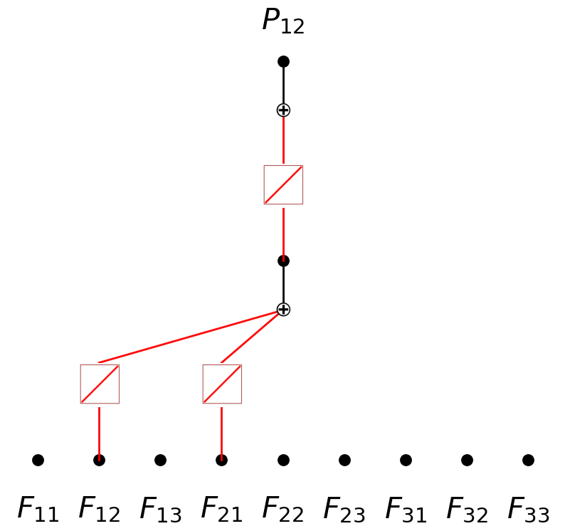
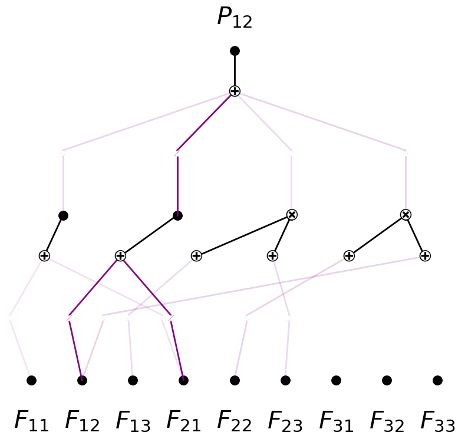
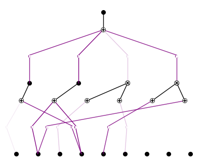

Physics 4B: Constitutive Law P12 with prior
===========================================

.. code:: ipython3

    from constitutive_laws_generator import LinearElasticConstitutiveLaw, NeoHookeanConstitutiveLaw
    import torch
    import matplotlib.pyplot as plt
    import numpy as np
    import random
    from sympy import *
    from kan import *
    from kan.compiler import kanpiler
    
    random.seed(0)
    np.random.seed(0)
    torch.manual_seed(0)
    torch.use_deterministic_algorithms(True)
    torch.set_default_dtype(torch.float64)
    
    N = 1000
    sigma = 0.2 # previously sigma = 0.2
    
    F = torch.eye(3,3)[None,:,:].expand(N,3,3) + (torch.rand(N,3,3)*2-1)*sigma
    det = torch.det(F)
    F *= (det > 0)[:,None,None]
    
    linear = LinearElasticConstitutiveLaw(young_modulus=1.0, poisson_ratio=0.2)
    P_l = linear(F)
    P11_l = P_l[:,[0],[0]]
    P12_l = P_l[:,[0],[1]]
    
    neo = NeoHookeanConstitutiveLaw(young_modulus=1.0, poisson_ratio=0.2)
    P_n = neo(F)
    P11_n = P_n[:,[0],[0]]
    P12_n = P_n[:,[0],[1]]
    
    # P11
    # linear: P11 = 2 * mu * (F11 - 1) + lambda * (F11 + F22 + F33 - 3)
    # neohookean: P11 = mu * (F11^2 + F21^2 + F31^2 - 1) + lambda * log(|F|)
    
    # P12
    # linear: P12 = mu * (F12 + F21)
    # neohookean: P12 = mu * (F12 * F11 + F22 * F21 + F32 * F31)

.. code:: ipython3

    mu, lambda_ = linear.get_lame_parameters()
    input_vars = F11, F12, F13, F21, F22, F23, F31, F32, F33 = symbols('F11 F12 F13 F21 F22 F23 F31 F32 F33')
    
    # compile more terms in ground truth
    # or make the network bigger
    P12_l_expr = mu * (F12 + F21)
    model = kanpiler(input_vars, P12_l_expr, base_fun='identity')
    
    F_flatten = F.reshape(N, -1)
    
    model.get_act(F_flatten)
    model.plot(in_vars=input_vars, out_vars=[r'$P_{12}$'], varscale=0.75, scale=1.0, out_vars_offset=0.08)

.. parsed-literal::

    saving model version 0.1

.. image:: Physics_4B_constitutive_laws_P12_with_prior_files/Physics_4B_constitutive_laws_P12_with_prior_2_1.png

.. code:: ipython3

    model.expand_depth()
    model.plot(in_vars=input_vars, out_vars=[r'$P_{12}$'], varscale=0.75, scale=1.0, out_vars_offset=0.08)

.. parsed-literal::

    saving model version 0.2

.. code:: ipython3

    model.expand_width(1,5,sum_bool=False,mult_arity=2)
    model.expand_width(1,4)
    model.plot(in_vars=input_vars, out_vars=[r'$P_{12}$'], varscale=0.75, scale=1.0, out_vars_offset=0.08)

.. parsed-literal::

    saving model version 0.3
    saving model version 0.4

.. image:: Physics_4B_constitutive_laws_P12_with_prior_files/Physics_4B_constitutive_laws_P12_with_prior_4_1.png

.. code:: ipython3

    model.perturb(mode='all')

.. parsed-literal::

    saving model version 0.5

.. code:: ipython3

    model.plot(in_vars=input_vars, out_vars=[r'$P_{12}$'], varscale=0.75, scale=1.0, out_vars_offset=0.08)

.. image:: Physics_4B_constitutive_laws_P12_with_prior_files/Physics_4B_constitutive_laws_P12_with_prior_6_0.png

.. code:: ipython3

    dataset = create_dataset_from_data(F_flatten, P12_n)
    torch.sqrt(torch.mean((model(dataset['train_input']) - dataset['train_label'])**2))

.. parsed-literal::

    tensor(0.2937, grad_fn=<SqrtBackward0>)

.. code:: ipython3

    from kan.utils import create_dataset_from_data
    
    #dataset = create_dataset_from_data(F_flatten, P12_n)
    model.fit(dataset, steps=100, lamb=1e-5);

.. parsed-literal::

    | train_loss: 2.00e-03 | test_loss: 1.51e-03 | reg: 4.69e+00 | : 100%|█| 100/100 [02:47<00:00,  1.67

.. parsed-literal::

    saving model version 0.6

.. parsed-literal::

    

.. code:: ipython3

    model.plot(in_vars=input_vars, out_vars=[r'$P_{12}$'], varscale=0.75, scale=1.0, out_vars_offset=0.08)

.. image:: Physics_4B_constitutive_laws_P12_with_prior_files/Physics_4B_constitutive_laws_P12_with_prior_9_0.png

.. code:: ipython3

    model = model.prune()
    model.plot(in_vars=input_vars, out_vars=[r'$P_{12}$'], varscale=0.75, scale=1.0, out_vars_offset=0.08)

.. parsed-literal::

    saving model version 0.7

.. code:: ipython3

    model = model.rewind('0.7')

.. parsed-literal::

    rewind to model version 0.7, renamed as 1.7

.. code:: ipython3

    model.fit(dataset, steps=100);

.. parsed-literal::

    | train_loss: 2.92e-04 | test_loss: 3.67e-04 | reg: 6.50e+00 | : 100%|█| 100/100 [01:23<00:00,  1.20

.. parsed-literal::

    saving model version 1.8

.. parsed-literal::

    

.. code:: ipython3

    model.plot()

.. code:: ipython3

    model = model.prune()
    model.auto_symbolic()

.. parsed-literal::

    saving model version 1.9
    fixing (0,0,0) with 0
    fixing (0,0,1) with 0
    fixing (0,0,2) with 0
    fixing (0,0,3) with 0
    fixing (0,0,4) with 0
    fixing (0,0,5) with 0
    fixing (0,1,0) with 0
    fixing (0,1,1) with x^2, r2=0.9983181760968648, c=2
    fixing (0,1,2) with 0
    fixing (0,1,3) with 0
    fixing (0,1,4) with 0
    fixing (0,1,5) with sin, r2=0.9991134619027429, c=2
    fixing (0,2,0) with 0
    fixing (0,2,1) with 0
    fixing (0,2,2) with x, r2=0.9992434434738733, c=1
    fixing (0,2,3) with 0
    fixing (0,2,4) with 0
    fixing (0,2,5) with 0
    fixing (0,3,0) with x, r2=0.9973857325647751, c=1
    fixing (0,3,1) with x^2, r2=0.9969197588869652, c=2
    fixing (0,3,2) with 0
    fixing (0,3,3) with 0
    fixing (0,3,4) with 0
    fixing (0,3,5) with 0
    fixing (0,4,0) with 0
    fixing (0,4,1) with 0
    fixing (0,4,2) with 0
    fixing (0,4,3) with 0
    fixing (0,4,4) with x, r2=0.9997375051819277, c=1
    fixing (0,4,5) with 0
    fixing (0,5,0) with 0
    fixing (0,5,1) with 0
    fixing (0,5,2) with 0
    fixing (0,5,3) with x, r2=0.9991375860233465, c=1
    fixing (0,5,4) with 0
    fixing (0,5,5) with 0
    fixing (0,6,0) with 0
    fixing (0,6,1) with 0
    fixing (0,6,2) with 0
    fixing (0,6,3) with 0
    fixing (0,6,4) with 0
    fixing (0,6,5) with 0
    fixing (0,7,0) with 0
    fixing (0,7,1) with 0
    fixing (0,7,2) with 0
    fixing (0,7,3) with 0
    fixing (0,7,4) with 0
    fixing (0,7,5) with 0
    fixing (0,8,0) with 0
    fixing (0,8,1) with 0
    fixing (0,8,2) with 0
    fixing (0,8,3) with 0
    fixing (0,8,4) with 0
    fixing (0,8,5) with 0
    fixing (1,0,0) with x^2, r2=0.9992679184992709, c=2
    fixing (1,1,0) with x, r2=0.9999994286233544, c=1
    fixing (1,2,0) with x, r2=0.9985408882836544, c=1
    fixing (1,3,0) with 0, r2=0.0, c=0
    saving model version 1.10

.. code:: ipython3

    model.fit(dataset, steps=100);

.. parsed-literal::

    | train_loss: 7.36e-03 | test_loss: 7.64e-03 | reg: 0.00e+00 | : 100%|█| 100/100 [01:31<00:00,  1.09

.. parsed-literal::

    saving model version 1.11

.. parsed-literal::

    

.. code:: ipython3

    from kan.utils import ex_round
    ex_round(expand(ex_round(model.symbolic_formula(var=input_vars)[0][0],4)),2)

.. math::

    \displaystyle 0.02 F_{12}^{2} + 0.42 F_{12} + 0.44 F_{13} F_{23} - 0.03 F_{21}^{2} + 0.42 F_{21}

