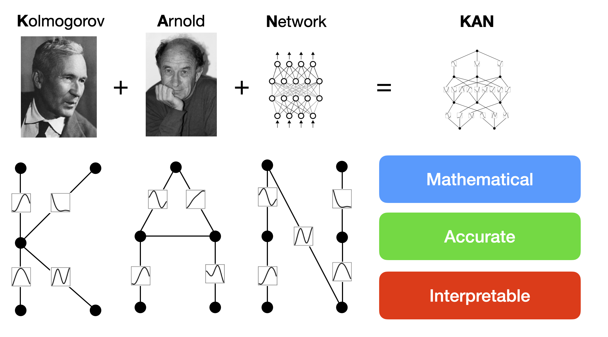

.. kolmogorov-arnold-network documentation master file, created by
   sphinx-quickstart on Sun Apr 21 12:57:28 2024.
   You can adapt this file completely to your liking, but it should at least
   contain the root `toctree` directive.

Welcome to Kolmogorov Arnold Network (KAN) documentation!
==========================================================

This documentation is for the `paper`_ "KAN: Kolmogorov-Arnold Networks" and the `github repo`_.
Kolmogorov-Arnold Networks, inspired by the Kolmogorov-Arnold representation theorem, are promising alternatives
of Multi-Layer Preceptrons (MLPs). KANs have activation functions on edges, whereas MLPs have activation functions on nodes.
This simple change makes KAN better than MLPs in terms of both accuracy and interpretability.

.. _github repo: https://github.com/KindXiaoming/pykan
.. _paper: https://arxiv.org/abs/2404.19756

Installation
------------

Installation via github
~~~~~~~~~~~~~~~~~~~~~~~~

.. code-block:: python

   git clone https://github.com/KindXiaoming/pykan.git
   cd pykan
   pip install -e .
   # pip install -r requirements.txt # install requirements

Installation via PyPI
~~~~~~~~~~~~~~~~~~~~~~~~~~~~

.. code-block:: python

   pip install pykan
   

Requirements
~~~~~~~~~~~~~~~~~~~~~~~~~~~~

.. code-block:: python
   # python==3.9.7
   matplotlib==3.6.2
   numpy==1.24.4
   scikit_learn==1.1.3
   setuptools==65.5.0
   sympy==1.11.1
   torch==2.2.2
   tqdm==4.66.2

Get started
-----------

* Quickstart: :ref:`hello-kan`
* KANs in Action: :ref:`api-demo`, :ref:`examples`
* API (advanced): :ref:`api`.

.. toctree::
   :maxdepth: 1
   :caption: Contents:

   intro.rst
   modules.rst
   demos.rst
   examples.rst

Indices and tables
==================

* :ref:`genindex`
* :ref:`modindex`
* :ref:`search`
