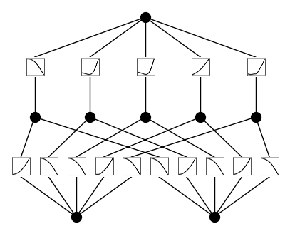
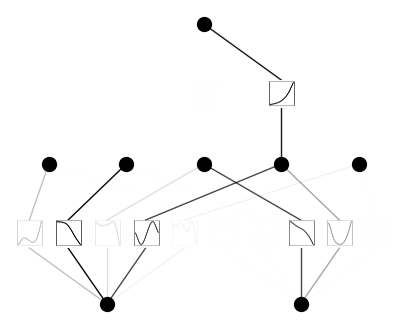
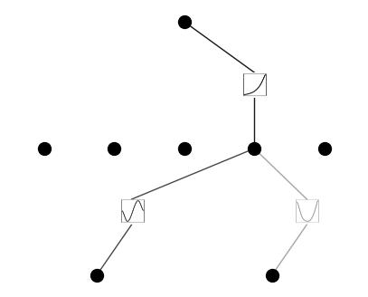
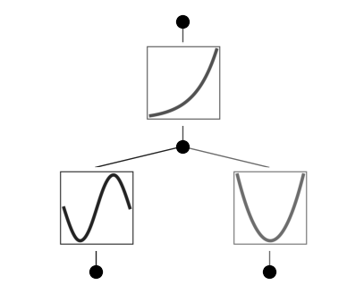

Hello, KAN!
===========

Initialize KAN
~~~~~~~~~~~~~~

.. code:: ipython3

    from kan import *
    # create a KAN: 2D inputs, 1D output, and 5 hidden neurons. cubic spline (k=3), 5 grid intervals (grid=5).
    model = KAN(width=[2,5,1], grid=5, k=3, seed=0)

Create dataset
~~~~~~~~~~~~~~

.. code:: ipython3

    # create dataset f(x,y) = exp(sin(pi*x)+y^2)
    f = lambda x: torch.exp(torch.sin(torch.pi*x[:,[0]]) + x[:,[1]]**2)
    dataset = create_dataset(f, n_var=2)
    dataset['train_input'].shape, dataset['train_label'].shape

.. parsed-literal::

    (torch.Size([1000, 2]), torch.Size([1000, 1]))

Plot KAN at initialization
~~~~~~~~~~~~~~~~~~~~~~~~~~

.. code:: ipython3

    # plot KAN at initialization
    model(dataset['train_input']);
    model.plot(beta=100)

Train KAN with sparsity regularization
~~~~~~~~~~~~~~~~~~~~~~~~~~~~~~~~~~~~~~

.. code:: ipython3

    # train the model
    model.train(dataset, opt="LBFGS", steps=20, lamb=0.01, lamb_entropy=10.);

.. parsed-literal::

    train loss: 6.96e-02 | test loss: 6.53e-02 | reg: 2.39e+01 : 100%|█| 20/20 [00:1

Plot trained KAN
~~~~~~~~~~~~~~~~

.. code:: ipython3

    model.plot()

Prune KAN and replot (keep the original shape)
~~~~~~~~~~~~~~~~~~~~~~~~~~~~~~~~~~~~~~~~~~~~~~

.. code:: ipython3

    model.prune()
    model.plot(mask=True)

Prune KAN and replot (get a smaller shape)
~~~~~~~~~~~~~~~~~~~~~~~~~~~~~~~~~~~~~~~~~~

.. code:: ipython3

    model = model.prune()
    model(dataset['train_input'])
    model.plot()

Continue training and replot
~~~~~~~~~~~~~~~~~~~~~~~~~~~~

.. code:: ipython3

    model.train(dataset, opt="LBFGS", steps=50);

.. parsed-literal::

    train loss: 4.69e-03 | test loss: 4.75e-03 | reg: 2.76e+00 : 100%|█| 50/50 [00:0

.. code:: ipython3

    model.plot()

Automatically or manually set activation functions to be symbolic
~~~~~~~~~~~~~~~~~~~~~~~~~~~~~~~~~~~~~~~~~~~~~~~~~~~~~~~~~~~~~~~~~

.. code:: ipython3

    mode = "auto" # "manual"

    if mode == "manual":
        # manual mode
        model.fix_symbolic(0,0,0,'sin');
        model.fix_symbolic(0,1,0,'x^2');
        model.fix_symbolic(1,0,0,'exp');
    elif mode == "auto":
        # automatic mode
        lib = ['x','x^2','x^3','x^4','exp','log','sqrt','tanh','sin','abs']
        model.auto_symbolic(lib=lib)

.. parsed-literal::

    fixing (0,0,0) with sin, r2=0.999987303715613
    fixing (0,1,0) with x^2, r2=0.9999997184335331
    fixing (1,0,0) with exp, r2=0.9999992042106736

Continue training to almost machine precision
~~~~~~~~~~~~~~~~~~~~~~~~~~~~~~~~~~~~~~~~~~~~~

.. code:: ipython3

    model.train(dataset, opt="LBFGS", steps=50);

.. parsed-literal::

    train loss: 8.88e-12 | test loss: 8.29e-12 | reg: 2.76e+00 : 100%|█| 50/50 [00:0

Obtain the symbolic formula
~~~~~~~~~~~~~~~~~~~~~~~~~~~

.. code:: ipython3

    model.symbolic_formula()[0]

.. math::

    \displaystyle 1.0 e^{1.0 x_{2}^{2} + 1.0 \sin{\left(3.14 x_{1} \right)}}

