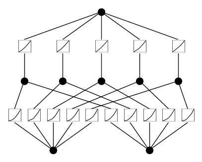
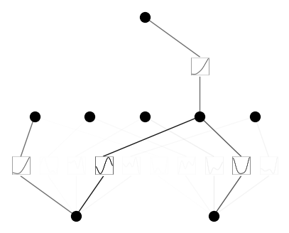
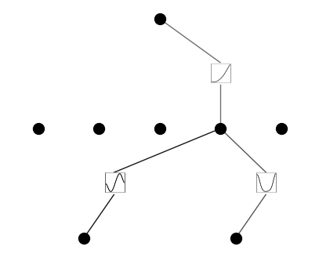
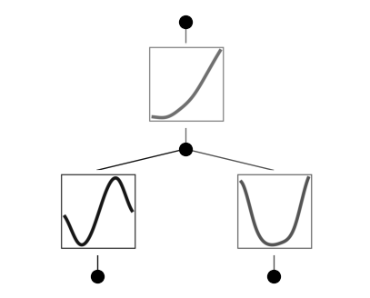
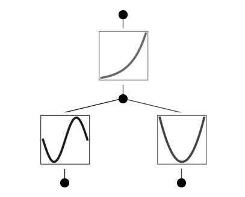

.. _hello-kan:

Hello, KAN!
===========

Kolmogorov-Arnold representation theorem
~~~~~~~~~~~~~~~~~~~~~~~~~~~~~~~~~~~~~~~~

Kolmogorov-Arnold representation theorem states that if :math:`f` is a
multivariate continuous function on a bounded domain, then it can be
written as a finite composition of continuous functions of a single
variable and the binary operation of addition. More specifically, for a
smooth :math:`f : [0,1]^n \to \mathbb{R}`,

.. math:: f(x) = f(x_1,...,x_n)=\sum_{q=1}^{2n+1}\Phi_q(\sum_{p=1}^n \phi_{q,p}(x_p))

where :math:`\phi_{q,p}:[0,1]\to\mathbb{R}` and
:math:`\Phi_q:\mathbb{R}\to\mathbb{R}`. In a sense, they showed that the
only true multivariate function is addition, since every other function
can be written using univariate functions and sum. However, this 2-Layer
width-:math:`(2n+1)` Kolmogorov-Arnold representation may not be smooth
due to its limited expressive power. We augment its expressive power by
generalizing it to arbitrary depths and widths.

Kolmogorov-Arnold Network (KAN)
~~~~~~~~~~~~~~~~~~~~~~~~~~~~~~~

The Kolmogorov-Arnold representation can be written in matrix form

.. math:: f(x)={\bf \Phi}_{\rm out}\circ{\bf \Phi}_{\rm in}\circ {\bf x}

where

.. math:: {\bf \Phi}_{\rm in}= \begin{pmatrix} \phi_{1,1}(\cdot) & \cdots & \phi_{1,n}(\cdot) \\ \vdots & & \vdots \\ \phi_{2n+1,1}(\cdot) & \cdots & \phi_{2n+1,n}(\cdot) \end{pmatrix},\quad {\bf \Phi}_{\rm out}=\begin{pmatrix} \Phi_1(\cdot) & \cdots & \Phi_{2n+1}(\cdot)\end{pmatrix}

We notice that both :math:`{\bf \Phi}_{\rm in}` and
:math:`{\bf \Phi}_{\rm out}` are special cases of the following function
matrix :math:`{\bf \Phi}` (with :math:`n_{\rm in}` inputs, and
:math:`n_{\rm out}` outputs), we call a Kolmogorov-Arnold layer:

.. math:: {\bf \Phi}= \begin{pmatrix} \phi_{1,1}(\cdot) & \cdots & \phi_{1,n_{\rm in}}(\cdot) \\ \vdots & & \vdots \\ \phi_{n_{\rm out},1}(\cdot) & \cdots & \phi_{n_{\rm out},n_{\rm in}}(\cdot) \end{pmatrix}

:math:`{\bf \Phi}_{\rm in}` corresponds to
:math:`n_{\rm in}=n, n_{\rm out}=2n+1`, and :math:`{\bf \Phi}_{\rm out}`
corresponds to :math:`n_{\rm in}=2n+1, n_{\rm out}=1`.

After defining the layer, we can construct a Kolmogorov-Arnold network
simply by stacking layers! Let’s say we have :math:`L` layers, with the
:math:`l^{\rm th}` layer :math:`{\bf \Phi}_l` have shape
:math:`(n_{l+1}, n_{l})`. Then the whole network is

.. math:: {\rm KAN}({\bf x})={\bf \Phi}_{L-1}\circ\cdots \circ{\bf \Phi}_1\circ{\bf \Phi}_0\circ {\bf x}

In constrast, a Multi-Layer Perceptron is interleaved by linear layers
:math:`{\bf W}_l` and nonlinearities :math:`\sigma`:

.. math:: {\rm MLP}({\bf x})={\bf W}_{L-1}\circ\sigma\circ\cdots\circ {\bf W}_1\circ\sigma\circ {\bf W}_0\circ {\bf x}

A KAN can be easily visualized. (1) A KAN is simply stack of KAN layers.
(2) Each KAN layer can be visualized as a fully-connected layer, with a
1D function placed on each edge. Let’s see an example below.

Get started with KANs
~~~~~~~~~~~~~~~~~~~~~

Initialize KAN

.. code:: ipython3

    from kan import *
    # create a KAN: 2D inputs, 1D output, and 5 hidden neurons. cubic spline (k=3), 5 grid intervals (grid=5).
    model = KAN(width=[2,5,1], grid=5, k=3, seed=0)

Create dataset

.. code:: ipython3

    # create dataset f(x,y) = exp(sin(pi*x)+y^2)
    f = lambda x: torch.exp(torch.sin(torch.pi*x[:,[0]]) + x[:,[1]]**2)
    dataset = create_dataset(f, n_var=2)
    dataset['train_input'].shape, dataset['train_label'].shape

.. parsed-literal::

    (torch.Size([1000, 2]), torch.Size([1000, 1]))

Plot KAN at initialization

.. code:: ipython3

    # plot KAN at initialization
    model(dataset['train_input']);
    model.plot(beta=100)

Train KAN with sparsity regularization

.. code:: ipython3

    # train the model
    model.fit(dataset, opt="LBFGS", steps=20, lamb=0.01, lamb_entropy=10.);

.. parsed-literal::

    train loss: 1.57e-01 | test loss: 1.31e-01 | reg: 2.05e+01 : 100%|██| 20/20 [00:18<00:00,  1.06it/s]

Plot trained KAN

.. code:: ipython3

    model.plot()

Prune KAN and replot (keep the original shape)

.. code:: ipython3

    model.prune()
    model.plot(mask=True)

Prune KAN and replot (get a smaller shape)

.. code:: ipython3

    model = model.prune()
    model(dataset['train_input'])
    model.plot()

Continue training and replot

.. code:: ipython3

    model.fit(dataset, opt="LBFGS", steps=50);

.. parsed-literal::

    train loss: 4.74e-03 | test loss: 4.80e-03 | reg: 2.98e+00 : 100%|██| 50/50 [00:07<00:00,  7.03it/s]

.. code:: ipython3

    model.plot()

Automatically or manually set activation functions to be symbolic

.. code:: ipython3

    mode = "auto" # "manual"
    
    if mode == "manual":
        # manual mode
        model.fix_symbolic(0,0,0,'sin');
        model.fix_symbolic(0,1,0,'x^2');
        model.fix_symbolic(1,0,0,'exp');
    elif mode == "auto":
        # automatic mode
        lib = ['x','x^2','x^3','x^4','exp','log','sqrt','tanh','sin','abs']
        model.auto_symbolic(lib=lib)

.. parsed-literal::

    fixing (0,0,0) with sin, r2=0.999987252534279
    fixing (0,1,0) with x^2, r2=0.9999996536741071
    fixing (1,0,0) with exp, r2=0.9999988529417926

Continue training to almost machine precision

.. code:: ipython3

    model.fit(dataset, opt="LBFGS", steps=50);

.. parsed-literal::

    train loss: 2.02e-10 | test loss: 1.13e-10 | reg: 2.98e+00 : 100%|██| 50/50 [00:02<00:00, 22.59it/s]

Obtain the symbolic formula

.. code:: ipython3

    model.symbolic_formula()[0][0]

.. math::

    \displaystyle 1.0 e^{1.0 x_{2}^{2} + 1.0 \sin{\left(3.14 x_{1} \right)}}

